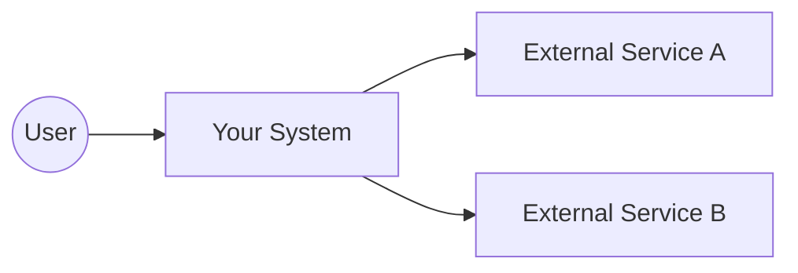
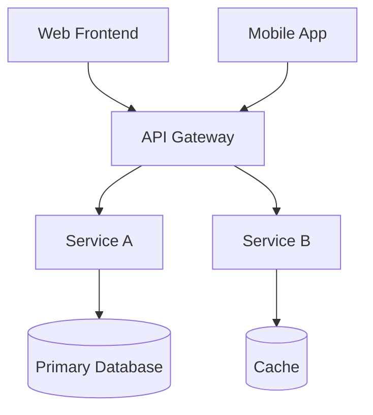

# Pattern: <Pattern Name>

!!! info "Quick facts"
    - **Category:** <e.g. Web & Mobile Apps>
    - **Maturity:** Adopt | Trial | Assess | Hold
    - **Typical team size:** <e.g. 2-5 engineers>
    - **Typical timeline to MVP:** <e.g. 8-12 weeks>
    - **Last reviewed:** YYYY-MM-DD by <reviewer>

## 1. Context

**Use this pattern when:**

- <Triggering signal 1>
- <Triggering signal 2>
- <Triggering signal 3>

**Do NOT use this pattern when:**

- <Counter-indication 1>
- <Counter-indication 2>

## 2. Problem it solves

<One paragraph stating the business problem in plain language. No tech jargon.>

## 3. Solution overview

### System context (C4 Level 1)

### Container view (C4 Level 2)

## 4. Technology stack

| Layer | Primary choice | Alternatives | Notes |
|---|---|---|---|
| Frontend | <e.g. Next.js> | <Remix, SvelteKit> | <Why primary?> |
| Backend | <e.g. NestJS> | <FastAPI, Spring Boot> | |
| Database | <e.g. PostgreSQL> | <MySQL, CockroachDB> | |
| Cache | <e.g. Redis> | <Memcached, Dragonfly> | |
| Auth | <e.g. Auth0> | <Clerk, Cognito, Keycloak> | |
| Hosting | <e.g. AWS ECS> | <Fly.io, Cloudflare, Vercel> | |
| CI/CD | <e.g. GitHub Actions> | <GitLab CI, CircleCI> | |
| Observability | <e.g. Datadog> | <Grafana stack, New Relic> | |

## 5. Non-functional characteristics

| Concern | Profile |
|---|---|
| **Scalability** | <e.g. Horizontal, scales to 10k concurrent users on default config> |
| **Availability target** | <e.g. 99.9% (43 min/month downtime budget)> |
| **Latency target** | <e.g. p95 < 300ms for read APIs> |
| **Security posture** | <e.g. OAuth2 + OWASP Top 10 controls + WAF> |
| **Data residency** | <e.g. Region-pinnable; supports EU-only deployment> |
| **Compliance fit** | <e.g. GDPR ✓, SOC 2 ✓, HIPAA with BAA ✓, PCI-DSS ✗> |

## 6. Cost ballpark

Indicative monthly cost in USD. Real costs vary with traffic patterns and reserved capacity discounts.

| Scale | Users | Monthly cost | Notes |
|---|---|---|---|
| Small | < 1,000 MAU | $50 - $200 | Single region, managed services |
| Medium | 1k - 100k MAU | $500 - $3,000 | Multi-AZ, basic observability |
| Large | 100k - 1M MAU | $5,000 - $25,000 | Multi-region, full observability, on-call |

## 7. LLM-assisted development fit

| Aspect | Rating | Notes |
|---|---|---|
| Boilerplate generation | ★★★★★ | Excellent — patterns well represented in training data |
| Test scaffolding | ★★★★ | Good — verify edge cases manually |
| Refactoring | ★★★ | Useful with small scope; large refactors still risky |
| Architecture decisions | ★ | Don't outsource — human judgment required |

## 8. Reference implementations

- **Public reference:** <Link to a public repo, blog post, or case study>
- **Internal case study:** <Link to anonymised internal example, if applicable>

## 9. Related decisions (ADRs)

- [ADR-XXXX: <decision title>](../../decisions/XXXX-decision-title.md)

## 10. Known risks & gotchas

- <Risk 1 with mitigation>
- <Risk 2 with mitigation>
