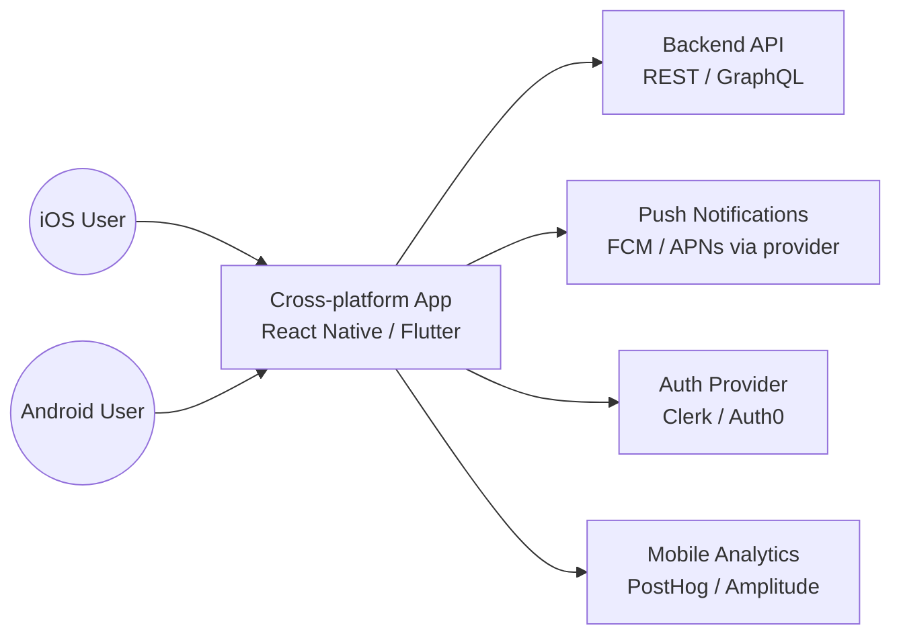
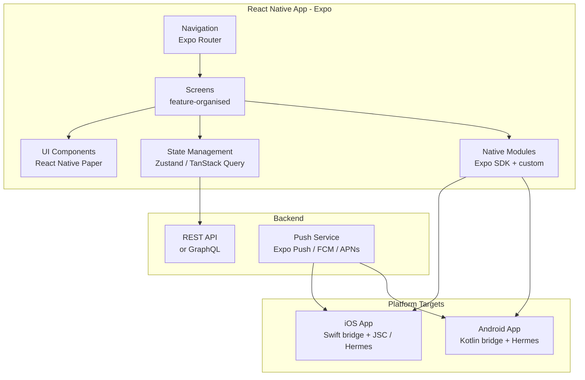

# Pattern: Cross-platform Mobile App

!!! info "Quick facts"
    - **Category:** Web & Mobile Applications
    - **Maturity:** Trial
    - **Typical team size:** 2-5 engineers
    - **Typical timeline to MVP:** 8-16 weeks
    - **Last reviewed:** 2026-05-03 by Architecture Team

## 1. Context

**Use this pattern when:**

- The app must ship on both iOS and Android and the team cannot afford to maintain two separate native codebases
- The UI is primarily standard components (lists, forms, navigation) rather than highly custom graphics or animations
- The team has existing JavaScript/TypeScript or Dart expertise and limited native iOS/Android experience

**Do NOT use this pattern when:**

- The app requires deep platform integration (custom camera pipeline, ARKit/ARCore, complex background processing, system-level extensions) that cross-platform frameworks expose awkwardly
- Rendering performance is the primary concern (complex animations, real-time 3D) — native or a game engine is more appropriate
- The app will only ever ship on one platform — native development removes the cross-platform overhead entirely

## 2. Problem it solves

Maintaining two separate native codebases (Swift/Kotlin) for iOS and Android doubles the engineering effort for every feature, doubles the bug surface, and requires a team with two distinct skill sets. A cross-platform framework shares the business logic, navigation, and most UI code between platforms, typically achieving 80–95% code reuse, while still compiling to native code or rendering with a native engine rather than a WebView.

## 3. Solution overview

### System context (C4 Level 1)

### Container view (C4 Level 2)

## 4. Technology stack

| Layer | Primary choice | Alternatives | Notes |
|---|---|---|---|
| Framework | React Native with Expo | Flutter (Dart) | React Native with Expo for JavaScript/TypeScript teams; Flutter for teams willing to learn Dart or needing smoother animations; both are production-ready in 2026 |
| Navigation | Expo Router (file-based) | React Navigation | Expo Router mirrors Next.js file-based routing; simpler mental model than manually configured React Navigation |
| UI components | React Native Paper | NativeWind (Tailwind for RN), Tamagui | React Native Paper provides Material Design components ready to use; NativeWind for design-system teams already using Tailwind |
| State management | Zustand + TanStack Query | Redux Toolkit, Jotai | TanStack Query for server state (API caching, pagination, optimistic updates); Zustand for client-only global state |
| Build / distribution | EAS Build (Expo Application Services) | Bitrise, Fastlane | EAS Build handles both iOS and Android CI builds in the cloud without a macOS machine; EAS Submit pushes to app stores |
| Auth | Expo + Clerk or Auth0 SDK | Firebase Auth | Clerk and Auth0 have first-class Expo SDKs with biometric and social login |
| Push notifications | Expo Push Notifications | Firebase Cloud Messaging (FCM) directly | Expo Push abstracts FCM and APNs behind one API; use FCM directly only if you need advanced features |
| Over-the-air updates | Expo Updates (EAS Update) | CodePush | OTA updates let you ship JS bundle fixes without app store review; cannot ship native code changes OTA |

## 5. Non-functional characteristics

| Concern | Profile |
|---|---|
| **Scalability** | The app is a thin client — scalability is a backend concern. App bundle size and cold start time are the relevant mobile metrics; target initial bundle < 5 MB and cold start < 2 s on a mid-range device. |
| **Availability target** | App store distribution means users run stale versions for days. Use OTA updates for critical JS-layer fixes; plan for at least 3 concurrent app versions in production. |
| **Latency target** | Perceived responsiveness is more important than raw latency. Use optimistic UI updates for common actions; target API round-trip < 500 ms on a 4G connection. |
| **Security posture** | Do not store secrets in the JS bundle — it is reverse-engineerable. API keys, tokens, and credentials belong in the device's secure storage (Expo SecureStore). Certificate pinning for sensitive apps. Jailbreak/root detection for financial or health apps. |
| **Data residency** | App data is on-device or in your API. Mobile analytics providers (Amplitude, Mixpanel) process data in their cloud — review DPAs. |
| **Compliance fit** | App store guidelines (Apple App Store Review, Google Play Policy) are compliance requirements; violations cause rejection. GDPR: apps must request consent before analytics; use ATT (App Tracking Transparency) prompt on iOS. |

## 6. Cost ballpark

Indicative monthly USD cost. App store developer fees and EAS Build are the fixed costs.

| Scale | MAU | Monthly cost | Cost drivers |
|---|---|---|---|
| Small | < 5,000 | $100 - $400 | EAS Build free tier, Apple ($99/yr) + Google ($25 once) developer accounts |
| Medium | 5k - 100k | $400 - $2,000 | EAS Build Production plan, push notification volume, analytics plan |
| Large | 100k+ | $1,500 - $8,000 | EAS Build Enterprise, push volume, analytics, crash reporting (Sentry) |

## 7. LLM-assisted development fit

| Aspect | Rating | Notes |
|---|---|---|
| Screen scaffolding and navigation setup | ★★★★★ | Excellent — Expo Router and React Navigation patterns are very well-represented. |
| TanStack Query hooks and API integration | ★★★★★ | Excellent — generates correct hooks with caching, pagination, and error states. |
| Native module bridging and Expo SDK usage | ★★★★ | Good; always test on a real device — simulators hide many native issues. |
| Complex animations (Reanimated, Skia) | ★★★ | Knows the APIs; performance tuning and `runOnUI` threading nuances need manual review. |
| Architecture decisions | ★ | Don't outsource. Use ADRs. |

**Recommended workflow:** Use Expo Go for rapid iteration during development; switch to a development build when you need native modules. Test on a physical device from week one — do not rely solely on simulators. Submit to TestFlight/Google Internal Testing before any feature is marked complete.

## 8. Reference implementations

- **Public reference:** [expo/expo](https://github.com/expo/expo) — the Expo SDK and tooling; `apps/bare-expo/` and `packages/` show real implementation patterns for every native module (200 OK ✓)
- **Public reference:** [flutter/flutter](https://github.com/flutter/flutter) — Flutter SDK; `examples/` and the Flutter Gallery app show idiomatic Dart patterns for cross-platform UI (200 OK ✓)
- **Internal case study:** _Add your anonymised internal example here_

## 9. Related decisions (ADRs)

- _No ADRs recorded yet. Candidate: React Native (Expo) vs Flutter — record when the team commits to a framework for a major new app._

## 10. Known risks & gotchas

- **Expo SDK upgrade breaks native modules** — updating Expo SDK major versions requires updating all native dependencies simultaneously; incompatibilities are common and time-consuming. Mitigation: allocate a dedicated upgrade sprint every Expo SDK release; never mix mismatched Expo SDK and expo-\* package versions.
- **OTA updates shipped to wrong users** — an EAS Update channel is misconfigured; a production fix goes to the development build channel and never reaches users. Mitigation: set up three EAS Update channels (development, staging, production) from day one; test OTA update delivery explicitly before relying on it for production fixes.
- **Android performance lags behind iOS** — the React Native JS thread is the same across both, but Android rendering is slower on low-end hardware. Mitigation: profile on a mid-range Android device (not a flagship); move heavy computation to worklets; consider Hermes engine (default in Expo SDK 48+).
- **App store review rejection delays launch** — Apple rejects the first build due to a privacy manifest, missing NSUsageDescription, or guideline violation; review takes 24–72 hours. Mitigation: run `expo-doctor` before every submission; review Apple's Guideline 5.1 (Data Collection) before launch; leave a two-week buffer before any deadline for app store review.
- **Stale app versions in production** — after launch, 20% of users run a version that is 3 months old; a critical API change breaks their app. Mitigation: force-upgrade via a minimum version check in the API; use EAS Update for JS-layer hotfixes; design API changes to be backward-compatible for at least 6 months.
