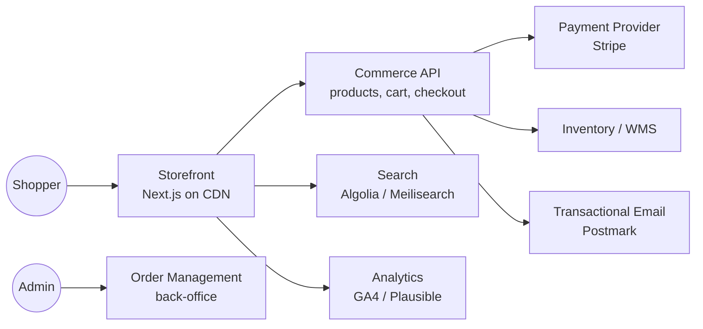
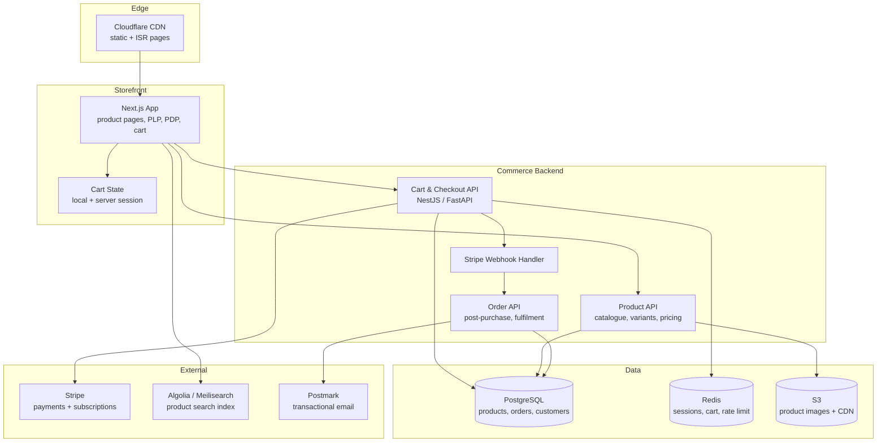

# Pattern: E-commerce Storefront

!!! info "Quick facts"
    - **Category:** Web & Mobile Applications
    - **Maturity:** Adopt
    - **Typical team size:** 3-6 engineers
    - **Typical timeline to MVP:** 8-16 weeks
    - **Last reviewed:** 2026-05-03 by Architecture Team

## 1. Context

**Use this pattern when:**

- Building an online retail storefront, marketplace, or subscription product with a shopping cart, product catalogue, checkout, and order management
- The business requires a customised brand experience that a hosted platform (Shopify, BigCommerce) cannot deliver
- Performance and SEO are first-class requirements — product pages must rank and load fast

**Do NOT use this pattern when:**

- The catalogue is small (< 100 products) and customisation needs are low — use Shopify or a similar hosted platform; the operational overhead of a custom storefront is hard to justify
- The primary sales channel is B2B with quote-based pricing — a custom CPQ or CRM integration is a better fit than a consumer checkout flow
- The team has no prior e-commerce experience — start with a hosted platform and migrate to headless only after proving the business model

## 2. Problem it solves

Hosted e-commerce platforms provide a fast path to market but impose constraints on design, performance, and third-party integrations that become painful at scale. A headless commerce architecture separates the storefront (Next.js, React) from the commerce logic (cart, checkout, inventory, payments) and the back-office (order management, fulfilment), allowing each layer to evolve independently and to be replaced without rebuilding the others.

## 3. Solution overview

### System context (C4 Level 1)

### Container view (C4 Level 2)

## 4. Technology stack

| Layer | Primary choice | Alternatives | Notes |
|---|---|---|---|
| Storefront framework | Next.js (App Router) | Remix, SvelteKit, Nuxt | Next.js ISR (Incremental Static Regeneration) lets product pages be statically served and refreshed on inventory/price changes without a full rebuild |
| Commerce backend | Custom NestJS API | Medusa.js, Vendure, Solidus | Custom for full control; Medusa.js if you want an open-source headless commerce engine with batteries included |
| Payments | Stripe (Payment Intents + Webhooks) | Paddle (MoR for global tax), Adyen | Stripe is the default; Paddle for global merchants who want a Merchant of Record to handle VAT/GST |
| Product search | Algolia | Meilisearch (self-hosted), Typesense | Algolia for managed search with merchandising rules; Meilisearch for self-hosted zero-cost search |
| Database | PostgreSQL | MySQL | Orders, products, customers, inventory in Postgres; never split these into separate databases without a strong reason |
| Session / cart | Redis | Database-backed session | Redis for fast cart reads on every page load; always persist cart to DB asynchronously |
| Image storage | AWS S3 + Cloudflare Images | Cloudinary, imgix | Cloudflare Images for automatic resizing and WebP conversion; no egress fees |
| Hosting | Vercel (storefront) + AWS ECS (API) | Netlify + Fly.io, fully on AWS | Vercel for Next.js ISR; ECS for the stateful commerce API |
| Email | Postmark (transactional) | Resend, SendGrid | Separate transactional (order confirmation, shipping) from marketing email |

## 5. Non-functional characteristics

| Concern | Profile |
|---|---|
| **Scalability** | Storefront scales to any traffic via CDN-served static + ISR pages. Commerce API scales horizontally; cart and checkout are stateless (session in Redis). Peak events (flash sales, Black Friday) need pre-warming — test with load before the event, not during. |
| **Availability target** | 99.9% for the checkout flow; storefront CDN availability is effectively 99.99%. Payment webhooks must be idempotent — Stripe can deliver the same event more than once. |
| **Latency target** | Storefront: Time to First Byte < 100 ms (CDN-served), Largest Contentful Paint < 2.5 s. Checkout API: p95 < 800 ms including Stripe API call. Search: p95 < 150 ms. |
| **Security posture** | PCI-DSS scope minimised by using Stripe-hosted payment fields (no card data touches your stack). HTTPS everywhere. CSRF protection on all form endpoints. Rate-limit checkout attempts per IP. Bot protection (Cloudflare Turnstile) on checkout. |
| **Data residency** | Customer PII and order data in Postgres in your chosen region. Stripe holds card data; ensure Stripe's DPA is signed. |
| **Compliance fit** | PCI-DSS SAQ A (Stripe-hosted fields, no card data on your servers). GDPR ✓ — right-to-erasure on customer and order data; anonymise, don't delete, order records for accounting. Consumer protection laws vary by market; seek legal advice for each new geography. |

## 6. Cost ballpark

Indicative monthly USD cost. Varies significantly with traffic and order volume.

| Scale | Monthly orders | Monthly cost | Cost drivers |
|---|---|---|---|
| Small | < 500 | $150 - $600 | Vercel Pro, 1 ECS task, RDS Postgres small, Algolia Starter |
| Medium | 500 - 10,000 | $800 - $5,000 | Vercel, ECS autoscaling, larger Postgres, Algolia volume, Cloudflare Images |
| Large | 10,000+ | $5,000 - $30,000 | Multi-region, Stripe volume fees (~2.9%), full observability, dedicated ops |

## 7. LLM-assisted development fit

| Aspect | Rating | Notes |
|---|---|---|
| Product listing and detail page scaffolding | ★★★★★ | Excellent — Next.js product pages are extremely well-represented. |
| Cart and checkout flow | ★★★★ | Good; always test edge cases (quantity changes, coupon codes, failed payments) manually. |
| Stripe integration (Payment Intents, webhooks) | ★★★★ | Good starting point; idempotency key handling and webhook signature verification need careful review. |
| Inventory race conditions | ★★ | Understands the concept; oversell prevention under concurrent checkout requires explicit locking strategy reviewed by hand. |
| Architecture decisions | ★ | Don't outsource. Use ADRs. |

**Recommended workflow:** Start with Stripe's hosted checkout (Stripe Checkout) to validate the business before investing in a custom checkout UI. Migrate to Payment Intents + custom UI only when conversion rate data justifies the engineering investment.

## 8. Reference implementations

- **Public reference:** [vercel/commerce](https://github.com/vercel/commerce) — Next.js Commerce reference storefront; shows ISR, cart state, and multiple commerce backend integrations (Shopify, BigCommerce, etc.) (200 OK ✓)
- **Public reference:** [spree/spree](https://github.com/spree/spree) — mature open-source commerce platform in Ruby/Rails with REST and GraphQL APIs; useful reference for the order management domain model (200 OK ✓)
- **Internal case study:** _Add your anonymised internal example here_

## 9. Related decisions (ADRs)

- _No ADRs recorded yet. Candidate: headless-custom API vs Medusa.js vs Vendure for the commerce engine — record when your organisation commits._

## 10. Known risks & gotchas

- **Oversell under concurrent checkout** — two shoppers purchase the last unit simultaneously; both succeed; one order cannot be fulfilled. Mitigation: use a `SELECT ... FOR UPDATE` row lock on the inventory record during checkout, or a Postgres advisory lock on the SKU; never rely on an application-level check-then-decrement without locking.
- **Stripe webhook delivered twice causes duplicate fulfilment** — Stripe retries webhooks on any non-2xx response; a slow handler that times out receives the event a second time. Mitigation: make all webhook handlers idempotent on the Stripe event ID; insert into a `processed_events` table with a unique constraint on `stripe_event_id` before any side effect.
- **ISR cache serves stale prices or out-of-stock products** — a product goes out of stock but cached pages still show "Add to Cart". Mitigation: call `revalidatePath()` from the commerce API when inventory reaches zero; add a real-time availability check at cart-add time regardless of what the product page shows.
- **Flash sale traffic spike takes down the checkout API** — 10,000 concurrent shoppers at sale start overwhelm the ECS task count before autoscaling responds. Mitigation: pre-scale the ECS service before scheduled sale events; rate-limit checkout endpoint aggressively; use a virtual waiting room (Cloudflare Waiting Room) for very high-traffic events.
- **Tax calculation complexity** — charging the wrong sales tax in a US state or missing EU VAT is a compliance and financial liability. Mitigation: use Stripe Tax or Avalara for automated tax calculation; never hand-roll tax logic.
