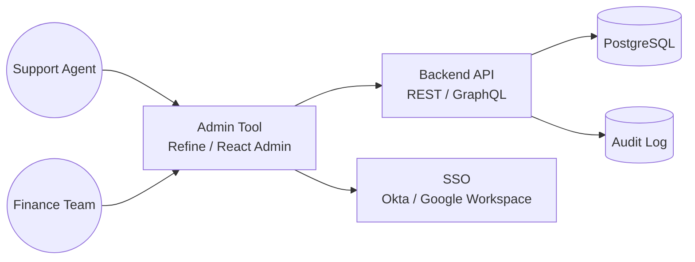
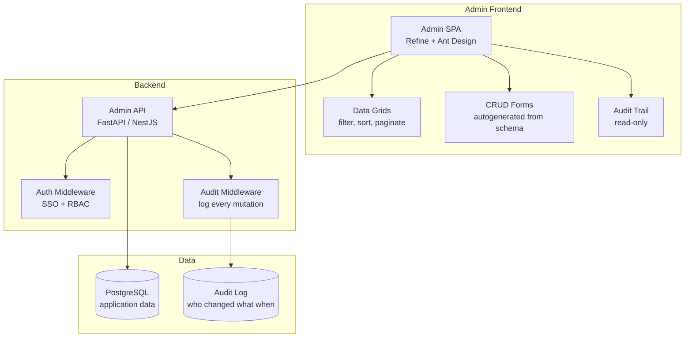

# Pattern: Internal Admin / Back-office Tool

!!! info "Quick facts"
    - **Category:** Web & Mobile Applications
    - **Maturity:** Adopt
    - **Typical team size:** 1-3 engineers
    - **Typical timeline to MVP:** 2-6 weeks
    - **Last reviewed:** 2026-05-03 by Architecture Team

## 1. Context

**Use this pattern when:**

- Internal operations teams (support, finance, ops) need to view and edit application data without direct database access
- The product has grown to the point where non-engineers need tools to manage configuration, resolve support tickets, trigger workflows, or review fraud
- Building a basic CRUD admin interface on top of your existing backend API

**Do NOT use this pattern when:**

- The audience is external customers — build a proper product UI with full UX investment instead
- The data access requirements are so simple that a read-only Metabase dashboard suffices
- The admin UI needs highly custom workflows that go far beyond CRUD — at that point, invest in a bespoke application

## 2. Problem it solves

As a product matures, operations teams accumulate workarounds: SQL queries sent to engineers on Slack, CSV exports processed in spreadsheets, manual API calls via Postman. Every workaround introduces risk (SQL on production by a non-engineer), delays (waiting for engineering bandwidth), and error (manual data entry). An internal admin tool packages the safe, audited operations that non-engineers legitimately need into a UI they can use without engineering intervention.

## 3. Solution overview

### System context (C4 Level 1)

### Container view (C4 Level 2)

## 4. Technology stack

| Layer | Primary choice | Alternatives | Notes |
|---|---|---|---|
| Frontend framework | Refine (React) | React Admin, AdminJS, Retool | Refine generates data grids, filters, and forms from an API schema with minimal boilerplate; React Admin is equally capable with a longer track record |
| UI component library | Ant Design (bundled with Refine) | Material UI, Mantine | Ant Design ships the dense, data-heavy components (tables, date pickers, tree selects) that admin UIs need |
| Backend | Existing application API (add admin endpoints) | Dedicated admin service | Reuse the existing NestJS/FastAPI service; add admin-only routes behind a role check rather than deploying a separate service |
| Authentication | SSO via Okta / Google Workspace (SAML or OIDC) | Auth0, Keycloak | Never build username/password auth for internal tools; SSO with your identity provider gives you automatic de-provisioning when employees leave |
| Authorisation | Role-based (RBAC) — roles defined per team | Attribute-based (ABAC) | Start with 3-4 roles (viewer, editor, support, admin); add field-level restrictions only when needed |
| Audit log | Immutable append-only Postgres table (`who`, `what`, `when`, `before`, `after`) | Dedicated audit service | Capture every mutation at the middleware layer; never let a mutation go unlogged in an admin tool |
| Hosting | Internal VPN-only or IP-allowlisted deployment | Cloudflare Access | Admin tools must not be public; put them behind a VPN or Cloudflare Access zero-trust policy |

## 5. Non-functional characteristics

| Concern | Profile |
|---|---|
| **Scalability** | Internal tools serve tens to hundreds of users, not millions. Scaling is not a concern — a single application instance with a read replica for expensive queries is sufficient for most admin tools. |
| **Availability target** | 99.5% — internal tool downtime is inconvenient, not a customer-facing incident. A brief outage means ops teams use a workaround for an hour; acceptable. |
| **Latency target** | p95 < 2 s for data grid loads with reasonable result sets. Admin users tolerate more latency than product users. Add pagination and filters before optimising queries. |
| **Security posture** | This is the highest-risk surface in most applications — admin tools have elevated privileges over production data. Mitigations: SSO with MFA enforced, IP allowlist or VPN-only, RBAC on every endpoint, immutable audit log, no bulk delete endpoints without two-factor confirmation, no plain SQL input fields. |
| **Data residency** | Admin tools access production data — same residency requirements as the main application. Do not create a separate data store for admin; read from the main database via a read replica. |
| **Compliance fit** | SOC 2 ✓ — the audit log is a key evidence artefact. GDPR: admin access to personal data must be logged and access controlled; support agents should see pseudonymised data unless a specific support reason justifies full PII access. HIPAA: PHI access in an admin tool requires the same controls as the main application. |

## 6. Cost ballpark

Internal tools are low-traffic; infrastructure costs are negligible.

| Scale | Internal users | Monthly cost | Cost drivers |
|---|---|---|---|
| Small | < 20 | $20 - $100 | Shared application server, read replica, SSO included in existing IdP |
| Medium | 20 - 200 | $100 - $500 | Dedicated small ECS task, read replica, Retool licence if commercial tool chosen |
| Large | 200+ | $300 - $2,000 | Larger read replica, Retool Enterprise or custom build, dedicated ops tooling |

## 7. LLM-assisted development fit

| Aspect | Rating | Notes |
|---|---|---|
| Refine / React Admin data grid and form scaffolding | ★★★★★ | Excellent — these frameworks are well-represented; generate page layouts from a resource definition. |
| RBAC middleware implementation | ★★★★ | Good; verify that role checks are applied at the API layer, not just the UI. |
| Audit log middleware | ★★★★ | Generates correct before/after capture; verify that all mutation paths (bulk updates, cascade deletes) are covered. |
| SSO/OIDC integration | ★★★★ | Standard OAuth2 PKCE flows generate cleanly; test token refresh and session expiry paths manually. |
| Architecture decisions | ★ | Don't outsource. Use ADRs. |

**Recommended workflow:** Start with read-only views for the top 5 support queries. Add write operations only after observing how support agents use read-only data. Every write endpoint added to an admin tool must have a corresponding audit log entry and a product/operations sign-off.

## 8. Reference implementations

- **Public reference:** [refinedev/refine](https://github.com/refinedev/refine) — open-source React framework for admin panels and internal tools; integrates with REST, GraphQL, and Supabase; extensive examples in `examples/` (200 OK ✓)
- **Public reference:** [marmelab/react-admin](https://github.com/marmelab/react-admin) — mature open-source admin framework with extensive data provider adapters and a large component library (200 OK ✓)
- **Internal case study:** _Add your anonymised internal example here_

## 9. Related decisions (ADRs)

- _No ADRs recorded yet. Candidate: Refine vs React Admin vs Retool for the admin framework._

## 10. Known risks & gotchas

- **Admin tool becomes a public endpoint** — the admin UI is deployed to a public URL without VPN or IP restriction; a credential stuffing attack compromises a support agent account. Mitigation: never expose an admin tool to the public internet; use Cloudflare Access or a corporate VPN as the outermost layer; enforce MFA on all SSO accounts.
- **Bulk operations bypass the audit log** — a "bulk delete" button calls a DB query directly, bypassing the middleware that logs mutations. Mitigation: route every mutation through the audited API layer; never add direct DB access in admin frontend code; add an integration test that verifies every mutation type creates an audit record.
- **RBAC enforced only in the UI** — a viewer role user is blocked by the UI from seeing a field, but the API endpoint returns it anyway. Mitigation: enforce RBAC at the API layer on every endpoint; treat the frontend RBAC as UX, not security.
- **Admin tool access not revoked when employees leave** — a former employee's SSO account is disabled but a service account token for the admin API remains valid. Mitigation: admin access must use short-lived SSO tokens only; no long-lived API keys for admin endpoints; audit active sessions quarterly.
- **Unbounded data grid query scans the full table** — a support agent searches for "all orders" without a filter on a 50M-row table; the query takes 5 minutes and impacts the read replica. Mitigation: require at least one indexed filter (date range, customer ID) before returning results; add a hard `LIMIT` on all admin list endpoints.
