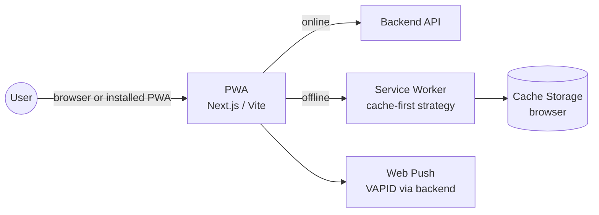
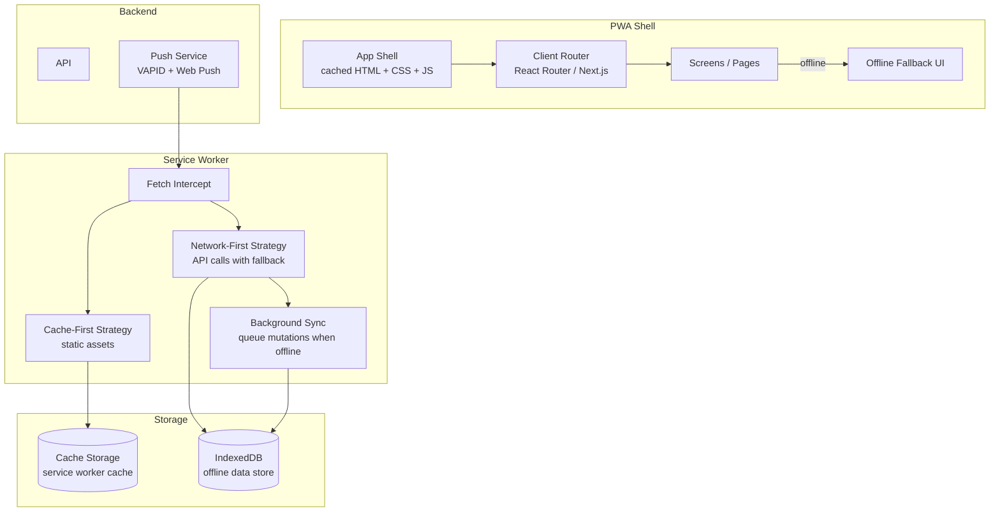

# Pattern: Progressive Web App (PWA)

!!! info "Quick facts"
    - **Category:** Web & Mobile Applications
    - **Maturity:** Trial
    - **Typical team size:** 1-3 engineers
    - **Typical timeline to MVP:** 4-8 weeks
    - **Last reviewed:** 2026-05-03 by Architecture Team

## 1. Context

**Use this pattern when:**

- You want users to install the app on their home screen without going through an app store, reducing distribution friction
- Offline or unreliable connectivity must be handled gracefully (field workers, low-connectivity markets)
- The app's functionality can be fully delivered through the web platform without deep native API access
- You want to maintain a single codebase that serves both browser and installable-app use cases

**Do NOT use this pattern when:**

- The app requires access to native APIs unavailable to the web platform: Bluetooth LE, NFC, advanced camera control, background audio, or system-level integrations — use a native or cross-platform app
- The primary distribution channel is the App Store / Google Play — PWAs are not listed in the App Store (iOS) and have limited discoverability in Google Play
- Users expect a fully native feel with platform-specific UI conventions — PWAs render in a browser engine and have visible constraints

## 2. Problem it solves

App stores add friction to distribution: users must find and install the app, permissions are requested upfront, and updates require store approval. A PWA is installed directly from the browser, updates silently in the background, works offline for cached content, and runs on any device with a modern browser — all from a single web codebase. This pattern captures the architectural decisions needed to make a web app reliably installable and offline-capable.

## 3. Solution overview

### System context (C4 Level 1)

### Container view (C4 Level 2)

## 4. Technology stack

| Layer | Primary choice | Alternatives | Notes |
|---|---|---|---|
| Web framework | Next.js + `next-pwa` plugin | Vite + Workbox, SvelteKit | Next.js for apps that need SSR/SSG; Vite + Workbox for pure SPA PWAs; SvelteKit has first-class PWA support |
| Service worker | Workbox (via `next-pwa` or `vite-plugin-pwa`) | Hand-written service worker | Workbox handles cache strategies, background sync, and update notifications; hand-rolling is error-prone |
| Cache strategy | Cache-first for static assets; Network-first with cache fallback for API calls | Stale-while-revalidate | Stale-while-revalidate for content that updates often but can show a cached version briefly |
| Offline data store | IndexedDB (via Dexie.js wrapper) | localStorage (< 5 MB, synchronous) | Dexie.js provides a clean async API over IndexedDB; localStorage is too small and blocks the main thread |
| Web Push | VAPID protocol + Web Push library (`web-push` npm) | Firebase Cloud Messaging (FCM) | VAPID is the open standard; FCM works for Android but requires the FCM SDK and is not available on iOS Safari < 16.4 |
| App manifest | `manifest.webmanifest` (auto-generated by Workbox) | Manual | Defines app name, icons, theme colour, `display: standalone` for installability |
| Hosting | Cloudflare Pages | Vercel, Netlify | Service workers require HTTPS; all major static hosts enforce it; Cloudflare Pages has no bandwidth fees |

## 5. Non-functional characteristics

| Concern | Profile |
|---|---|
| **Scalability** | Same as a static web app — served from CDN edge nodes with near-infinite scale. Backend API scales independently. |
| **Availability target** | Offline capability is the key resilience feature: cached content is available without any network. Define which routes are cached and what happens on a cache miss; never show a blank page. |
| **Latency target** | Installed PWA: first paint from cache in < 200 ms. Online mode: same as a standard web app (< 1.5 s LCP). Service worker install adds one additional network round-trip on the very first visit. |
| **Security posture** | Service workers require HTTPS (enforced by browsers). Service workers run on the same origin — a compromised SW can intercept all requests; keep SW code minimal, audited, and covered by CSP. Web Push requires explicit user permission; never request permission on first page load. |
| **Data residency** | Cached data lives in the user's browser (Cache Storage, IndexedDB). Be explicit about what is cached and for how long; sensitive data should not be stored in the service worker cache. |
| **Compliance fit** | GDPR: browser storage (IndexedDB, Cache Storage) may be considered "local processing" rather than data transfer; consult legal for sensitive data types. iOS Safari added Web Push support in iOS 16.4 (2023) — users on older iOS do not receive push notifications; design for this gracefully. |

## 6. Cost ballpark

PWAs have near-zero incremental infrastructure cost over a standard web app.

| Scale | MAU | Monthly cost | Cost drivers |
|---|---|---|---|
| Small | < 50,000 | $0 - $50 | Cloudflare Pages free tier handles most small PWAs |
| Medium | 50k - 1M | $50 - $500 | CDN bandwidth, Web Push notification service (e.g., OneSignal) |
| Large | 1M+ | $300 - $3,000 | CDN, push notification volume, analytics |

## 7. LLM-assisted development fit

| Aspect | Rating | Notes |
|---|---|---|
| Workbox configuration and cache strategy setup | ★★★★ | Good — Workbox patterns are well-documented and represented; test cache behaviour with Chrome DevTools offline mode. |
| Service worker fetch handler and background sync | ★★★ | Understands the patterns; edge cases in background sync (retry logic, conflict resolution) need manual testing. |
| Web Push VAPID implementation | ★★★★ | Good; test on both iOS Safari 16.4+ and Android Chrome to verify cross-platform delivery. |
| `manifest.webmanifest` and installability criteria | ★★★★★ | Excellent — straightforward JSON; Lighthouse audits confirm completeness. |
| Architecture decisions | ★ | Don't outsource. Use ADRs. |

**Recommended workflow:** Build the web app first, then add PWA capabilities (manifest, service worker, offline fallback) as a distinct phase. Use Lighthouse in Chrome DevTools to validate PWA criteria before launch. Test the install flow on a real iOS device and a real Android device — simulators hide critical differences.

## 8. Reference implementations

- **Public reference:** [GoogleChrome/workbox](https://github.com/GoogleChrome/workbox) — the Workbox library underpinning most modern PWA service workers; `packages/` shows every cache strategy with test coverage (200 OK ✓)
- **Internal case study:** _Add your anonymised internal example here_

## 9. Related decisions (ADRs)

- _No ADRs recorded yet. Candidate: PWA vs cross-platform native app (React Native/Flutter) for a given project — the decision framework depends on offline requirements and native API needs._

## 10. Known risks & gotchas

- **iOS Safari PWA limitations are significant** — as of 2026, iOS Safari PWAs lack support for some Web Push features and have stricter storage eviction policies than Chrome. Mitigation: test every feature explicitly on iOS Safari; document which features are iOS-only limited; consider graceful degradation messaging for iOS users.
- **Service worker update not applied until all tabs are closed** — a user with 3 tabs open receives a SW update; the old version serves cached content indefinitely until all tabs are closed. Mitigation: implement the `skipWaiting` + `clients.claim` pattern; show a "new version available — refresh" banner using the SW `waiting` event.
- **Stale cache serves outdated critical content** — a product price or safety notice is updated on the server; users with a cached version see old data. Mitigation: use network-first (not cache-first) for API responses and critical content; only use cache-first for versioned static assets (JS, CSS, fonts) that change URLs on each build.
- **Offline mutations lost on cache eviction** — background sync queues a mutation to IndexedDB; the browser evicts the storage under memory pressure; the user's data is lost silently. Mitigation: implement a server-side sync confirmation; notify users explicitly when a mutation was queued vs. confirmed.
- **Push permission prompt at the wrong time destroys opt-in rate** — requesting Web Push permission on the first page load results in < 5% opt-in; users dismiss without context. Mitigation: request push permission only after the user has completed a meaningful action that demonstrates value (first order placed, first document saved); explain the benefit in a pre-permission dialogue.
