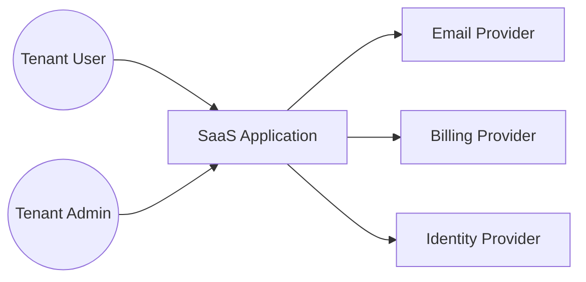
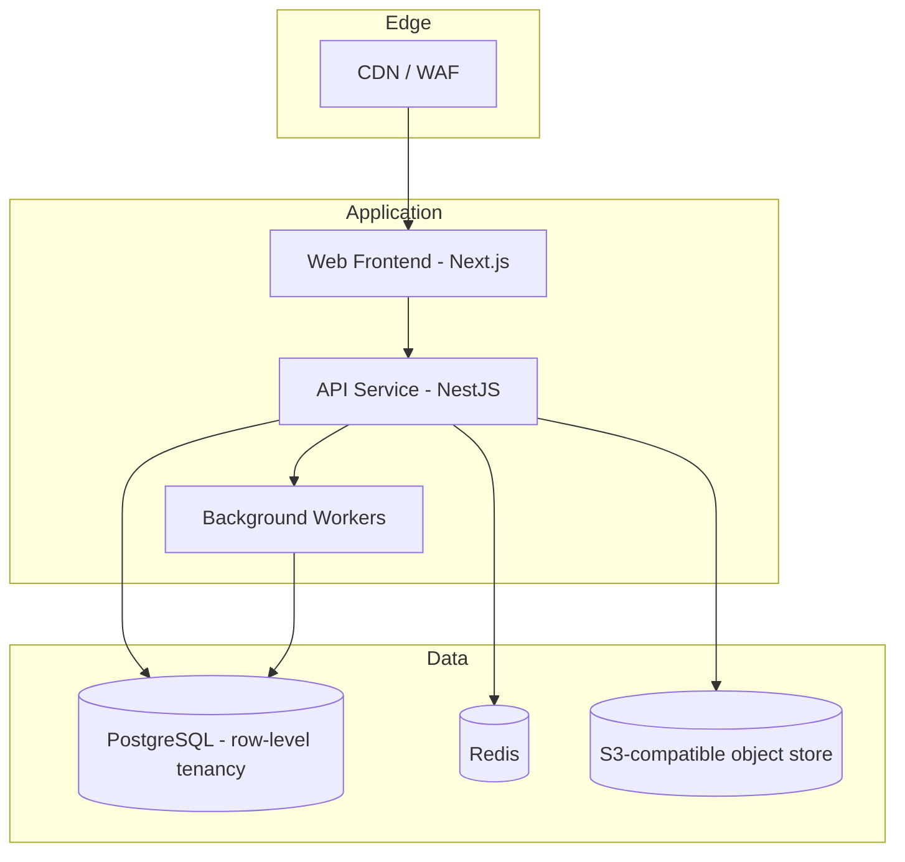

# Pattern: SaaS Multi-Tenant Web Application

!!! info "Quick facts"
    - **Category:** Web & Mobile Applications
    - **Maturity:** Adopt
    - **Typical team size:** 3-8 engineers
    - **Typical timeline to MVP:** 10-16 weeks
    - **Last reviewed:** 2026-05-02 by Architecture Team

## 1. Context

**Use this pattern when:**

- Building a B2B subscription product where many customer organisations share infrastructure
- Each customer needs logical data isolation but not physical separation
- The product has standard SaaS concerns: signup, billing, role-based access, audit logging
- You expect to scale from 10 to 10,000+ tenants without re-architecting

**Do NOT use this pattern when:**

- A single customer requires a dedicated, isolated deployment (use single-tenant deployment pattern instead)
- Strict data residency rules per tenant make shared infrastructure non-viable
- The product is primarily consumer (B2C) — the multi-tenant overhead is wasted

## 2. Problem it solves

Customers want a turnkey SaaS product with their own users, data, and configuration, and they want it instantly. The vendor wants to serve all of them from a single codebase and shared infrastructure to keep margins healthy. This pattern reconciles those two goals.

## 3. Solution overview

### System context (C4 Level 1)

### Container view (C4 Level 2)

## 4. Technology stack

| Layer | Primary choice | Alternatives | Notes |
|---|---|---|---|
| Frontend | Next.js (React) | Remix, SvelteKit, Nuxt | Server components reduce client bundle; great LLM support |
| Backend | NestJS (Node) | FastAPI (Python), Spring Boot (Java), Rails | NestJS gives structure without ceremony |
| Database | PostgreSQL | MySQL, CockroachDB | Row-level security (RLS) provides tenant isolation |
| Cache | Redis | Dragonfly, KeyDB | Session, rate limiting, queue backend |
| Background jobs | BullMQ on Redis | Temporal, Sidekiq, Celery | Use Temporal if workflows get complex |
| Auth | Clerk or Auth0 | Cognito, Keycloak, Supabase Auth | Buy, don't build, unless you have a hard reason |
| Billing | Stripe Billing | Paddle, Lago | Paddle handles tax/MoR for global B2B |
| Email | Postmark (transactional), Resend | SendGrid, SES | Separate transactional from marketing |
| File storage | AWS S3 | Cloudflare R2, Backblaze B2 | R2 has zero egress fees |
| Hosting | AWS ECS Fargate | Fly.io, Railway, Vercel + Render | Fargate is the boring-but-safe choice |
| CDN / WAF | Cloudflare | AWS CloudFront, Fastly | Cloudflare is cheapest for most workloads |
| CI/CD | GitHub Actions | GitLab CI, CircleCI | |
| Observability | Datadog | Grafana Cloud, New Relic, Honeycomb | Honeycomb if event-heavy debugging matters |
| Error tracking | Sentry | Bugsnag, Rollbar | |
| Feature flags | LaunchDarkly | PostHog, Unleash, Flagsmith | PostHog if you also want product analytics |
| Search | PostgreSQL full-text → Meilisearch → Elasticsearch | Typesense, Algolia | Don't reach for Elasticsearch on day one |

## 5. Non-functional characteristics

| Concern | Profile |
|---|---|
| **Scalability** | Horizontal app tier; vertical-then-shard for the database. Comfortable to ~10,000 tenants on a single Postgres before needing per-tenant sharding. |
| **Availability target** | 99.9% (typical SaaS SLO). Multi-AZ deployment, no multi-region by default. |
| **Latency target** | p95 < 400ms for read APIs, < 800ms for writes. |
| **Security posture** | OAuth2/OIDC, OWASP Top 10 controls, WAF, encrypted at rest and in transit, row-level security for tenant isolation, regular pen tests. |
| **Data residency** | Region-pinnable per environment. True per-tenant residency requires the single-tenant deployment pattern. |
| **Compliance fit** | GDPR ✓, SOC 2 Type II ✓ (achievable in 6-9 months), HIPAA ✓ with BAA on infrastructure providers, PCI-DSS via Stripe (no card data touches your stack). |

## 6. Cost ballpark

Indicative monthly USD cost. Real costs vary heavily with traffic patterns, regional pricing, and reserved-capacity discounts.

| Scale | Tenants | Monthly cost | Cost drivers |
|---|---|---|---|
| Small | 1-50 | $200 - $600 | Mostly fixed: 1 small DB, 2 app instances, observability free tiers |
| Medium | 50-500 | $1,500 - $5,000 | DB sizing, observability volume, support of multiple environments |
| Large | 500-5,000 | $8,000 - $30,000 | DB scaling, multi-AZ, full observability, dedicated security tooling |

## 7. LLM-assisted development fit

| Aspect | Rating | Notes |
|---|---|---|
| Boilerplate (CRUD, forms, auth flows) | ★★★★★ | Excellent. Generate scaffolds, then review. |
| Test scaffolding | ★★★★ | Great starting point; verify edge cases by hand. |
| Tenant isolation logic | ★★ | Risky — easy for the LLM to forget RLS or tenant filters. Always pair-review. |
| Migrations | ★★★ | Generate the SQL, but humans should review every destructive migration. |
| Architecture decisions | ★ | Don't outsource. Use ADRs. |

**Recommended workflow:** Write a `spec.md` and feature-by-feature plan first (per Addy Osmani's playbook), then generate one component at a time with the LLM. Hand-write the tenant isolation layer.

## 8. Reference implementations

- **Public reference:** [SaaS Starter by Vercel](https://github.com/vercel/nextjs-subscription-payments) — Next.js + Stripe + Supabase
- **Public reference:** [Cal.com](https://github.com/calcom/cal.com) — large open-source multi-tenant SaaS; row-level tenancy, NestJS API, Next.js frontend
- **Public reference:** [boxyhq/saas-starter-kit](https://github.com/boxyhq/saas-starter-kit) — enterprise-focused SaaS starter with teams, SAML SSO, directory sync, and audit logs; good reference for the auth and access-control layer (200 OK ✓)
- **Internal case study:** _Add your anonymised internal example here_

## 9. Related decisions (ADRs)

- [ADR-0001: Tenant isolation strategy — row-level vs schema-per-tenant vs database-per-tenant](../../decisions/0001-tenant-isolation-strategy.md)

## 10. Known risks & gotchas

- **"Noisy neighbour" tenants** — One large tenant can starve others. Mitigation: per-tenant rate limits at the API gateway, query timeouts, and connection pool partitioning.
- **Migrations across millions of tenant rows** — Plan for online migrations from day one (e.g., `pg-online-schema-change`, batched backfills).
- **Forgotten tenant filter in a query** — The single most common multi-tenant security bug. Mitigation: row-level security in Postgres + a linter rule that flags queries on tenant tables without an explicit tenant filter.
- **Background jobs leaking across tenants** — Always include `tenantId` in the job payload and assert it in the worker.
- **Per-tenant observability** — Tag every log, metric, and trace with `tenantId` from day one. Retrofitting is painful.
