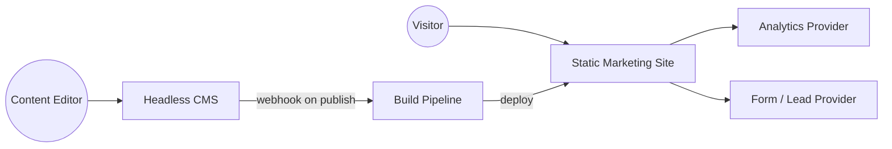
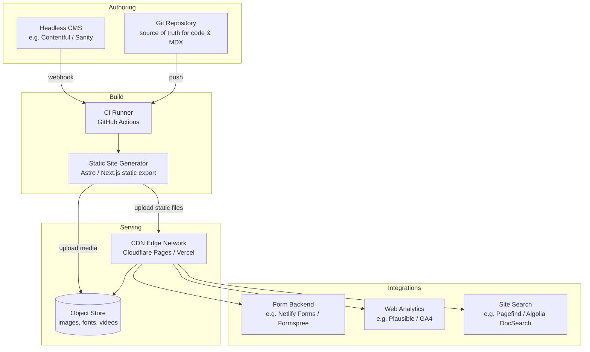

# Pattern: Static Marketing Site

!!! info "Quick facts"
    - **Category:** Web & Mobile Applications
    - **Maturity:** Adopt
    - **Typical team size:** 1-3 engineers
    - **Typical timeline to MVP:** 2-4 weeks
    - **Last reviewed:** 2026-05-02 by Architecture Team

## 1. Context

**Use this pattern when:**

- Building a brochure site, product landing page, or documentation portal where content changes infrequently (hours to days, not seconds)
- The primary goal is conversion, trust-building, or information delivery — not application behaviour
- Performance and SEO rank are first-class requirements
- The team is small or front-end-only, and you want to avoid owning a database and API surface

**Do NOT use this pattern when:**

- Pages are personalised per authenticated user (use the SaaS Multi-Tenant or Internal Admin pattern instead)
- Prices, availability, or inventory must reflect real-time state (the CDN cache makes this impractical)
- The site has heavy user-generated content that needs moderation workflows
- You are building a documentation site that ships with a complex product and must version tightly with it (consider docs-as-code inside a monorepo with dedicated tooling like Docusaurus or MkDocs)

## 2. Problem it solves

Marketing and content teams need to publish pages quickly, keep costs near zero, and rank well on search engines — without waiting for backend engineers to provision databases or manage servers. Meanwhile the engineering team wants the site to be fast globally, trivially scalable to any traffic spike (a viral moment, a Product Hunt launch), and cheap to operate. A static site built once at deploy time and served entirely from a CDN edge resolves all of these goals simultaneously.

## 3. Solution overview

### System context (C4 Level 1)

### Container view (C4 Level 2)

## 4. Technology stack

| Layer | Primary choice | Alternatives | Notes |
|---|---|---|---|
| Static site generator | Astro | Next.js (static export), SvelteKit, Eleventy, Hugo | Astro ships zero JS by default, ideal for content-heavy pages; Next.js if you already use it for a product |
| Styling | Tailwind CSS | CSS Modules, vanilla CSS | Tailwind is the boring-but-safe choice in 2026; pairs well with component libraries |
| Component library | shadcn/ui | Radix UI, Headless UI, Flowbite | shadcn/ui gives you owned, editable components rather than a locked-in dependency |
| Headless CMS | Contentful | Sanity, Storyblok, Prismic, Tina CMS | Contentful is the most mature; Sanity if you want real-time collab and a custom studio; skip entirely for pure-code sites |
| Hosting / CDN | Cloudflare Pages | Vercel, Netlify, AWS S3 + CloudFront | Cloudflare Pages has no bandwidth fees and free analytics; Vercel if the rest of the stack is already there |
| Forms | Formspree | Netlify Forms, Basin, custom API route | No backend needed; Netlify Forms only if you are also hosting on Netlify |
| Web analytics | Plausible | Fathom, Posthog, Google Analytics 4 | Plausible is GDPR-compliant out of the box; no cookie banner required |
| Site search | Pagefind | Algolia DocSearch (docs only), Orama | Pagefind runs entirely at build time — zero runtime cost, zero backend |
| Image optimisation | Astro Image / `<Image>` | Cloudflare Images, Imgix | Built-in to Astro; externalise only if media library is very large |
| CI/CD | GitHub Actions | GitLab CI, Cloudflare Pages built-in | Built-in Cloudflare/Vercel CI is fine for simple sites; GitHub Actions gives more control |
| Error tracking | Sentry (browser) | Highlight.io | Optional for pure static sites; add if you have interactive JS islands |
| A/B testing | Cloudflare Zaraz + Edge config | Vercel Edge Config, Optimizely | Keep experiments at the edge to avoid layout shift; avoid client-side flicker |

## 5. Non-functional characteristics

| Concern | Profile |
|---|---|
| **Scalability** | Effectively infinite at the CDN layer — no origin server to saturate. A Product Hunt or Hacker News spike costs nothing extra on Cloudflare Pages. |
| **Availability target** | 99.99%+ passively, because there is no stateful origin to go down. All availability risk shifts to the CDN provider and the build pipeline. |
| **Latency target** | p95 < 50ms TTFB globally from CDN edge. First Contentful Paint < 1.2s on a 4G mobile connection is achievable with Astro defaults. |
| **Security posture** | No server-side attack surface by definition. Risks shift to: supply-chain (npm), form endpoints (spam, injection), and CMS credentials. Apply CSP headers, Subresource Integrity on third-party scripts, and bot protection on forms. |
| **Data residency** | Content is replicated globally to CDN edges by design. If content is sensitive enough to restrict by geography, this pattern is the wrong choice. |
| **Compliance fit** | GDPR ✓ (Plausible avoids cookie consent entirely), CCPA ✓, SOC 2 N/A (no data processed), PCI-DSS N/A (no payment data on the static layer — use a Stripe-hosted checkout link instead). |

## 6. Cost ballpark

Indicative monthly USD cost. Static sites are among the cheapest architectures to run; the floor is essentially zero.

| Scale | Monthly visitors | Monthly cost | Cost drivers |
|---|---|---|---|
| Small | < 50k | $0 - $20 | Cloudflare Pages free tier covers most small sites; cost only from paid CMS or analytics plan |
| Medium | 50k - 1M | $20 - $150 | CMS content seats, analytics data retention, image optimisation volume |
| Large | 1M - 10M | $100 - $500 | CMS API call volume, media egress if not on Cloudflare, A/B testing platform |

## 7. LLM-assisted development fit

| Aspect | Rating | Notes |
|---|---|---|
| Page and component scaffolding | ★★★★★ | Excellent. Astro and Tailwind are heavily represented in training data; generate full page layouts confidently. |
| MDX / content authoring | ★★★★★ | LLMs are excellent at writing and reformatting Markdown-heavy content pages. |
| CMS schema design | ★★★ | Good starting point; review field types and validation rules manually — CMS schemas are hard to migrate after content is in. |
| Accessibility (WCAG) | ★★★ | Generates correct semantic HTML and ARIA attributes most of the time; always audit with axe or Lighthouse. |
| Performance optimisation | ★★★ | Knows Core Web Vitals principles well; recommendations are correct but sometimes outdated on framework-specific APIs. |
| Architecture decisions | ★ | Don't outsource. Use ADRs. |

**Recommended workflow:** Scaffold pages and components with the LLM, then run Lighthouse CI in the build pipeline to catch regressions automatically. Write CMS content models by hand after sketching them with the LLM.

## 8. Reference implementations

- **Public reference:** [Astro Starter Blog](https://github.com/withastro/astro/tree/main/examples/blog) — minimal Astro site with Markdown content
- **Public reference:** [Leerob.io](https://github.com/leerob/leerob.io) — personal site using Next.js static export, widely referenced
- **Public reference:** [Cloudflare Pages deployment guide](https://developers.cloudflare.com/pages/framework-guides/deploy-an-astro-site/) — official Astro + Cloudflare Pages walkthrough
- **Internal case study:** _Add your anonymised internal example here_

## 9. Related decisions (ADRs)

- _No ADRs recorded yet. Candidates: choice of SSG framework, CMS vendor selection, CDN provider._

## 10. Known risks & gotchas

- **Build time explodes as content grows** — At tens of thousands of pages, full rebuilds become slow (minutes, not seconds). Mitigation: enable incremental/on-demand builds (Astro's `output: 'hybrid'`, Next.js ISR) so only changed pages are rebuilt on a CMS publish event.
- **Cache invalidation on urgent content changes** — A retraction or correction may take minutes to propagate to all CDN edge nodes. Mitigation: use Cloudflare's Cache Purge API or Vercel's on-demand ISR in your CMS webhook, and document the SLA for editors.
- **Form spam without a backend** — Formspree and similar services are targetted by bots. Mitigation: add hCaptcha or Cloudflare Turnstile; never use honeypot fields alone.
- **Third-party script performance creep** — Marketing teams add chat widgets, analytics pixels, and tag managers over time. Each one can erase your Lighthouse score. Mitigation: enforce a Content Security Policy and gate new script additions through a pull-request review; use Cloudflare Zaraz to load third-party scripts server-side.
- **CMS vendor lock-in** — Migrating tens of thousands of structured content entries between CMS vendors is painful. Mitigation: keep a thin content adapter layer in the codebase so the SSG is not coupled directly to the CMS API shape.
- **Broken links after URL restructuring** — Marketing teams frequently want to rename slugs. Mitigation: maintain a `_redirects` file (supported natively by Cloudflare Pages and Netlify) and run a broken-link checker in CI.
