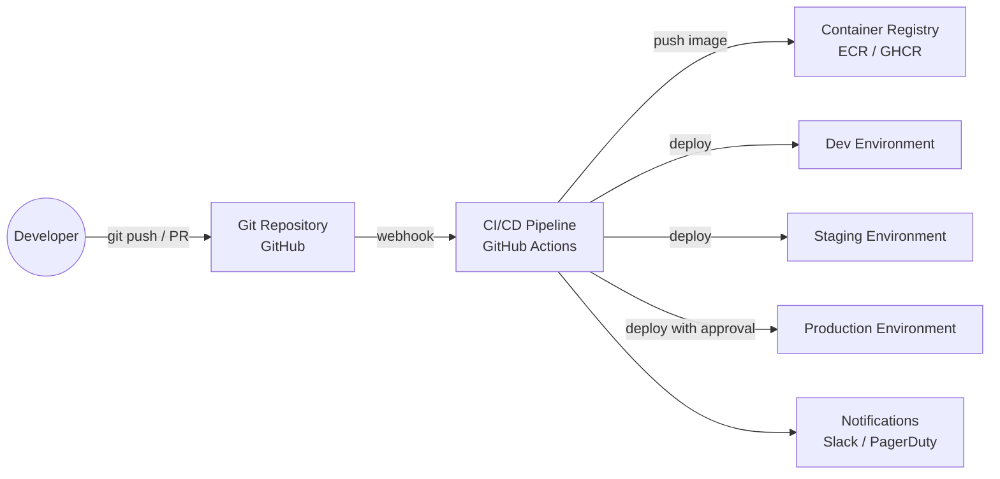
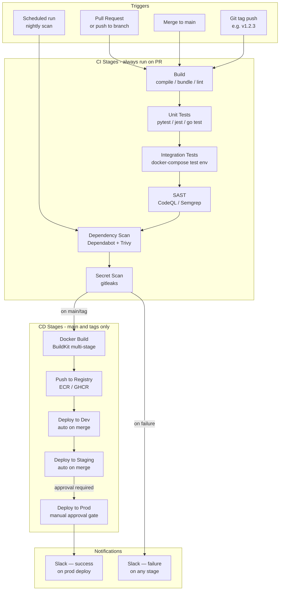

# Pattern: CI/CD Pipeline

!!! info "Quick facts"
    - **Category:** Scripts & Automation
    - **Maturity:** Adopt
    - **Typical team size:** 1-2 engineers (to build), whole engineering team (to consume)
    - **Typical timeline to MVP:** 1-2 weeks
    - **Last reviewed:** 2026-05-02 by Architecture Team

## 1. Context

**Use this pattern when:**

- Automating the build, test, security scanning, and deployment of any software project
- You want every merge to `main` to be deployable (or deployed) without manual steps
- The team has more than one engineer — at that point, manual deploy coordination becomes a bottleneck and a source of incidents

**Do NOT use this pattern when:**

- The "deployment" is publishing a static artifact (Python package, npm package) with no infrastructure changes — the pipeline still applies, but the deploy stage simplifies to a registry publish
- You need complex stateful workflows with human approval, compensation, and retries across days — that is an orchestrated workflow (Temporal, Step Functions), not a CI/CD pipeline
- You are in a highly regulated environment where the deployment tool must produce a tamper-evident audit trail with hardware attestation — evaluate specialised release tooling (e.g., SLSA Level 3 build systems)

## 2. Problem it solves

Without automation, deployments are artisanal: engineers SSH into servers, run scripts from memory, and skip steps when under pressure. Bugs that automated tests would catch reach production. Security patches sit undeployed for weeks. A CI/CD pipeline makes every change go through the same repeatable gates — build, test, scan, package, deploy — and creates an audit trail of exactly what was deployed, when, and by whom.

## 3. Solution overview

### System context (C4 Level 1)

### Container view (C4 Level 2)

## 4. Technology stack

| Layer | Primary choice | Alternatives | Notes |
|---|---|---|---|
| CI/CD platform | GitHub Actions | GitLab CI, CircleCI, Buildkite, Jenkins | GitHub Actions if code is on GitHub; Buildkite for large self-hosted fleets needing fine-grained billing; avoid Jenkins for new projects |
| Container build | Docker with BuildKit | Podman, Kaniko | BuildKit enables layer caching, multi-platform builds, and `--secret` mount; Kaniko for building inside Kubernetes without a Docker daemon |
| Container registry | AWS ECR | GitHub Container Registry (GHCR), Docker Hub | ECR if deploying to AWS; GHCR is free for public repos and integrates natively with Actions; Docker Hub rate-limits unauthenticated pulls |
| Cloud credentials | OIDC (federated identity) | Long-lived AWS access keys as secrets | OIDC lets GitHub Actions assume an IAM role without storing long-lived credentials; set this up first — retrofitting is painful |
| Dependency scanning | Dependabot + Trivy | Snyk, Grype, Renovate | Dependabot for automated PR updates; Trivy for container image CVE scanning in the pipeline; Renovate for monorepos or non-GitHub hosts |
| SAST | CodeQL | Semgrep, SonarQube | CodeQL is free for public repos and covers most languages; Semgrep for custom organisation-specific rules |
| Secrets scanning | gitleaks | TruffleHog, GitHub Secret Scanning | Run gitleaks on every push — pre-commit hook and CI; GitHub Secret Scanning catches pushed secrets but only after the fact |
| Deployment target | AWS ECS (rolling update) or Lambda | Kubernetes + kubectl, AWS CodeDeploy, Heroku | Rolling update on ECS is the simplest zero-downtime deploy; ArgoCD if the org has Kubernetes and wants GitOps |
| Notifications | Slack (GitHub Actions webhook step) | PagerDuty, email, Microsoft Teams | Notify on every production deploy success and on any pipeline failure |

## 5. Non-functional characteristics

| Concern | Profile |
|---|---|
| **Scalability** | GitHub Actions scales runners on demand (GitHub-hosted) or requires fleet management (self-hosted). GitHub-hosted runners handle most workloads; add self-hosted runners only when build times exceed 20 minutes or costs become significant. |
| **Availability target** | The pipeline is a critical path for deploying fixes. GitHub Actions has a 99.9% SLA. Mitigation for downtime: keep a documented manual deploy runbook; the pipeline should be a convenience, not the only path to production. |
| **Latency target** | PR feedback in under 10 minutes is the target for developer experience. Parallelise independent stages (unit tests, SAST, dep scan) rather than running them sequentially. Cache pip/npm/cargo dependencies between runs. |
| **Security posture** | Use OIDC for cloud credentials. Pin third-party Actions to a commit SHA, not a mutable tag (`uses: actions/checkout@v4` is `@<SHA>` under the hood — prefer the SHA). Restrict `GITHUB_TOKEN` permissions at the workflow level. Never print secrets in logs; use `::add-mask::` for dynamic secrets. |
| **Data residency** | GitHub-hosted runners execute in Azure datacenters; ensure this is acceptable for your data classification. For sensitive workloads, use self-hosted runners inside your VPC. |
| **Compliance fit** | SOC 2 ✓ — pipeline creates an immutable audit trail of every deploy. GDPR: ensure build logs do not contain PII (test data, error messages with real user data). PCI-DSS: the pipeline must not have access to production card data; use environment isolation. |

## 6. Cost ballpark

Indicative monthly USD cost. GitHub-hosted runner minutes are the main variable; free tier is generous for small teams.

| Scale | Pipeline runs / month | Monthly cost | Cost drivers |
|---|---|---|---|
| Small | < 1,000 | $0 - $20 | GitHub free tier (2,000 min/month for public; 500 for private); ECR storage |
| Medium | 1,000 - 10,000 | $50 - $300 | GitHub Actions minutes overage, ECR data transfer, self-hosted runner EC2 if used |
| Large | 10,000+ | $300 - $2,000 | Self-hosted runner fleet, artifact storage, Snyk or SonarQube commercial tier, multiple environment accounts |

## 7. LLM-assisted development fit

| Aspect | Rating | Notes |
|---|---|---|
| Workflow YAML scaffolding | ★★★★★ | Excellent — GitHub Actions syntax and common job patterns are very well-represented. Generate a full workflow from a description of stages. |
| Security scanning integration | ★★★★ | Correctly wires up CodeQL, Trivy, and gitleaks; always review the permissions granted to each step. |
| Docker multi-stage build files | ★★★★ | Generates efficient multi-stage Dockerfiles; verify the final stage does not include build tools or development dependencies. |
| Secret management and OIDC setup | ★★★ | Knows the concept; OIDC trust policy JSON and IAM role ARN wiring require careful manual review — mistakes here create privilege escalation paths. |
| Architecture decisions | ★ | Don't outsource — platform choice, runner strategy, and approval gate design have long-term team-wide consequences. Use ADRs. |

**Recommended workflow:** Generate the workflow YAML and Dockerfile with the LLM, then manually audit every `permissions:` block and every third-party Action used. Pin Actions to commit SHAs before merging. Add the `gitleaks` scan first — it's the fastest return on investment.

## 8. Reference implementations

- **Public reference:** [actions/starter-workflows](https://github.com/actions/starter-workflows) — official GitHub Actions starter templates for dozens of languages and deployment targets
- **Public reference:** [docker/build-push-action](https://github.com/docker/build-push-action) — canonical Action for BuildKit image builds with cache and multi-platform support
- **Public reference:** [trufflesecurity/trufflehog](https://github.com/trufflesecurity/trufflehog) and [gitleaks/gitleaks](https://github.com/gitleaks/gitleaks) — the two leading open-source secret scanners, both with GitHub Actions integrations
- **Internal case study:** _Add your anonymised internal example here_

## 9. Related decisions (ADRs)

- _No ADRs recorded yet. Candidates: self-hosted vs GitHub-hosted runners, ArgoCD GitOps vs Actions-push deploys, monorepo pipeline strategy._

## 10. Known risks & gotchas

- **Mutable Action tags create supply-chain risk** — `uses: some-org/some-action@v3` resolves to whatever commit that tag points to today, which can change. A compromised Action maintainer can inject malicious code. Mitigation: pin all third-party Actions to a full commit SHA (`uses: actions/checkout@11bd71901bbe5b1630ceea73d27597364c9af683`); use Dependabot to keep SHAs up to date.
- **Long-lived AWS credentials in secrets are a liability** — Rotating them is manual and often forgotten; a leak compromises the account. Mitigation: set up OIDC federation on day one (`aws-actions/configure-aws-credentials` with `role-to-assume`); delete any existing long-lived access keys from CI.
- **Flaky integration tests slow down every PR** — A test that fails intermittently trains developers to re-run pipelines rather than investigate, and hides real failures. Mitigation: quarantine flaky tests immediately into a separate job with a `continue-on-error: true` flag and a tracking issue; fix or delete within one sprint.
- **Build cache invalidation causes silently stale artifacts** — A Docker layer cache hit may include a dependency that was patched for a CVE. Mitigation: run a full no-cache build on a nightly schedule (not just PR builds) and treat Trivy scan failures as pipeline failures.
- **Approval gates bypassed under incident pressure** — When production is on fire, engineers merge directly to bypass staging. Mitigation: require approval gates via GitHub Environments (not just convention) and document a formal break-glass procedure that still creates an audit trail (e.g., a required incident ticket number in the approval comment).
