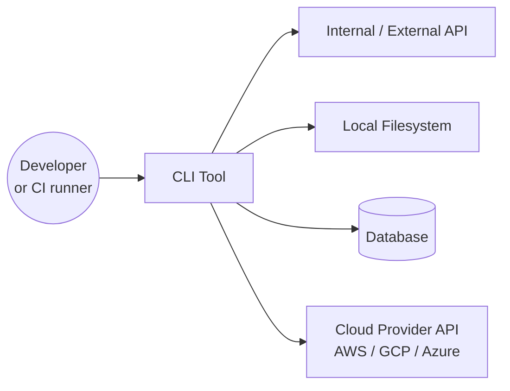
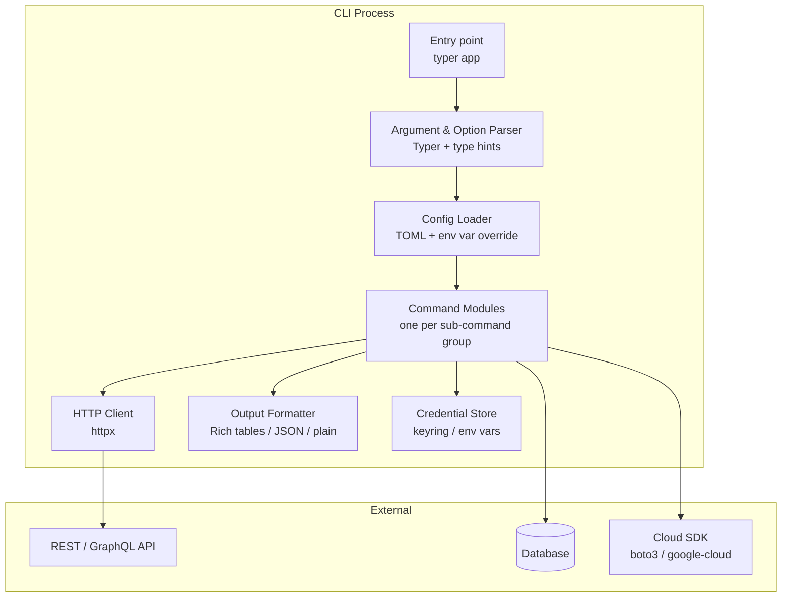

# Pattern: CLI Tool

!!! info "Quick facts"
    - **Category:** Scripts & Automation
    - **Maturity:** Adopt
    - **Typical team size:** 1-2 engineers
    - **Typical timeline to MVP:** 1-3 weeks
    - **Last reviewed:** 2026-05-02 by Architecture Team

## 1. Context

**Use this pattern when:**

- Building internal developer tooling, ops automation, or utilities that engineers run from a terminal
- The interaction model is command-driven (verbs + flags), not a UI or long-running daemon
- The tool needs to be distributed to teammates or CI environments, not just run locally by the author

**Do NOT use this pattern when:**

- The operation takes more than a few minutes and needs background execution — wrap it in a scheduled job or serverless function instead
- The primary audience is non-technical users who need a GUI
- The tool needs to maintain long-running state or listen for events — that is a service, not a CLI tool
- You only need to run the script once — write a plain script, not a packaged CLI

## 2. Problem it solves

Engineering teams accumulate repetitive manual operations: rotating credentials, triggering deployments, querying internal systems, seeding test data. Each of these starts as a README step, becomes a Bash one-liner, then grows until nobody trusts it. A properly packaged CLI tool gives the operation a stable interface, a help system, testable code, and a version history — so the team can confidently hand it to a new hire on day one.

## 3. Solution overview

### System context (C4 Level 1)

### Container view (C4 Level 2)

## 4. Technology stack

| Layer | Primary choice | Alternatives | Notes |
|---|---|---|---|
| Language | Python 3.12+ with uv | Go, Rust | Python for tools used by Python teams with rich library dependencies; Go or Rust when distributing a single binary to machines without Python — see [ADR-0002](../../decisions/0002-default-scripting-language.md) |
| Argument parsing | Typer | Click, argparse | Typer is Click with type annotations; auto-generates `--help` from type hints; argparse is stdlib but verbose for sub-commands |
| Configuration | tomllib (stdlib) + python-dotenv | pydantic-settings, Dynaconf | tomllib (Python 3.11+) for file config; dotenv for environment overrides; pydantic-settings if you need validation and env-var casting |
| Terminal output | Rich | colorama, tabulate, termcolor | Rich renders tables, progress bars, and syntax-highlighted output with zero config; outputs plain text automatically when stdout is piped |
| HTTP client | httpx | requests | httpx for async-capable and HTTP/2 clients; requests is fine for simple sync scripts |
| Credential storage | keyring | Environment variables, `~/.netrc` | keyring uses the OS credential store (macOS Keychain, Windows DPAPI, SecretService on Linux); fall back to env vars in CI |
| Testing | pytest + Typer's `CliRunner` | unittest | Typer's `CliRunner` (inherited from Click) lets you invoke commands in-process without subprocess overhead |
| Packaging | uv build → PyPI or private index | Go `goreleaser` for binaries, Homebrew tap | uv can publish to PyPI; for internal tools, a private PyPI (AWS CodeArtifact or Nexus) avoids leaking tooling to the public index |
| CI/CD | GitHub Actions | GitLab CI | Lint (ruff), type-check (mypy), test, publish on tag push |

## 5. Non-functional characteristics

| Concern | Profile |
|---|---|
| **Scalability** | A CLI runs as a single process per invocation. There is no scalability dimension in the traditional sense — if a single invocation becomes slow, profile and optimise the bottleneck (usually a slow API call or large local file), or offload to a background job. |
| **Availability target** | Not a service. Availability = "the binary installs correctly and exits 0 on a valid invocation". Track this with a smoke test in CI. |
| **Latency target** | Cold start (import time) should be under 300ms for interactive tools. Avoid importing heavy libraries (pandas, boto3) at the top level; import inside the command function so unrelated sub-commands stay fast. |
| **Security posture** | Credentials must never be in command-line flags (they appear in `ps` output and shell history). Use `--password-stdin`, environment variables, or keyring. Log the command invoked (minus secrets) for audit purposes. Validate all inputs before passing to shell or SQL. |
| **Data residency** | CLI tools typically operate on data in transit between systems; they do not store data themselves. Ensure any temp files written to disk are cleaned up and respect local data handling policies. |
| **Compliance fit** | CLI tools are internal tooling; formal compliance certifications rarely apply. Exception: tools that access PII or production databases should log invocations for SOC 2 audit trails. |

## 6. Cost ballpark

CLI tools have near-zero infrastructure cost — they run on the developer's machine or in a CI runner.

| Scale | Users | Monthly cost | Cost drivers |
|---|---|---|---|
| Small | 1-10 internal users | $0 - $10 | GitHub Actions CI minutes; no infrastructure |
| Medium | 10-100 users, private package index | $10 - $100 | AWS CodeArtifact or Nexus private registry; CI compute |
| Large | 100+ users, cross-team distribution | $50 - $300 | Private registry, code signing, multi-platform binary builds, documentation hosting |

## 7. LLM-assisted development fit

| Aspect | Rating | Notes |
|---|---|---|
| Command scaffolding and help text | ★★★★★ | Excellent — Typer / Click patterns are extremely well-represented. Generate a full sub-command skeleton from a spec. |
| Argument parsing and validation | ★★★★★ | Generates correct type annotations, validators, and `--help` strings reliably. |
| Output formatting with Rich | ★★★★ | Good; verify table column alignment and colour choices manually in a real terminal. |
| Error handling and user-facing messages | ★★★★ | Produces reasonable error messages; review for clarity with a non-expert user in mind. |
| Architecture decisions | ★ | Don't outsource — specifically the Python vs Go decision has real deployment consequences. Use ADRs. |

**Recommended workflow:** Write a `spec.md` listing every sub-command, its flags, and expected output format. Feed it to the LLM to generate the Typer skeleton, then fill in the business logic. Add a `CliRunner` test for every command's happy path before merging.

## 8. Reference implementations

- **Public reference:** [tiangolo/typer](https://github.com/tiangolo/typer) — Typer itself is the canonical reference; the `docs_src/` directory contains runnable examples for every feature
- **Public reference:** [pallets/click — examples](https://github.com/pallets/click/tree/main/examples) — Click examples including multi-command applications and complex option types
- **Public reference:** [cli/cli](https://github.com/cli/cli) — GitHub's own `gh` CLI, written in Go; excellent reference for Go-based CLI architecture with Cobra
- **Internal case study:** _Add your anonymised internal example here_

## 9. Related decisions (ADRs)

- [ADR-0002: Python as the default scripting language](../../decisions/0002-default-scripting-language.md)

## 10. Known risks & gotchas

- **Credentials leaking into shell history or process list** — A flag like `--api-key=secret` is visible in `ps aux` and persists in `~/.zsh_history`. Mitigation: never accept secrets as positional arguments or named flags; use `--token-stdin` (read from stdin), environment variables, or `keyring.get_password()`.
- **Import-time slowness makes the tool feel sluggish** — Importing `boto3`, `pandas`, or `google-cloud-*` at module level adds 300–800ms to every invocation, even for commands that do not use them. Mitigation: lazy-import heavy libraries inside the command function body, not at the top of the file.
- **Breaking changes in sub-command interfaces** — A renamed flag breaks teammates' shell aliases and CI scripts. Mitigation: treat the CLI interface as a public API; version it, publish a changelog, and keep the old flag as a deprecated alias for at least one release cycle.
- **Untested error paths produce confusing output** — LLM-generated code tends to re-raise raw exceptions, printing Python tracebacks to end users. Mitigation: catch known error types and print a human-readable message with `typer.echo(..., err=True)` and `raise typer.Exit(1)`; reserve raw tracebacks for a `--debug` flag.
- **Single-platform packaging** — A tool built on macOS with `uv build` may fail on Linux CI or on a Windows developer machine due to platform-specific dependencies. Mitigation: run `uv sync` + smoke tests in CI on all target platforms (matrix build); document supported platforms in the README.
