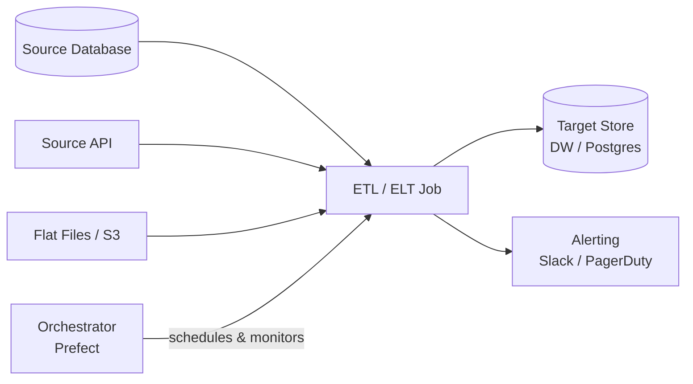
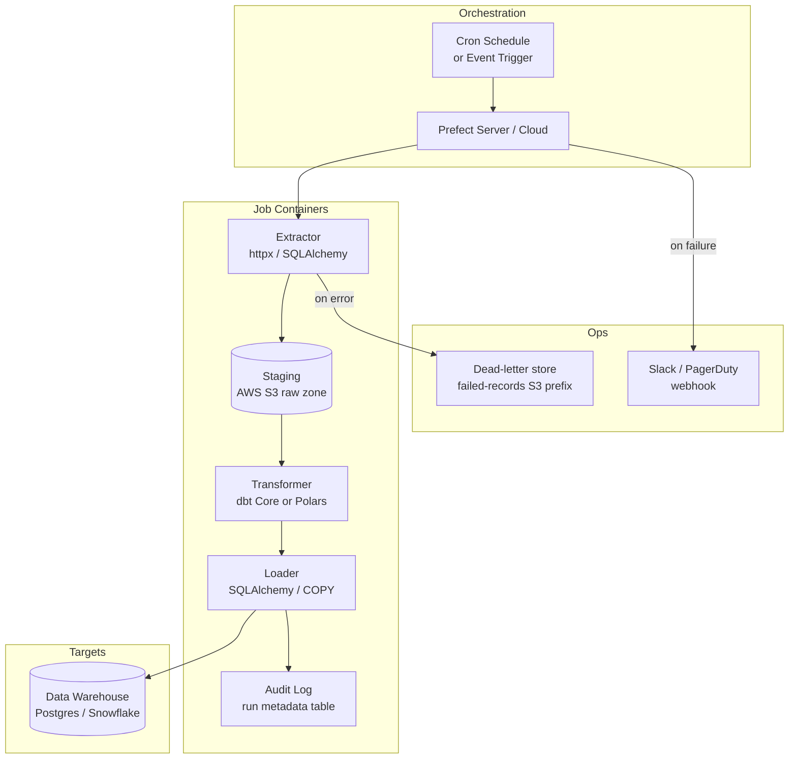

# Pattern: ETL/ELT Job

!!! info "Quick facts"
    - **Category:** Scripts & Automation
    - **Maturity:** Adopt
    - **Typical team size:** 1-3 engineers
    - **Typical timeline to MVP:** 2-4 weeks
    - **Last reviewed:** 2026-05-02 by Architecture Team

## 1. Context

**Use this pattern when:**

- Moving data from one or more source systems into a target store on a schedule or event trigger
- The data transformation can tolerate minutes to hours of latency (batch, not streaming)
- You need a repeatable, observable, and re-runnable data movement process
- Sources include databases, REST APIs, flat files, or cloud storage buckets

**Do NOT use this pattern when:**

- End-to-end latency must be under a few seconds — use a stream-processing pattern (Kafka + Flink/Spark Streaming) instead
- The "transformation" is actually a complex business workflow with human approval steps — use an orchestrated workflow pattern with Temporal
- The source system offers a native CDC (Change Data Capture) stream that you can consume directly without polling

## 2. Problem it solves

Operational data lives in transactional systems optimised for writes, not analysis. Analytical queries on a live OLTP database degrade user-facing performance, and joining data across multiple source systems in application code is brittle and slow. This pattern moves a reliable, schema-stable copy of the data into a system built for reads — letting analysts query freely without touching production, and letting engineers define transformations in one auditable place.

## 3. Solution overview

### System context (C4 Level 1)

### Container view (C4 Level 2)

## 4. Technology stack

| Layer | Primary choice | Alternatives | Notes |
|---|---|---|---|
| Language | Python 3.12+ with uv | Go, Scala (Spark) | Python has the richest data ecosystem; see [ADR-0002](../../decisions/0002-default-scripting-language.md) |
| Orchestration | Prefect | Apache Airflow, Dagster, cron + systemd | See [ADR-0003](../../decisions/0003-etl-orchestrator.md) for the full trade-off |
| Extraction | httpx + SQLAlchemy | Airbyte (managed), Singer/Meltano | Use Airbyte for commodity connectors (Salesforce, Stripe); write custom extractors for bespoke internal APIs |
| Transformation | dbt Core | Polars, pandas, Spark | dbt for SQL-native warehouse transforms; Polars if you need large in-memory transforms before loading |
| Staging | AWS S3 (raw zone) | Azure Blob, GCS, local filesystem | Always stage raw data before transforming — enables re-processing without re-fetching |
| Target | PostgreSQL | Snowflake, BigQuery, DuckDB | Postgres for operational targets (< 100 GB); Snowflake / BigQuery for analytical warehouses |
| Packaging | Docker + uv | Poetry + pip, conda | Package each job as a container for environment reproducibility; uv lock file pins all transitive deps |
| Alerting | Slack webhook (Prefect block) | PagerDuty, email | Page on every failure in prod; Slack notification only in staging |
| CI/CD | GitHub Actions | GitLab CI | Lint, type-check, run unit tests, build and push Docker image on merge |

## 5. Non-functional characteristics

| Concern | Profile |
|---|---|
| **Scalability** | Vertical scaling on the extract/transform container handles most batch jobs. Parallelise across partitions (date ranges, entity shards) for large data volumes. dbt runs multiple models in parallel by default. |
| **Availability target** | The job itself is not a long-running service. Availability is measured as "pipeline completes within SLA window". Target: 99.5% of scheduled runs complete within their SLA (allows ~3.6 failed runs/month per pipeline). |
| **Latency target** | Not applicable for sub-second latency. Define an SLA window instead (e.g., "data in warehouse within 4 hours of source write"). Alert when a run exceeds 2× its historical average duration. |
| **Security posture** | Source credentials in AWS Secrets Manager, never in code or environment files checked into git. Network access to source DBs via VPC peering or private endpoints only. Audit table records every run's row counts and checksums. |
| **Data residency** | Data moves between systems — ensure source and target reside in the same region unless cross-region transfer is explicitly approved. Tag S3 objects with data classification. |
| **Compliance fit** | GDPR ✓ with PII masking in the transform layer; document which fields are masked in dbt schema.yml. SOC 2 ✓ (audit log + access controls). HIPAA ✓ with encrypted S3 and Postgres + BAA on AWS. |

## 6. Cost ballpark

Indicative monthly USD cost. Costs scale primarily with compute runtime and data volume, not number of pipelines.

| Scale | Jobs / day | Monthly cost | Cost drivers |
|---|---|---|---|
| Small | < 20 | $30 - $150 | Prefect Cloud free tier (3 workspaces), t3.small ECS task, small RDS Postgres |
| Medium | 20 - 200 | $300 - $1,500 | Prefect Cloud Team plan, right-sized ECS tasks, Snowflake on-demand compute |
| Large | 200+ | $2,000 - $10,000 | Dedicated Prefect agent fleet, Snowflake reserved compute, multi-region S3, full observability |

## 7. LLM-assisted development fit

| Aspect | Rating | Notes |
|---|---|---|
| Extractor boilerplate (pagination, retries, auth) | ★★★★★ | Excellent — REST pagination patterns are well-represented; always add exponential backoff. |
| dbt model and test scaffolding | ★★★★ | Generates correct SQL and schema.yml tests; verify grain and join keys manually. |
| Idempotency and incremental logic | ★★★ | Gets the concept right but often misses edge cases (late-arriving data, deletes). Review watermark logic by hand. |
| Orchestration DAG topology | ★★ | Correct for simple linear flows; makes subtle mistakes with fan-out/fan-in and cross-pipeline dependencies. Sketch the DAG yourself first. |
| Architecture decisions | ★ | Don't outsource. Use ADRs. |

**Recommended workflow:** Generate extractor classes and dbt models with the LLM, then hand-write the idempotency key logic and incremental watermark. Run `dbt test` in CI on every PR.

## 8. Reference implementations

- **Public reference:** [dbt-labs/jaffle_shop](https://github.com/dbt-labs/jaffle_shop) — canonical dbt project showing model structure, tests, and documentation
- **Public reference:** [PrefectHQ/prefect — recipes](https://github.com/PrefectHQ/prefect/tree/main/docs/recipes) — official Prefect flow examples including ETL patterns
- **Public reference:** [dagster-io/dagster — examples](https://github.com/dagster-io/dagster/tree/master/examples) — alternative orchestrator with asset-oriented ETL examples
- **Internal case study:** _Add your anonymised internal example here_

## 9. Related decisions (ADRs)

- [ADR-0002: Python as the default scripting language](../../decisions/0002-default-scripting-language.md)
- [ADR-0003: Prefect as the default ETL/ELT orchestrator](../../decisions/0003-etl-orchestrator.md)

## 10. Known risks & gotchas

- **Non-idempotent loads corrupt data on re-run** — Every job must be safe to re-run for the same time window. Mitigation: use `INSERT ... ON CONFLICT DO UPDATE` (upsert) or truncate-and-reload partition strategies; never plain `INSERT` without deduplication.
- **Schema drift in the source silently breaks downstream models** — A column rename or type change in the source cascades through your transforms. Mitigation: add a schema-assertion step at the start of each extract run (e.g., `pandera` for DataFrames, a `SELECT` count + type check against the staging table); fail loudly before touching the target.
- **Clock skew causes records to fall between incremental windows** — If source timestamps have millisecond drift or the source DB is in a different timezone, records near the watermark boundary are silently missed. Mitigation: always subtract a small overlap window (e.g., 5 minutes) from your lower-bound watermark and deduplicate on load.
- **Long-running extract locks the source database** — A `SELECT *` on a large table during business hours is a production incident. Mitigation: use read replicas for extraction, add `statement_timeout`, and schedule heavy extracts in off-peak hours.
- **Sensitive data in the staging bucket** — S3 raw zone contains unmasked PII. Mitigation: encrypt with SSE-KMS, apply a lifecycle rule to expire raw files after 30 days, restrict bucket access to the ETL IAM role only.
