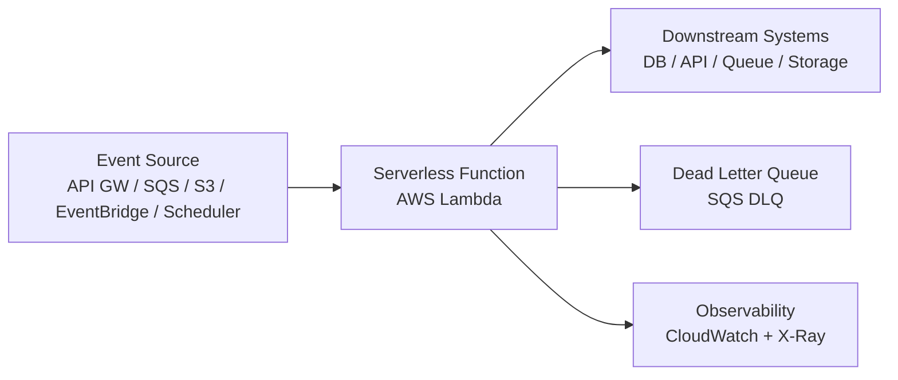
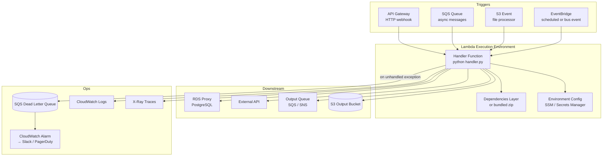

# Pattern: Serverless Function

!!! info "Quick facts"
    - **Category:** Scripts & Automation
    - **Maturity:** Adopt
    - **Typical team size:** 1-3 engineers
    - **Typical timeline to MVP:** 1-2 weeks
    - **Last reviewed:** 2026-05-02 by Architecture Team

## 1. Context

**Use this pattern when:**

- Responding to events: an HTTP webhook, a file landing in S3, a message on a queue, or a scheduled cron trigger
- Invocation frequency is irregular — idle for hours, then bursting — and you do not want to pay for idle compute
- Each invocation is independent and stateless (or state lives in an external store)
- Execution time is under 15 minutes per invocation

**Do NOT use this pattern when:**

- The function runs for more than 15 minutes — use an ECS/Fargate task or a background job instead
- You need persistent in-process state between invocations (connection pools, warmed caches) and cold starts are unacceptable — consider a long-running container service
- Sustained throughput exceeds ~1,000 requests/second continuously — at that point a provisioned container service often costs less than Lambda
- The workload has complex step-by-step business logic with retries and compensation — use a workflow engine like Temporal instead

## 2. Problem it solves

Glue code — webhook handlers, file processors, notification dispatchers, scheduled reports — does not warrant the overhead of a full service: a Dockerfile, a cluster, health-check endpoints, and 24/7 compute costs. This pattern provides event-driven execution with no infrastructure to manage, automatic scaling to zero, and a billing model that charges only for actual runtime.

## 3. Solution overview

### System context (C4 Level 1)

### Container view (C4 Level 2)

## 4. Technology stack

| Layer | Primary choice | Alternatives | Notes |
|---|---|---|---|
| Platform | AWS Lambda | Google Cloud Functions, Azure Functions, Cloudflare Workers | Lambda has the widest ecosystem and longest track record; Cloudflare Workers for sub-millisecond edge latency (no VPC access); GCF/AzFunc if already on that cloud |
| Runtime | Python 3.12 | Node.js 22, Go 1.x, Java 21 (SnapStart) | Python for data-heavy functions; Go for cold-start-sensitive paths (Go cold starts are ~10× faster than Python); Java 21 with SnapStart nearly matches Go |
| IaC / deployment | AWS SAM | Serverless Framework, SST, Terraform | SAM is AWS-native, free, and requires no extra dependencies; SST for TypeScript-first teams with a frontend; Terraform if the broader stack is already managed there |
| Event routing | Amazon EventBridge | SQS trigger, SNS, API Gateway | EventBridge for event-bus patterns with content-based routing; SQS for reliable queue-pull with back-pressure control |
| Dead letter handling | SQS DLQ | SNS DLQ | Always configure a DLQ — Lambda silently drops failures on async invocations without one |
| Database access | RDS Proxy (Postgres) | DynamoDB, Aurora Serverless v2 | RDS Proxy prevents connection pool exhaustion (Lambda can spawn hundreds of instances simultaneously); DynamoDB for serverless-native key-value access |
| Secrets | AWS Secrets Manager | SSM Parameter Store (SecureString) | Secrets Manager for rotating credentials; SSM Parameter Store is ~3× cheaper for non-rotating config values |
| Observability | AWS X-Ray + CloudWatch Logs | Datadog Lambda extension, Lumigo | X-Ray for distributed traces across Lambda → RDS/SQS; add Datadog if the rest of the organisation is already instrumented there |

## 5. Non-functional characteristics

| Concern | Profile |
|---|---|
| **Scalability** | Scales to zero and to 1,000 concurrent executions by default (soft limit; request increase for higher). No action required for burst traffic — Lambda handles it automatically. Account-level concurrency limit applies across all functions; set per-function reserved concurrency to protect critical functions. |
| **Availability target** | AWS Lambda SLA is 99.95%. The function itself must be idempotent — SQS and EventBridge guarantee at-least-once delivery, so duplicate invocations must produce the same result. |
| **Latency target** | Warm invocations: p95 < 100ms for lightweight functions. Cold starts: Python 3.12 is typically 200–600ms; mitigate with Provisioned Concurrency for latency-critical paths. API Gateway adds ~10ms overhead. |
| **Security posture** | Least-privilege IAM role per function — never share roles between functions. No inbound network access; all communication is outbound from within a VPC. Inject secrets at runtime from Secrets Manager, never in environment variables checked into source control. Enable Lambda function URL auth or API Gateway authoriser — never expose a public unauthenticated endpoint. |
| **Data residency** | Function executes in the AWS region you deploy to. Ensure downstream stores (RDS, S3) are in the same region to avoid cross-region data transfer and residency violations. |
| **Compliance fit** | GDPR ✓ with correct region selection and data minimisation in logs. SOC 2 ✓ — CloudTrail records all Lambda API calls. HIPAA ✓ with encrypted environment variables + BAA on AWS. PCI-DSS: do not process raw card data in Lambda; use Stripe-hosted pages instead. |

## 6. Cost ballpark

Indicative monthly USD cost. Lambda pricing is per invocation + per GB-second of compute; the free tier covers 1M invocations/month.

| Scale | Invocations / month | Monthly cost | Cost drivers |
|---|---|---|---|
| Small | < 1M | $0 - $5 | AWS free tier covers 1M invocations + 400,000 GB-seconds; cost is effectively zero for low-volume webhooks |
| Medium | 1M - 100M | $20 - $200 | Lambda compute + API Gateway request charges; RDS Proxy if DB-connected |
| Large | 100M+ | $300 - $3,000 | Lambda at scale, Provisioned Concurrency for latency-sensitive paths, data transfer, X-Ray tracing volume |

## 7. LLM-assisted development fit

| Aspect | Rating | Notes |
|---|---|---|
| Handler boilerplate and event parsing | ★★★★★ | Excellent — Lambda event schemas (SQS, S3, API GW) are well-represented; generate the handler skeleton from a spec. |
| SAM / IaC template scaffolding | ★★★★ | Generates correct SAM YAML for most use cases; always review IAM policy statements — LLMs often over-provision permissions. |
| Idempotency and deduplication logic | ★★★ | Understands the concept but misses edge cases (e.g., partial writes before a crash). Review DLQ re-drive logic manually. |
| Cold start optimisation | ★★★ | Knows the common techniques (lazy imports, Lambda Layers, Provisioned Concurrency); recommendations are correct but sometimes outdated on runtime-specific details. |
| Architecture decisions | ★ | Don't outsource — specifically the runtime choice and IaC tooling have long-term consequences. Use ADRs. |

**Recommended workflow:** Generate the handler and SAM template, then manually tighten the IAM policy using the AWS IAM Policy Simulator. Add a DLQ and CloudWatch alarm before deploying to production — not as a follow-up.

## 8. Reference implementations

- **Public reference:** [aws-samples/aws-sam-cli-app-templates](https://github.com/aws-samples/aws-sam-cli-app-templates) — official SAM starter templates for Python, Node, Go runtimes
- **Public reference:** [serverless/examples](https://github.com/serverless/examples) — community examples for Python + various event sources (SQS, S3, HTTP, cron)
- **Public reference:** [awslabs/aws-lambda-powertools-python](https://github.com/aws-powertools/powertools-lambda-python) — Lambda Powertools: structured logging, tracing, idempotency utilities — use this in every Python Lambda
- **Internal case study:** _Add your anonymised internal example here_

## 9. Related decisions (ADRs)

- [ADR-0002: Python as the default scripting language](../../decisions/0002-default-scripting-language.md)

## 10. Known risks & gotchas

- **Silent failures on async invocations without a DLQ** — When Lambda is invoked asynchronously (EventBridge, S3 events), a function failure is retried twice then silently discarded unless a DLQ or on-failure destination is configured. Mitigation: always configure an SQS DLQ and a CloudWatch alarm on its `ApproximateNumberOfMessagesVisible` metric before going live.
- **Connection pool exhaustion against RDS** — Each Lambda instance opens its own database connection. At 500 concurrent Lambdas, you exceed Postgres's default `max_connections`. Mitigation: always sit behind RDS Proxy; it multiplexes Lambda connections into a fixed pool and manages keep-alive.
- **Cold starts degrade user-facing APIs** — A Python Lambda behind API Gateway adds 300–600ms on a cold start, which is perceptible. Mitigation: use Provisioned Concurrency for latency-sensitive endpoints; keep the deployment package small (< 10 MB unzipped); avoid VPC attachment unless the function needs private network access (VPC cold starts add ~300ms themselves).
- **Over-privileged IAM roles become a blast radius** — Sharing one IAM role across multiple functions, or using `*` resource ARNs, means a compromised function can access every resource in the account. Mitigation: one IAM role per function, scoped to the exact ARNs it accesses; use `sam policy-templates` or the Condition block to restrict to specific resource patterns.
- **Log volume cost surprises** — A high-throughput Lambda logging every event at INFO level can generate gigabytes of CloudWatch Logs per day. Mitigation: set log level to WARN in production via an environment variable; use Lambda Powertools' `Logger` which respects the `LOG_LEVEL` env var and samples debug logs at a configurable rate.
