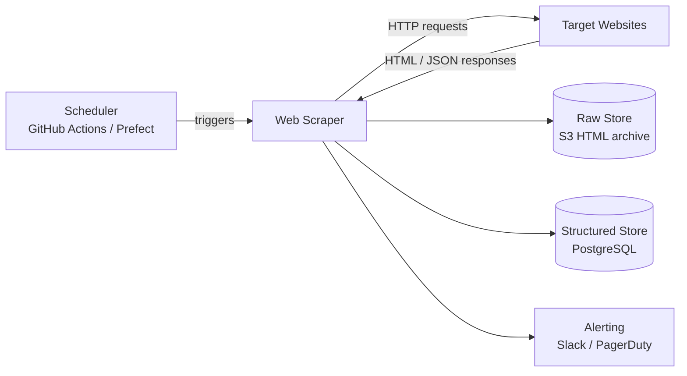
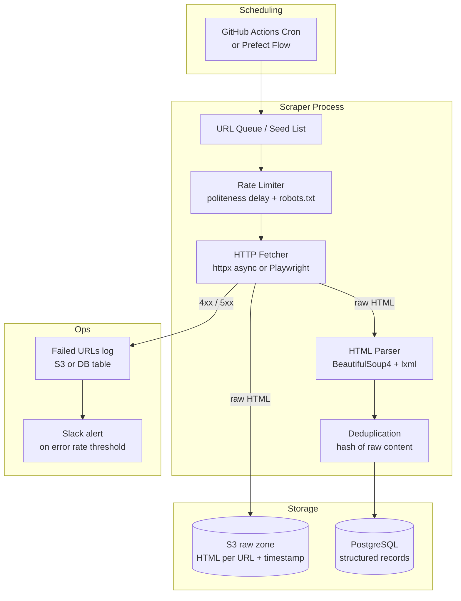

# Pattern: Web Scraper

!!! info "Quick facts"
    - **Category:** Scripts & Automation
    - **Maturity:** Adopt
    - **Typical team size:** 1-2 engineers
    - **Typical timeline to MVP:** 1-2 weeks
    - **Last reviewed:** 2026-05-02 by Architecture Team

## 1. Context

**Use this pattern when:**

- You need structured data from a public website and no official API or data export exists
- The data changes on a schedule (prices, listings, public records) and you need to track it over time
- Volume is thousands to millions of pages per day — not a one-off manual copy-paste

**Do NOT use this pattern when:**

- An official API exists — use it; scraping is always more brittle than an API
- The site's Terms of Service explicitly prohibit automated access to the data you need — review ToS and `robots.txt` first
- The data is behind authentication and belongs to a third party — this pattern does not cover authenticated scraping of private user data
- You need sub-second freshness — scraping is not a streaming data source

## 2. Problem it solves

Valuable information is published on the web in HTML meant for human reading, not machine consumption. Converting that into queryable, structured data requires reliably fetching pages, extracting the right fields, handling rendering inconsistencies and anti-bot measures, storing raw copies for reprocessing, and scheduling repeated runs as the source changes. Doing this correctly is more work than it looks — this pattern captures the recurring decisions so you do not start from scratch each time.

## 3. Solution overview

### System context (C4 Level 1)

### Container view (C4 Level 2)

## 4. Technology stack

| Layer | Primary choice | Alternatives | Notes |
|---|---|---|---|
| Language | Python 3.12+ with uv | Node.js (Puppeteer/Crawlee), Go (Colly) | Python has the richest scraping ecosystem; see [ADR-0002](../../decisions/0002-default-scripting-language.md) |
| HTTP client | httpx (async) | requests (sync), aiohttp | httpx supports async, HTTP/2, and connection pooling natively; use for static HTML sites |
| JavaScript rendering | Playwright | Selenium, Puppeteer, Splash | Playwright is faster and more reliable than Selenium; required when the target page uses client-side rendering |
| HTML parsing | BeautifulSoup4 + lxml backend | lxml direct, cssselect, parsel (Scrapy's parser) | lxml backend makes BS4 ~10× faster than the html.parser default; parsel if you prefer XPath |
| Crawl framework | Scrapy | crawlee (Node.js) | Scrapy for large-scale multi-page crawls with link following; skip for simple single-page jobs |
| Scheduling | GitHub Actions cron | Prefect, APScheduler | GitHub Actions is simplest for infrequent scrapes (hourly or slower); Prefect for complex dependency chains |
| Proxy rotation | Bright Data | Oxylabs, Smartproxy | Required for large-scale scraping where IP bans are likely; overkill for occasional small jobs |
| Raw storage | AWS S3 | Cloudflare R2, local filesystem | Always store the raw HTML before parsing — enables schema evolution and re-parsing without re-fetching |
| Structured storage | PostgreSQL | DuckDB, SQLite, MongoDB | Postgres for shared queryable output; DuckDB for local analytical workloads; SQLite for single-machine jobs |

## 5. Non-functional characteristics

| Concern | Profile |
|---|---|
| **Scalability** | Single-process async (httpx) handles ~100 concurrent requests comfortably. Scrapy scales to millions of pages/day with its built-in downloader middleware. Beyond that, parallelise across multiple worker containers partitioned by domain or URL range. |
| **Availability target** | Not a long-running service. Availability = "scheduled run completes and new records appear in the structured store within the SLA window". A 10% transient HTTP error rate from the target is normal and must not fail the whole run. |
| **Latency target** | Not latency-sensitive. Optimise for throughput (pages/hour) and politeness (requests/second per domain), not p95 response time. |
| **Security posture** | Outbound HTTP only — the scraper has no inbound surface. Risks: credentials for storage in environment (use Secrets Manager), accidental exfiltration of authenticated sessions, and legal risk from scraping prohibited data. Rotate proxy credentials on a schedule. |
| **Data residency** | Raw HTML is stored in S3; choose a region that matches your data classification requirements. Do not store PII from scraped pages without a legal basis. |
| **Compliance fit** | Legal basis for scraping varies by jurisdiction and site ToS. GDPR: do not store scraped personal data without a lawful basis. CFAA (US): do not scrape after receiving a cease-and-desist. Always check `robots.txt` and respect `Crawl-delay` directives. |

## 6. Cost ballpark

Indicative monthly USD cost. Proxy costs dominate at scale; compute is cheap.

| Scale | Pages / day | Monthly cost | Cost drivers |
|---|---|---|---|
| Small | < 10,000 | $5 - $50 | GitHub Actions free tier, S3 storage, no proxies needed |
| Medium | 10k - 1M | $100 - $600 | Proxy bandwidth, ECS compute, S3 + Postgres storage and transfer |
| Large | 1M+ | $800 - $5,000 | Dedicated proxy plan (Bright Data ~$500/TB), large ECS fleet, significant S3 storage |

## 7. LLM-assisted development fit

| Aspect | Rating | Notes |
|---|---|---|
| Initial scraper scaffolding | ★★★★★ | Excellent — CSS/XPath selectors, pagination loops, and retry logic are generated well. |
| CSS and XPath selector writing | ★★★★ | Good; verify against the actual rendered DOM with DevTools. Selectors break on site redesigns regardless of how they were written. |
| Playwright async scripts | ★★★★ | Solid for standard navigation and form interaction; struggles with non-standard UI patterns (canvas, shadow DOM). |
| Anti-bot evasion logic | ★★ | Suggests plausible but brittle tricks (user-agent rotation, fake mouse moves). These require constant maintenance and are an arms race. Invest in legitimate proxy infrastructure instead. |
| Legal / ethical review | ★ | Never outsource ToS interpretation or data privacy decisions to an LLM. |

**Recommended workflow:** Generate the fetcher and parser skeleton, then write the deduplication and re-parse-from-raw logic by hand. Store raw HTML from day one — you will need to re-parse.

## 8. Reference implementations

- **Public reference:** [scrapy/quotesbot](https://github.com/scrapy/quotesbot) — canonical Scrapy tutorial spider, good starting structure
- **Public reference:** [microsoft/playwright-python — examples](https://github.com/microsoft/playwright-python/tree/main/examples) — official Playwright Python examples including async patterns
- **Public reference:** [lorien/awesome-web-scraping](https://github.com/lorien/awesome-web-scraping) — curated list of Python scraping libraries with descriptions
- **Internal case study:** _Add your anonymised internal example here_

## 9. Related decisions (ADRs)

- [ADR-0002: Python as the default scripting language](../../decisions/0002-default-scripting-language.md)

## 10. Known risks & gotchas

- **Selectors break silently on site redesigns** — The target website changes its HTML structure; your parser returns empty results or wrong data with no error. Mitigation: assert that key fields are non-null after each parse; alert on a sudden drop in extracted-record count; store raw HTML so you can re-parse when you fix the selector.
- **Politeness violations trigger IP bans** — Sending requests too fast gets your IP blocked and may constitute a DoS. Mitigation: respect `robots.txt` crawl-delay, add a random jitter between requests (0.5–3 s per domain), never paralllelise more than 2–3 concurrent requests to the same host.
- **JavaScript-rendered content silently missing** — You scrape the HTML but the data you need is loaded by a subsequent XHR. Mitigation: run the first request without Playwright; if the target field is missing, switch to Playwright and add a `wait_for_selector` on the element before extracting.
- **Memory leak in long-running async loops** — An async httpx/Playwright process that never exits accumulates sessions and DOM objects. Mitigation: process URLs in bounded batches (e.g., 1,000 URLs per process invocation), then exit cleanly; do not run as a single infinite loop.
- **Re-scraping rate after schema change is expensive** — If you did not store raw HTML, a parser bug or schema change means re-fetching everything. Mitigation: always write raw HTML to S3 before parsing. Storage is cheap; bandwidth and proxy costs are not.
