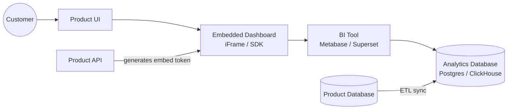
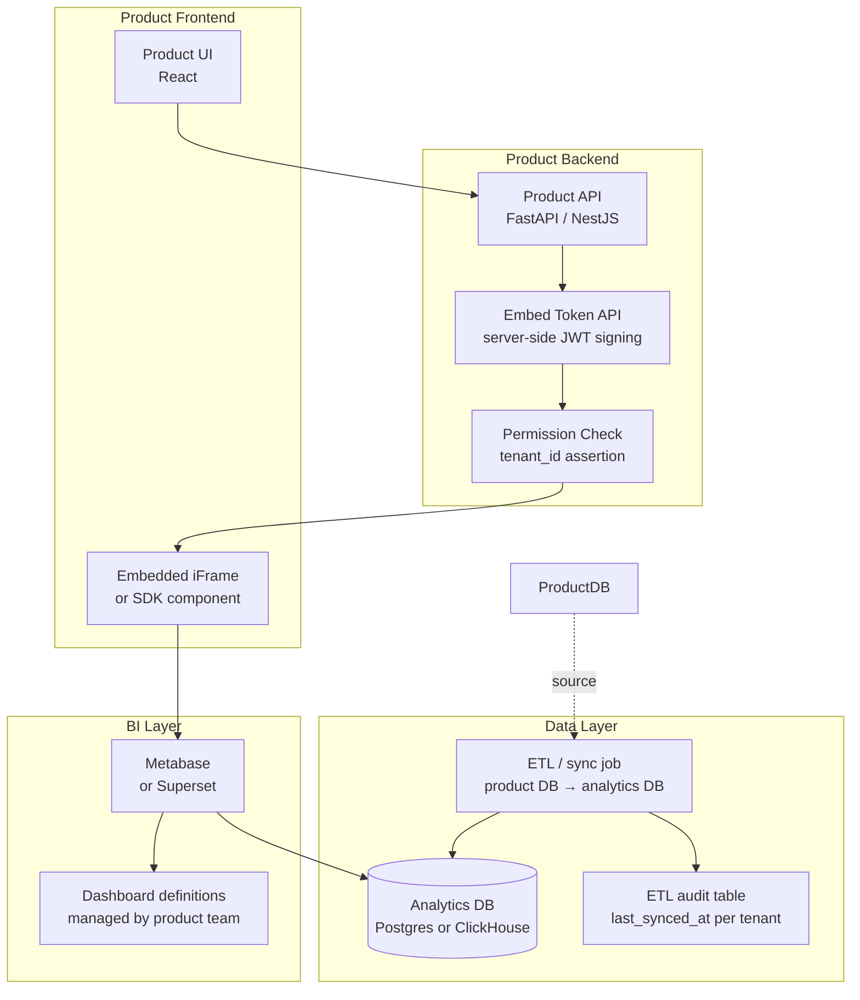

# Pattern: Embedded Analytics

!!! info "Quick facts"
    - **Category:** Data & Analytics
    - **Maturity:** Adopt
    - **Typical team size:** 1-2 engineers
    - **Typical timeline to MVP:** 2-4 weeks
    - **Last reviewed:** 2026-05-03 by Architecture Team

## 1. Context

**Use this pattern when:**

- Your SaaS product needs to show customers dashboards and charts built from their own operational data, within the product UI
- Building a custom charting layer from scratch (D3.js, Recharts) would take months and produce a less capable result than an embedded BI tool
- Customers are asking for "export to CSV" as a workaround — that is the signal they need analytics inside the product, not outside it
- Each customer should only ever see their own data — multi-tenant isolation is a hard requirement

**Do NOT use this pattern when:**

- A single, simple chart is all that is needed — use a charting library (Recharts, Chart.js) directly; full embedded BI is overkill for one visualisation
- All users share the same data with no per-tenant isolation — just link to a public Grafana or Superset dashboard
- Customers need to bring their own data sources and build their own models — that is a different product category (analytics platform, not embedded analytics)
- Query latency requirements are sub-second on billions of rows — that needs a dedicated serving layer (ClickHouse) rather than Postgres

## 2. Problem it solves

SaaS customers want to understand their own usage: adoption trends, spend breakdowns, operational metrics. Without in-product analytics, they export CSVs and stitch spreadsheets together — a slow, error-prone workflow that produces one-off snapshots rather than live data. Building a full BI feature from scratch (charting library, query engine, permissions model, dashboard builder) takes months. Embedding a third-party BI tool delivers a polished, self-serve analytics experience in weeks, with tenant isolation enforced at the embed token level.

## 3. Solution overview

### System context (C4 Level 1)

### Container view (C4 Level 2)

## 4. Technology stack

| Layer | Primary choice | Alternatives | Notes |
|---|---|---|---|
| BI tool | Metabase | Apache Superset, Grafana, Preset (hosted Superset) | Metabase has the simplest embedding API; Superset is more flexible but harder to embed securely; Grafana for time-series / operational metrics |
| Embedded display | Metabase Signed Embedding (JWT iFrame) | Superset Guest Token API, Grafana Viewer | Signed embedding scopes the dashboard to a specific tenant via a server-side JWT; never expose admin credentials to the frontend |
| Analytics database | PostgreSQL | ClickHouse, DuckDB (in-process for small scale) | Postgres for < 50M rows; ClickHouse for > 50M rows or sub-second query requirements on large aggregations |
| Multi-tenancy enforcement | Locked `tenant_id` filter in embed token | Database-level row-level security | Pass `customer_id` as an immutable locked parameter in the embed token — the BI tool enforces it on every query; test this is actually enforced |
| ETL from product DB | Postgres logical replication + pgoutput | dbt incremental model on a schedule, Airbyte | Logical replication for near-real-time sync (seconds latency); scheduled dbt sync for hourly freshness tolerance |
| Charting (custom one-offs) | Recharts (React) | Chart.js, Highcharts, Vega-Lite | Use for single charts outside the embedded BI scope; Recharts is free, Highcharts requires a commercial licence |
| BI tool hosting | Self-hosted Metabase on ECS / Docker | Metabase Cloud, Preset Cloud, Grafana Cloud | Self-host for data residency or cost control; managed cloud to reduce operational burden |
| ETL freshness monitoring | Custom `last_synced_at` table | Prefect / Airflow observability | Surface freshness timestamp on every dashboard so customers know when data was last updated |

## 5. Non-functional characteristics

| Concern | Profile |
|---|---|
| **Scalability** | The BI server is stateless — queries execute against the database at query time; scale by adding replicas. The analytics database is the bottleneck: ClickHouse scales horizontally; Postgres scales vertically then needs read replicas. |
| **Availability target** | 99.9%; BI tool unavailability degrades a feature, not core product functionality. Implement graceful degradation: render a "dashboards temporarily unavailable" banner rather than a broken iFrame that confuses users. |
| **Latency target** | Dashboard load: p95 < 3 s. ClickHouse aggregation queries: p95 < 500 ms. Postgres with proper indexes: p95 < 2 s for aggregates over ≤ 50M rows. Add pre-computed summary tables for the slowest recurring queries. |
| **Security posture** | The most critical invariant: every embedded query must be scoped to the tenant whose credentials generated the embed token. Never allow customers to supply or modify the `tenant_id` filter client-side. Verify cross-tenant isolation with an automated test on every deployment. |
| **Data residency** | Analytics data lives in your own infrastructure. The BI tool queries your database — no customer data is transmitted to a third-party SaaS (unlike cloud-hosted BI tools that pull data into their cloud). |
| **Compliance fit** | GDPR ✓ — analytics data is in your infrastructure; right-to-erasure cascades from the product DB to the analytics DB via the ETL deletion event. SOC 2 ✓ — tenant isolation via embed token is a testable, auditable control. HIPAA ✓ with encrypted analytics DB and BAA on your hosting infrastructure. |

## 6. Cost ballpark

Indicative monthly USD cost. BI tool licensing and database sizing are the main variables.

| Scale | Customers using dashboards | Monthly cost | Cost drivers |
|---|---|---|---|
| Small | < 100 | $50 - $300 | Self-hosted Metabase (free community edition), Postgres analytics DB |
| Medium | 100 - 1,000 | $400 - $2,000 | Metabase Pro licence (~$500/month), ClickHouse Cloud or larger Postgres, ETL compute |
| Large | 1,000+ | $2,000 - $10,000 | Metabase Enterprise or Preset Cloud, ClickHouse cluster, dedicated ETL infrastructure, SLA support |

## 7. LLM-assisted development fit

| Aspect | Rating | Notes |
|---|---|---|
| ETL sync query and pipeline code | ★★★★★ | Excellent — Postgres → Postgres replication and incremental sync patterns generate cleanly. |
| Embed token JWT signing (server-side) | ★★★★★ | Excellent — JWT signing with locked parameters is a standard pattern; well-represented in all backend languages. |
| ClickHouse schema design (MergeTree) | ★★★★ | Good — ORDER BY and PARTITION BY choices need validation against your specific query patterns. |
| Dashboard JSON configuration | ★★★ | Metabase and Superset dashboard schemas are version-specific and complex; test generated configs against the actual BI tool version. |
| Architecture decisions | ★ | Don't outsource. Use ADRs. |

**Recommended workflow:** Start with a single dashboard showing the top 3 metrics customers actually ask for (check support tickets). Hard-code the tenant filter before launch. Add self-serve dashboard configuration only after validating that customers want it — most do not.

## 8. Reference implementations

- **Public reference:** [metabase/metabase](https://github.com/metabase/metabase) — open-source BI tool; `docs/embedding/` covers signed embedding, JWT token generation, and locked parameter configuration (200 OK ✓)
- **Public reference:** [apache/superset](https://github.com/apache/superset) — open-source BI and data exploration platform; `superset/embedded/` covers the Guest Token API used for multi-tenant embedding (200 OK ✓)
- **Public reference:** [grafana/grafana](https://github.com/grafana/grafana) — open-source observability and analytics platform; useful reference for time-series embedded dashboards (200 OK ✓)
- **Internal case study:** _Add your anonymised internal example here_

## 9. Related decisions (ADRs)

- _No ADRs recorded yet. Candidate: Postgres vs ClickHouse analytics database choice — record when data volume forces a migration decision._

## 10. Known risks & gotchas

- **Cross-tenant data leak through a misconfigured embed token** — the `tenant_id` locked filter is absent or incorrectly set; one customer's dashboard returns another's data. Mitigation: write an automated integration test that generates tokens for two different tenants and asserts the query results are disjoint; run this test on every deployment — not just at launch.
- **Full-table-scan queries cause dashboard timeouts** — the BI tool generates a query with no date-range filter on a 100M-row table; it takes minutes and times out. Mitigation: add default date-range filters to every dashboard; configure a 30-second query timeout in the BI tool's admin settings; ensure the analytics table is partitioned by date with a covering index.
- **ETL lag shows stale data without customer disclosure** — the sync job fails silently; the dashboard still renders but shows data from three days ago with no indication. Mitigation: display "Last updated: {timestamp}" on every dashboard (pulled from the ETL audit table); alert the engineering team when ETL lag exceeds the stated SLA.
- **Embed URL leaks expose tenant data** — a signed embed URL is copied from a browser tab and forwarded to an unauthorised person; the URL remains valid. Mitigation: set short embed token expiry (15 minutes maximum); never use unsigned "public embedding" for multi-tenant data; regenerate the token on every dashboard load via a server-side API call.
- **BI tool upgrades break embedded dashboards** — a Metabase or Superset minor version changes the embed URL schema or removes a chart type used in production dashboards. Mitigation: pin the BI tool version in Docker; run automated screenshot-comparison tests for the three most-used dashboards in CI; use a staged rollout (dev → staging → prod) for any BI tool upgrade.
