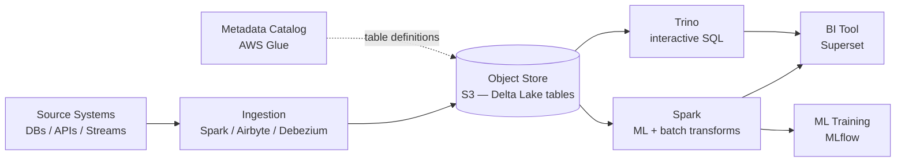
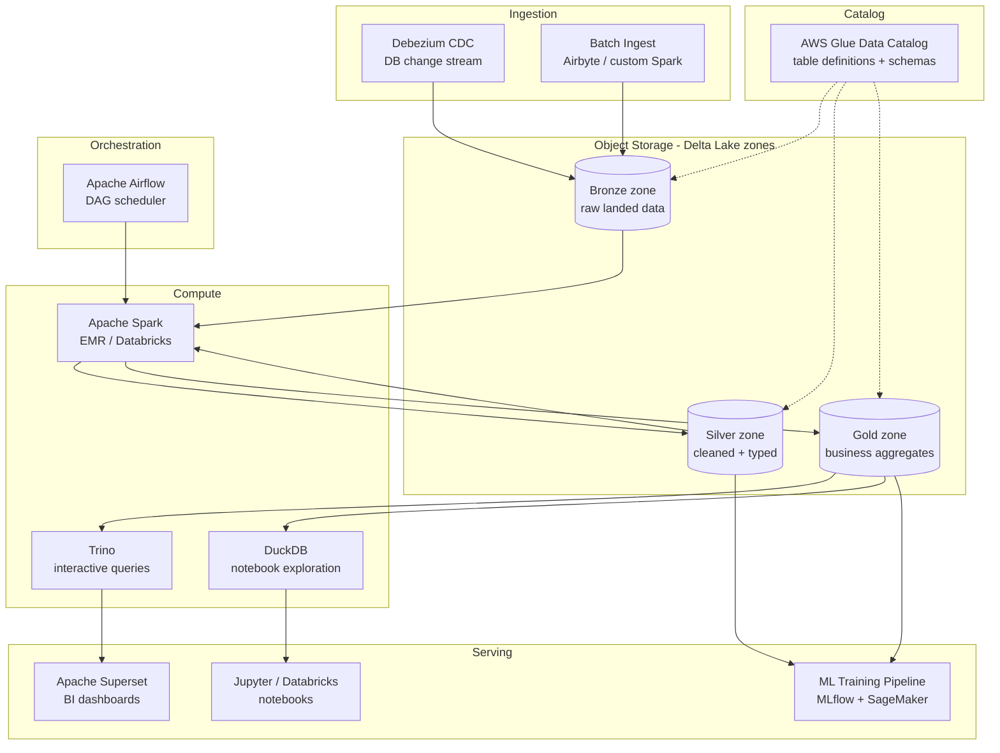

# Pattern: Lakehouse

!!! info "Quick facts"
    - **Category:** Data & Analytics
    - **Maturity:** Trial
    - **Typical team size:** 3-6 engineers
    - **Typical timeline to MVP:** 8-16 weeks
    - **Last reviewed:** 2026-05-03 by Architecture Team

## 1. Context

**Use this pattern when:**

- Workloads mix SQL analytics (BI dashboards) and ML training (bulk reads, feature engineering) on the same underlying data, and copying data between a warehouse and a lake is too expensive or too slow
- Raw data volumes are in the hundreds of GB to PB range, making managed warehouse storage costs prohibitive
- Multiple compute engines need to read the same data: Spark for ML, Trino for BI, DuckDB for analyst notebooks
- Schema evolution, time-travel (auditing past states), and data versioning are first-class requirements

**Do NOT use this pattern when:**

- Your data is under 100 GB and the team is small — the Modern Data Stack with a managed warehouse is simpler, cheaper, and operationally lighter
- All workloads are BI/SQL with no ML training — a managed warehouse delivers better query performance and operator experience for pure analytics
- The team has no distributed compute experience — the operational cost of learning Spark and Flink is high; start with a managed warehouse and migrate when you hit genuine limits

## 2. Problem it solves

A data warehouse optimises for SQL analytics but charges for compute every time you scan data for ML training, and stores data in a proprietary format that locks you in. A data lake stores data cheaply in open formats but can't serve low-latency SQL queries reliably. The Lakehouse stores data in open, ACID-compliant table formats (Delta Lake, Iceberg) on commodity object storage, letting different engines — Spark for training, Trino for dashboards — share the same physical files without copying, at warehouse-quality reliability.

## 3. Solution overview

### System context (C4 Level 1)

### Container view (C4 Level 2)

## 4. Technology stack

| Layer | Primary choice | Alternatives | Notes |
|---|---|---|---|
| Object storage | AWS S3 | Azure Data Lake Storage Gen2, Google Cloud Storage | S3 is most mature with Delta Lake and Iceberg; all three work equivalently |
| Table format | Delta Lake | Apache Iceberg | See [ADR-0007](../../decisions/0007-lakehouse-table-format.md); Delta Lake for Spark-primary workloads; Iceberg for multi-engine or cloud-agnostic deployments |
| Batch compute | Apache Spark on EMR | Databricks (managed Spark), Dask, Ray | Databricks wraps Spark with managed infra and built-in MLflow; EMR for teams preferring open-source and AWS-native IAM |
| Interactive SQL | Trino | Apache Spark SQL, DuckDB, Presto | Trino for sub-minute latency SQL over the lakehouse; DuckDB for local notebook queries via `duckdb.read_parquet()` |
| Orchestration | Apache Airflow | Prefect, Dagster | Airflow's `SparkSubmitOperator` is the most mature; Dagster has first-class Delta Lake integration via software-defined assets |
| Metadata catalog | AWS Glue Data Catalog | Apache Hive Metastore, Project Nessie | Glue for AWS deployments; Nessie adds Git-like catalog branching useful for data CI/CD and isolated dev environments |
| BI | Apache Superset | Metabase, Looker | Superset connects directly to Trino; self-hostable and has good Delta Lake support via the Trino connector |
| ML tracking | MLflow | Weights & Biases | MLflow integrates natively with Databricks and reads Delta tables directly; see the ML Training Pipeline pattern |

## 5. Non-functional characteristics

| Concern | Profile |
|---|---|
| **Scalability** | S3 scales to any volume at constant cost-per-GB. Spark and Trino each scale horizontally by adding nodes. Design partition keys (typically `year/month/day`) upfront — repartitioning an existing table is a full rewrite. |
| **Availability target** | S3 durability: 99.999999999%. Compute clusters (Spark, Trino) are ephemeral; design all Spark jobs to be re-runnable from the last checkpoint. A cluster failure means delayed results, not lost data. |
| **Latency target** | Batch transforms: hours (SLA-driven). Trino interactive queries on Gold zone data: p95 < 30 s for pre-partitioned queries. Not suitable for sub-second queries — add ClickHouse as a serving layer for those. |
| **Security posture** | IAM roles for all compute-to-S3 access; never long-lived credentials. Column-level security in the Glue catalog via Lake Formation. Encrypt S3 with SSE-KMS. Ranger or Lake Formation for fine-grained row/column access policies. |
| **Data residency** | All data in one cloud account and region. Cross-region replication adds S3 transfer costs; document requirements explicitly. |
| **Compliance fit** | GDPR ✓ — Delta Lake `DELETE` + `VACUUM` implement right-to-erasure; bound `VACUUM` retention to no more than 30 days to avoid indefinite PII persistence. HIPAA ✓ with encrypted S3 + AWS BAA. SOC 2 ✓ with Glue catalog access logs and Airflow run history. |

## 6. Cost ballpark

Indicative monthly USD cost. Spark/Databricks compute is the largest variable; S3 storage costs are low.

| Scale | Data volume | Monthly cost | Cost drivers |
|---|---|---|---|
| Small | < 500 GB | $300 - $1,000 | S3 storage, small EMR cluster (3 × m5.xlarge), Glue crawlers |
| Medium | 500 GB - 20 TB | $2,000 - $10,000 | EMR or Databricks compute (dominant), S3 request costs, Trino cluster |
| Large | 20 TB+ | $10,000 - $50,000 | Spark fleet, Databricks licences if managed, cross-AZ data transfer, dedicated ops time |

## 7. LLM-assisted development fit

| Aspect | Rating | Notes |
|---|---|---|
| PySpark transform scaffolding | ★★★★ | Good — PySpark patterns are well-represented; verify partition logic, broadcast hints, and join strategies by hand. |
| Delta Lake DDL and MERGE statements | ★★★★ | Generates correct Delta SQL for upserts and schema evolution; validate MERGE conditions for idempotency. |
| Trino SQL query writing | ★★★ | Generates syntactically correct Trino SQL; query plan optimisation (partition pruning, predicate pushdown) requires hands-on profiling. |
| Airflow DAG for Spark jobs | ★★★★ | Standard `SparkSubmitOperator` and `EmrAddStepsOperator` patterns generate cleanly. |
| Architecture decisions | ★ | Don't outsource. Use ADRs. |

**Recommended workflow:** Start with a single Bronze → Silver Spark job before building out the full medallion architecture. Validate partition strategy on a representative data sample. Add Trino only after the Gold zone is stable and analysts need interactive queries.

## 8. Reference implementations

- **Public reference:** [delta-io/delta](https://github.com/delta-io/delta) — Delta Lake source; `examples/` contains Python and Scala notebooks covering ACID transactions, schema evolution, time-travel, and OPTIMIZE (200 OK ✓)
- **Public reference:** [apache/iceberg](https://github.com/apache/iceberg) — Iceberg table format; reference for the alternative format's Java and Python API, catalog integration, and hidden partitioning (200 OK ✓)
- **Public reference:** [trinodb/trino](https://github.com/trinodb/trino) — Trino distributed SQL engine; `plugin/trino-delta-lake/` shows the Delta Lake connector implementation (200 OK ✓)
- **Internal case study:** _Add your anonymised internal example here_

## 9. Related decisions (ADRs)

- [ADR-0007: Delta Lake as the default lakehouse table format](../../decisions/0007-lakehouse-table-format.md)

## 10. Known risks & gotchas

- **Small files degrade query performance** — Streaming writes or fine-grained appends produce thousands of tiny Parquet files; Trino opens a file handle per file, making queries slow. Mitigation: run `OPTIMIZE` (Delta Lake) or `rewrite_data_files` (Iceberg) on a daily schedule to compact small files; target 128–256 MB per file.
- **VACUUM deletes time-travel history needed for audits** — Running `VACUUM` with a 7-day retention removes the old file versions that prove a record was deleted (GDPR compliance). Mitigation: set `VACUUM` retention to at least 30 days; document the tension between storage cost and audit window in your data retention policy.
- **Partition skew stalls Spark executors** — A partition key with uneven distribution (one large tenant, one busy day) causes a single executor to process 80% of the data. Mitigation: choose partition keys with roughly equal cardinality; use salting or repartitioning for heavily skewed dimensions.
- **Metadata catalog becomes a silent single point of failure** — If Glue is unreachable, Spark and Trino cannot resolve table locations, even though S3 data is intact. Mitigation: enable Glue HA across AZs; consider the Iceberg REST catalog or Project Nessie as a more resilient alternative.
- **Schema evolution breaks downstream Spark jobs silently** — Renaming a column or changing a type in a Delta table breaks every Spark job that references it by name, often without a clear error. Mitigation: enable Delta Lake schema enforcement (`delta.columnMapping.mode = name`) for rename safety; enforce a column deprecation policy (add new column → dual-write → migrate all consumers → remove old column across one release cycle).
