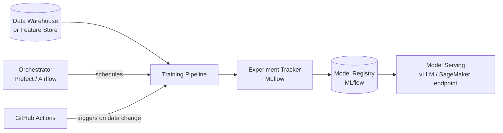
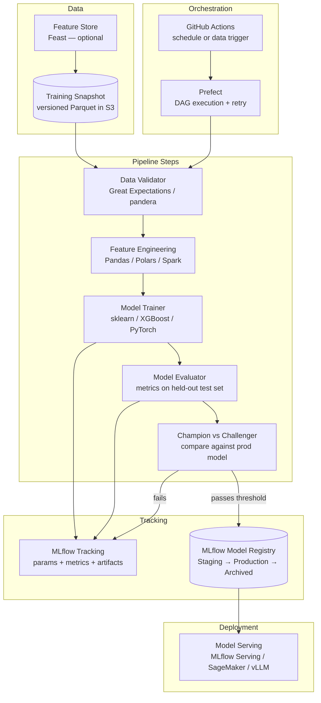

# Pattern: ML Training Pipeline

!!! info "Quick facts"
    - **Category:** Data & Analytics
    - **Maturity:** Trial
    - **Typical team size:** 2-4 engineers (ML engineering expertise required)
    - **Typical timeline to MVP:** 6-12 weeks
    - **Last reviewed:** 2026-05-03 by Architecture Team

## 1. Context

**Use this pattern when:**

- A machine learning model needs recurring automated retraining on fresh data (daily, weekly, or triggered by data volume thresholds)
- Experiments must be reproducible — the same data snapshot, code version, and hyperparameters must produce bit-comparable results
- Multiple team members produce competing model versions that need systematic comparison and a gated path to production
- The model is important enough to require versioning, lineage tracking, and rollback capability

**Do NOT use this pattern when:**

- The model will be trained once and never retrained — run a notebook; the pipeline overhead is not justified
- Fine-tuning a foundation LLM is the goal — see the Fine-tuned Domain Model pattern in the AI/LLM-Integrated category
- The model is simple enough (logistic regression, shallow decision tree) that `sklearn` + a cron job is sufficient and the team is small
- Data volumes fit in memory on a single machine and training takes under 10 minutes — `python train.py` in a GitHub Actions job is a valid pipeline

## 2. Problem it solves

A machine learning model trained on last year's data degrades as the world changes — user behaviour shifts, product evolves, fraud patterns adapt. Re-running a Jupyter notebook manually is error-prone, unreproducible, and doesn't scale when multiple engineers work on competing model versions. This pattern wraps the training loop in an automated pipeline that fetches current data, validates it, tracks every experiment with its parameters and metrics, compares challengers against the production champion, and promotes the winner — making ML iteration as auditable as software development.

## 3. Solution overview

### System context (C4 Level 1)

### Container view (C4 Level 2)

## 4. Technology stack

| Layer | Primary choice | Alternatives | Notes |
|---|---|---|---|
| Orchestration | Prefect | Apache Airflow, Dagster, Metaflow | Prefect for teams already using it for ETL (shared infrastructure); Metaflow for ML-specific data dependency management; Airflow for organisations with existing investment |
| Experiment tracking | MLflow | Weights & Biases, Neptune, Comet | MLflow is open-source, self-hostable, and integrates with all training frameworks; W&B for richer real-time visualisation and team collaboration |
| Feature engineering | pandas / Polars | Spark (large scale), Tecton (managed) | pandas/Polars for features that fit in memory (< 10 GB); Spark for distributed feature computation at TB+ scale |
| Feature store | Feast (open source) | Tecton, Hopsworks, AWS SageMaker Feature Store | Feast ensures identical feature computation offline (training) and online (serving); skip for small teams — materialise features into a versioned Parquet file per run instead |
| Training framework | scikit-learn / XGBoost | PyTorch, TensorFlow, LightGBM | scikit-learn for tabular ML; XGBoost/LightGBM for gradient boosting (often the best performer on structured data); PyTorch for deep learning or NLP |
| Training infrastructure | AWS SageMaker Training Jobs | Modal, Ray Train, local machine | SageMaker for teams on AWS — managed, auditable, spot instance support; Modal for simpler pay-per-second GPU compute |
| Data validation | Great Expectations | pandera, Deepchecks | Run schema and statistical distribution checks on training data before training; a silently corrupted training set produces a wrong model with no error |
| Model registry | MLflow Model Registry | W&B Model Registry, Hugging Face Hub | MLflow provides `Staging → Production → Archived` transitions with approval gates and environment-level tagging |

## 5. Non-functional characteristics

| Concern | Profile |
|---|---|
| **Scalability** | Single-machine training is correct for most tabular models (XGBoost on 50M rows in minutes on an m5.4xlarge). Distribute training with SageMaker or Ray Train only when data exceeds available RAM or training time exceeds the SLA window. |
| **Availability target** | The pipeline is not a long-running service. Availability = "training completes on schedule." Target: 99% of scheduled runs complete within SLA. Failed runs must be retriable from the failing step — not from scratch. |
| **Latency target** | Define a pipeline duration SLA per model, not a per-request latency. Example: "daily model must be promoted within 4 hours of 00:00 UTC." Alert when any run exceeds 2× its historical median duration. |
| **Security posture** | Training data often contains PII or sensitive features. Restrict dataset read access to the training IAM role. Model artifacts encode training data patterns — store in a private S3 bucket with the same access controls as the training data. Log every model promotion to the registry with the approver's identity. |
| **Data residency** | Training snapshots, feature stores, and model artifacts reside in your S3 account. If using SageMaker or Modal, confirm the BAA covers training data in transit to compute nodes. |
| **Compliance fit** | GDPR — training data snapshots are subject to right-to-erasure; document model provenance (which snapshot trained which model version) in MLflow; define snapshot retention policy. HIPAA: BAA required if training on PHI. SOC 2 ✓ with MLflow audit trail of every training run and model promotion. |

## 6. Cost ballpark

Indicative monthly USD cost. Compute instance type and training frequency drive costs.

| Scale | Pipeline runs / month | Monthly cost | Cost drivers |
|---|---|---|---|
| Small | < 50 | $100 - $600 | ml.m5.xlarge SageMaker (~$0.23/hr), S3 storage, self-hosted MLflow |
| Medium | 50 - 500 | $600 - $4,000 | Larger training instances, feature store compute, MLflow managed hosting |
| Large | 500+ | $4,000 - $20,000 | GPU training instances (ml.g5.2xlarge ~$1.52/hr), W&B/Neptune licences, Feast infrastructure |

## 7. LLM-assisted development fit

| Aspect | Rating | Notes |
|---|---|---|
| Feature engineering (pandas, Polars transforms) | ★★★★★ | Excellent — pandas and Polars transformations generate cleanly; validate output distributions on real data. |
| MLflow instrumentation (`log_metric`, `log_param`, `log_artifact`) | ★★★★★ | Excellent — MLflow API is well-represented; generated tracking code is correct. |
| sklearn / XGBoost pipeline scaffolding | ★★★★ | Good starting point; hyperparameter grid choices and cross-validation folds require domain knowledge. |
| Great Expectations suite design | ★★★ | Generates structurally correct expectation suites; threshold values require calibration against real data distributions. |
| Architecture decisions | ★ | Don't outsource — feature store choice and orchestrator selection have long-term team implications. |

**Recommended workflow:** Establish a champion/challenger evaluation gate before automating model promotion. Start without a feature store — materialise features into a versioned Parquet file per training run. Add Feast only when the same features are needed by multiple models or must be served online.

## 8. Reference implementations

- **Public reference:** [mlflow/mlflow](https://github.com/mlflow/mlflow) — MLflow tracking, model registry, and serving; `examples/` covers sklearn, XGBoost, PyTorch, and Spark integrations (200 OK ✓)
- **Public reference:** [feast-dev/feast](https://github.com/feast-dev/feast) — open-source feature store; `examples/` shows offline feature retrieval for training and online serving parity (200 OK ✓)
- **Public reference:** [ray-project/ray](https://github.com/ray-project/ray) — distributed ML framework; `python/ray/train/examples/` covers distributed XGBoost, PyTorch, and LightGBM training patterns (200 OK ✓)
- **Internal case study:** _Add your anonymised internal example here_

## 9. Related decisions (ADRs)

- [ADR-0003: Prefect as the default ETL/ELT orchestrator](../../decisions/0003-etl-orchestrator.md)
- _Candidate ADR: MLflow vs W&B experiment tracking choice — record when your organisation commits._

## 10. Known risks & gotchas

- **Training–serving skew silently degrades production accuracy** — the feature engineering code in the training pipeline differs subtly from the serving path (different null handling, different timezone conversion, different library version). The model was trained on clean features but scores messy ones. Mitigation: use a shared feature store that computes features identically offline and online; write a parity test that runs both pipelines on the same input row and asserts output equality before every deployment.
- **Data leakage inflates evaluation metrics** — a feature aggregated over the full dataset (including the test period) encodes future information; the held-out metric looks great but collapses in production. Mitigation: enforce strict temporal splits; only allow features computed from data available strictly before the prediction timestamp; review every feature derivation in PRs.
- **Experiment artifact storage grows unboundedly** — MLflow stores every run's model, parameters, and metrics; after a year of daily runs the registry holds hundreds of model files. Mitigation: define a retention policy; delete non-Production stage runs older than 90 days with a weekly cleanup job.
- **Champion model degrades without a trigger to retrain** — the production model's accuracy drifts as data distribution changes, but no one notices because the pipeline only runs on a time schedule. Mitigation: run accuracy on a rolling window of recent labelled production predictions as a separate monitoring job; trigger retraining when accuracy drops below a threshold, independent of the time schedule.
- **Non-reproducible training from floating random seeds** — two runs on the same snapshot produce different models because random seeds were not pinned; debugging model regressions becomes impossible. Mitigation: log the exact random seed, data snapshot S3 path, and all library versions in MLflow on every run; assert that re-running the pipeline on the same snapshot produces metrics within a ±1% tolerance.
