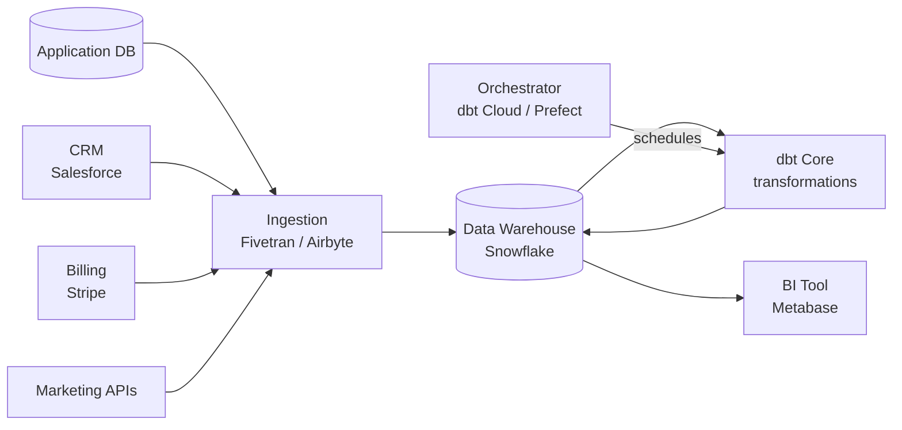
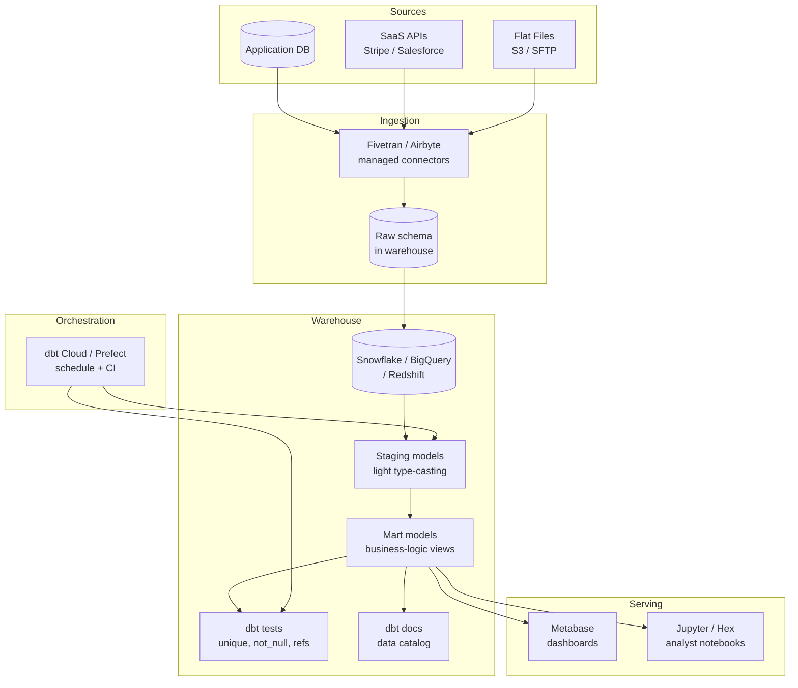

# Pattern: Modern Data Stack (Warehouse + dbt + BI)

!!! info "Quick facts"
    - **Category:** Data & Analytics
    - **Maturity:** Adopt
    - **Typical team size:** 1-3 engineers
    - **Typical timeline to MVP:** 4-8 weeks
    - **Last reviewed:** 2026-05-03 by Architecture Team

## 1. Context

**Use this pattern when:**

- Multiple source systems (CRM, product database, billing, marketing APIs) need to be unified for analysis
- Business analysts need to query data without touching production databases
- The primary deliverable is dashboards, reports, or self-serve analytics — not ML training
- The team wants a governed, version-controlled, tested transformation layer rather than a tangle of hand-rolled SQL scripts

**Do NOT use this pattern when:**

- Data freshness under 15 minutes is required — use the Real-time Streaming Analytics pattern instead
- Your entire dataset fits in a single Postgres instance and the team is small — direct Postgres + Metabase is simpler and costs nothing extra
- ML training dominates the workload and data volumes exceed multi-TB — the Lakehouse pattern gives better price-performance for bulk feature computation
- You need to query raw semi-structured logs at scale — a purpose-built log analytics store (ClickHouse, Loki) is more appropriate

## 2. Problem it solves

Business teams ask questions like "What is our MRR by region this quarter?" but the data lives across five different systems. Each cross-system query consumes engineering time and produces inconsistent answers because different analysts apply different business logic. The Modern Data Stack solves this by centralising all source data into a warehouse, defining business logic once in version-controlled SQL, and serving consistent metrics to any BI tool — so every analyst sees the same number.

## 3. Solution overview

### System context (C4 Level 1)

### Container view (C4 Level 2)

## 4. Technology stack

| Layer | Primary choice | Alternatives | Notes |
|---|---|---|---|
| Ingestion | Fivetran | Airbyte (open source), Stitch, Meltano | Fivetran for simplicity and reliability; Airbyte if custom connectors are needed or vendor lock-in is a concern |
| Warehouse | Snowflake | BigQuery, Redshift, DuckDB | Snowflake separates compute from storage cleanly and scales with no cluster management; DuckDB for teams under 50 GB with no budget for a managed warehouse |
| Transformation | dbt Core | SQLMesh, Coalesce | dbt is the de-facto standard with the largest ecosystem; SQLMesh is a compatible alternative with better incremental model semantics |
| Orchestration | dbt Cloud scheduler | Prefect, Dagster, Apache Airflow | dbt Cloud is simplest when dbt is the only workload; Prefect for complex dependency graphs that span dbt and Python jobs |
| BI | Metabase | Apache Superset, Looker, Tableau | Metabase is open-source, self-hostable, and accessible to non-technical users; Looker if a governed semantic layer is critical |
| Data quality | dbt built-in tests + Elementary | Great Expectations, Soda | dbt's `unique`, `not_null`, and `accepted_values` tests cover 80% of cases; Elementary adds Slack alerting on top |
| Data catalog | dbt docs (auto-generated) | DataHub, Atlan, Collibra | dbt docs auto-generate from model YAML; add a dedicated catalog only at larger team sizes (> 5 data engineers) |
| CI/CD | GitHub Actions + `dbt build --select state:modified+` | dbt Cloud CI | Run only changed models and their dependents on every PR; full rebuild nightly |

## 5. Non-functional characteristics

| Concern | Profile |
|---|---|
| **Scalability** | Snowflake and BigQuery auto-scale warehouse compute on demand. dbt parallelises model runs automatically using the DAG. Comfortable to hundreds of GB without tuning; TB-scale needs explicit partitioning strategy and clustering keys. |
| **Availability target** | 99.9% (warehouse SLA). Transformation failures affect data freshness, not user-facing systems. Alert on any failed dbt run within 30 minutes; analytics is not real-time, so a delayed alert is acceptable. |
| **Latency target** | Data freshness SLA, not per-query response time. Target: data in BI tool within 4 hours of source write for hourly schedules. BI query p95 < 5 s on pre-aggregated mart tables. |
| **Security posture** | Role-based access in the warehouse: raw schema read-only for the ETL role; mart schema read-only for analysts. Column-level masking for PII applied in dbt staging models. Fivetran/Airbyte source credentials in AWS Secrets Manager. |
| **Data residency** | Data lands in the warehouse region you choose at provisioning time. Document source-to-warehouse region policy; cross-region ingestion has cost and may have compliance implications. |
| **Compliance fit** | GDPR ✓ with PII masking in staging models and right-to-erasure automated via a dbt deletion model. SOC 2 ✓ with dbt run history and warehouse access logs as audit trail. HIPAA: avoid loading PHI into the warehouse unless BAA is in place with the warehouse vendor. |

## 6. Cost ballpark

Indicative monthly USD cost. Warehouse compute (Snowflake credits, BigQuery slots) is the dominant variable.

| Scale | Data volume | Monthly cost | Cost drivers |
|---|---|---|---|
| Small | < 100 GB | $100 - $500 | Snowflake XS warehouse on-demand, Fivetran Starter, self-hosted Metabase |
| Medium | 100 GB - 5 TB | $1,000 - $5,000 | Snowflake compute credits, Fivetran seat volume, dbt Cloud Team plan |
| Large | 5 TB+ | $5,000 - $30,000 | Warehouse compute (dominant), Fivetran volume pricing, Looker or Tableau licences |

## 7. LLM-assisted development fit

| Aspect | Rating | Notes |
|---|---|---|
| dbt model and test scaffolding | ★★★★★ | Excellent — SQL SELECT transforms and dbt YAML schema tests generate cleanly from a source schema description. |
| Ingestion connector configuration | ★★★★ | Good for standard Fivetran/Airbyte connectors; custom connector logic requires review. |
| Business logic SQL (metrics, joins) | ★★★ | Generates syntactically correct SQL; grain and join correctness require domain knowledge the LLM does not have — always validate with a domain expert. |
| Data quality test design | ★★★ | Knows common patterns (uniqueness, referential integrity); threshold values and `accepted_values` lists require business knowledge. |
| Architecture decisions | ★ | Don't outsource. Use ADRs. |

**Recommended workflow:** Define your metrics dictionary (what "MRR" means, how churn is calculated) before writing any dbt models. Generate model scaffolds from source table schemas, then have a domain expert validate the business logic SQL. Run `dbt test` in CI on every PR.

## 8. Reference implementations

- **Public reference:** [dbt-labs/dbt-core](https://github.com/dbt-labs/dbt-core) — the dbt framework itself; `examples/` and the official jaffle_shop demo show full project structure with models, tests, and documentation (200 OK ✓)
- **Public reference:** [airbytehq/airbyte](https://github.com/airbytehq/airbyte) — open-source EL tool with 300+ connectors; reference for self-hosted ingestion alternative to Fivetran (200 OK ✓)
- **Public reference:** [metabase/metabase](https://github.com/metabase/metabase) — open-source BI tool; shows the embedding and multi-database connection architecture (200 OK ✓)
- **Internal case study:** _Add your anonymised internal example here_

## 9. Related decisions (ADRs)

- [ADR-0003: Prefect as the default ETL/ELT orchestrator](../../decisions/0003-etl-orchestrator.md)
- _Candidate ADR: Snowflake vs BigQuery vs Redshift warehouse choice — record when your organisation makes a committed vendor decision._

## 10. Known risks & gotchas

- **"Which number is right?" metric inconsistency** — two analysts define MRR slightly differently in separate dbt models; the CEO sees two different figures in two dashboards. Mitigation: define all business metrics in a single dbt metrics layer; establish a "one model per concept" convention enforced in code review.
- **Compute cost explosion from ad-hoc full-table scans** — an analyst runs `SELECT * FROM large_table` with no filter in Snowflake; the bill for that one query is $50. Mitigation: set per-user resource monitors in Snowflake (cost alerts + auto-suspend); add default date-range filters to all BI dashboards; build pre-aggregated mart tables for common query patterns.
- **Slow dbt full-builds block analyst iteration** — a full `dbt build` taking 45+ minutes means any hotfix takes an hour to reach analysts. Mitigation: use `--select state:modified+` in CI (builds only changed models and their dependents); separate large historical backfill models into their own scheduled job.
- **PII persists in the raw schema beyond GDPR retention windows** — Fivetran or Airbyte writes raw source rows including PII into the warehouse and they sit there indefinitely. Mitigation: document retention policy per raw table; implement masking macros in dbt staging models; automate deletion via a dbt model or warehouse `ALTER TABLE ... DROP COLUMN` after the retention period.
- **Schema drift from source silently breaks downstream models** — a CRM field is renamed, Fivetran syncs the new schema, and 12 downstream dbt models start returning `NULL`. Mitigation: add `dbt source freshness` and schema contract tests; alert on information\_schema diffs in the raw layer before each dbt run.
