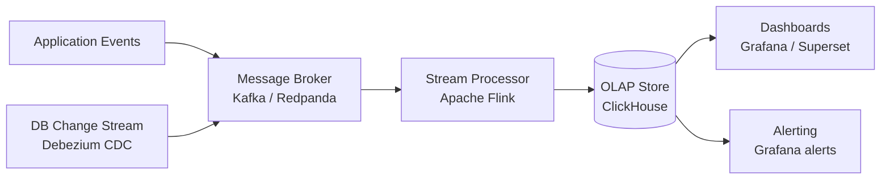
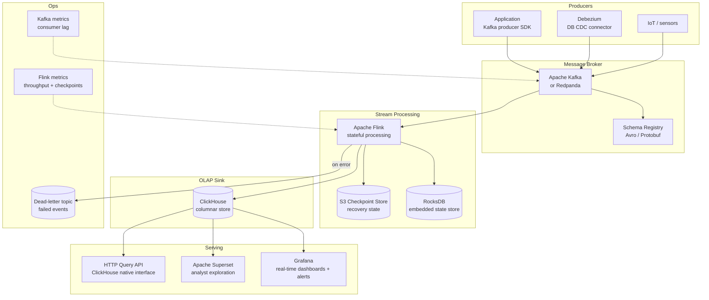

# Pattern: Real-time Streaming Analytics

!!! info "Quick facts"
    - **Category:** Data & Analytics
    - **Maturity:** Trial
    - **Typical team size:** 2-4 engineers
    - **Typical timeline to MVP:** 6-10 weeks
    - **Last reviewed:** 2026-05-03 by Architecture Team

## 1. Context

**Use this pattern when:**

- Business decisions require data with sub-minute latency: fraud detection, live operational dashboards, real-time alerting, anomaly detection
- Event volumes are high enough (thousands of events per second) that polling a transactional database is not viable
- The data model is event-oriented — page views, transactions, sensor readings, log lines — rather than entity-oriented

**Do NOT use this pattern when:**

- 15-minute data freshness is acceptable — use the Modern Data Stack with an hourly dbt schedule; the operational complexity of streaming is significant and unwarranted at that latency target
- The workload requires complex multi-table joins over large historical datasets — batch Spark is more cost-effective for that access pattern
- The engineering team has no prior experience with distributed messaging systems; the learning curve is steep and operational failures are hard to diagnose

## 2. Problem it solves

Batch ETL pipelines update dashboards in hours. For fraud detection, a 4-hour-old view of transaction patterns means fraudulent accounts have been operating unchecked. For operational dashboards, yesterday's numbers drive today's decisions. This pattern ingests events as they are generated, aggregates them in a stateful stream processor, and writes results to a columnar OLAP store — making the latest data queryable within seconds rather than hours.

## 3. Solution overview

### System context (C4 Level 1)

### Container view (C4 Level 2)

## 4. Technology stack

| Layer | Primary choice | Alternatives | Notes |
|---|---|---|---|
| Message broker | Apache Kafka | Redpanda, AWS Kinesis, Google Pub/Sub | Kafka is the industry standard with the richest connector ecosystem; Redpanda is drop-in API-compatible but simpler to operate (no ZooKeeper/KRaft complexity); Kinesis for AWS-native deployments |
| Stream processor | Apache Flink | Spark Structured Streaming, Kafka Streams | Flink for complex stateful operations (windows, joins, CEP); Kafka Streams for simpler topologies that live entirely in the Kafka ecosystem; Spark Streaming if the team already uses Spark |
| Schema registry | Confluent Schema Registry | AWS Glue Schema Registry, Apicurio | Enforces Avro/Protobuf schemas on every topic; prevents malformed events from propagating silently into consumers |
| Real-time OLAP | ClickHouse | Apache Druid, Apache Pinot | ClickHouse delivers sub-second SQL on billions of rows with a simple operational model; Druid for pre-aggregated time-series at extreme scale; Pinot for user-facing (externally-served) real-time queries |
| Visualisation | Grafana | Apache Superset, Metabase | Grafana for operational dashboards with built-in alert routing; Superset for richer ad-hoc analytical exploration |
| Serialisation | Apache Avro | Protocol Buffers, JSON | Avro with Schema Registry gives compact binary encoding and schema evolution guarantees; JSON only in low-volume dev environments |
| CDC source | Debezium | AWS DMS, Maxwell | Debezium captures row-level changes from Postgres/MySQL into Kafka topics without application code changes |
| Deployment | Kubernetes + Flink Operator | AWS MSK + Amazon Managed Flink | Kubernetes for full control over sizing and tuning; managed services trade control for simpler operations |

## 5. Non-functional characteristics

| Concern | Profile |
|---|---|
| **Scalability** | Kafka scales by adding partitions and consumer replicas. Flink scales by increasing parallelism (task slots). ClickHouse scales by adding shards. Each layer scales independently — identify the bottleneck before adding capacity. |
| **Availability target** | 99.9%+ with Kafka replication factor ≥ 3 and Flink checkpointing to S3. A Flink restart recovers from the last checkpoint; with exactly-once semantics (Kafka source + ClickHouse idempotent sink), no data is lost or duplicated. |
| **Latency target** | Event-to-ClickHouse: p95 < 5 s. Dashboard refresh: p95 < 30 s end-to-end. ClickHouse query on pre-indexed data: p95 < 500 ms. Tune Flink checkpoint interval to balance recovery time vs throughput. |
| **Security posture** | Kafka mTLS between producers and consumers; ACLs per topic. Flink runs in a VPC with no public exposure. ClickHouse behind an internal load balancer with IP allowlisting. Encrypt data in transit (TLS everywhere) and at rest. |
| **Data residency** | All data processed within your cloud region. Define Kafka retention policies (7-day default) to prevent unbounded accumulation of sensitive event data. |
| **Compliance fit** | GDPR — event streams often contain PII; apply field-level pseudonymisation in Flink before writing to ClickHouse; implement a "forget event" pattern for right-to-erasure in streaming systems (true deletion from an append-only log is non-trivial). HIPAA ✓ with encryption at every layer and AWS/GCP BAA. |

## 6. Cost ballpark

Indicative monthly USD cost. Kafka and Flink compute dominate at medium and large scale.

| Scale | Events / second | Monthly cost | Cost drivers |
|---|---|---|---|
| Small | < 1,000 | $400 - $1,200 | 3-node Kafka cluster (m5.large), 2-node Flink, small ClickHouse instance |
| Medium | 1,000 - 50,000 | $2,000 - $10,000 | Larger Kafka and Flink clusters, ClickHouse with SSD-backed storage |
| Large | 50,000+ | $10,000 - $50,000 | Multi-broker Kafka with high replication, Flink cluster with many task slots, ClickHouse cluster with cross-shard replication |

## 7. LLM-assisted development fit

| Aspect | Rating | Notes |
|---|---|---|
| Kafka producer and consumer boilerplate | ★★★★★ | Excellent — Kafka client patterns for Python, Java, and Go are extremely well-represented. |
| Flink job scaffolding (DataStream / Table API) | ★★★ | Generates structurally correct Flink code; windowing semantics, watermarks, and state TTL have subtle correctness issues that require careful manual review. |
| ClickHouse schema and MergeTree design | ★★★★ | Good — ClickHouse SQL is close to standard SQL; ORDER BY and PARTITION BY key selection for a specific query pattern needs review. |
| Exactly-once end-to-end configuration | ★★ | Knows the concepts; the specific configuration required across Kafka + Flink + ClickHouse for true end-to-end exactly-once needs explicit integration testing. |
| Architecture decisions | ★ | Don't outsource. Use ADRs. |

**Recommended workflow:** Start with a single Kafka topic and a minimal Flink job that writes to ClickHouse before adding stateful operations. Test the restart/recovery path with fault injection before going to production — exactly-once semantics are only as good as your last recovery test.

## 8. Reference implementations

- **Public reference:** [apache/flink](https://github.com/apache/flink) — Flink source; `flink-examples/` contains DataStream, Table API, and windowing examples in Java and Python (200 OK ✓)
- **Public reference:** [apache/kafka](https://github.com/apache/kafka) — Kafka source; `examples/` covers producer, consumer, Streams API, and Connect patterns (200 OK ✓)
- **Public reference:** [ClickHouse/ClickHouse](https://github.com/ClickHouse/ClickHouse) — ClickHouse source; `docs/` covers MergeTree engine family, replication, and Kafka table engine integration (200 OK ✓)
- **Public reference:** [redpanda-data/redpanda](https://github.com/redpanda-data/redpanda) — Redpanda, the Kafka-compatible alternative; useful reference for operational simplification at smaller cluster sizes (200 OK ✓)
- **Internal case study:** _Add your anonymised internal example here_

## 9. Related decisions (ADRs)

- _No ADRs recorded yet. Candidates: Kafka vs Redpanda broker choice, Flink vs Spark Streaming processor choice, ClickHouse vs Druid OLAP store — record when your organisation makes a committed decision._

## 10. Known risks & gotchas

- **Consumer lag accumulates past Kafka retention** — a slow Flink consumer falls behind; if it falls past Kafka's retention window, messages are permanently lost before processing. Mitigation: alert on consumer group lag exceeding 10 minutes; set Kafka retention to at least 7 days; provision Flink to process at 2× steady-state throughput to absorb traffic spikes.
- **Late-arriving events corrupt windowed aggregates** — an event timestamped 5 minutes ago arrives after a 5-minute tumbling window has already closed and been emitted. Mitigation: use Flink event-time processing with watermarks that allow configurable lateness (e.g., 10-minute allowed lateness); emit corrected results when late events arrive rather than silently dropping them.
- **Schema Registry unavailability halts all pipelines** — if the Schema Registry is unreachable, producers and consumers cannot serialise or deserialise; all pipelines stop. Mitigation: run Schema Registry in HA mode (multiple replicas); configure producers and consumers to cache schemas locally (`auto.register.schemas=false`, cached fallback); test registry failure explicitly.
- **ClickHouse INSERT amplification from small Flink batches** — thousands of individual row inserts create many small data parts in ClickHouse, causing write amplification and query slowdown. Mitigation: configure the Flink ClickHouse sink to batch at least 10,000 rows or 1 second of data per flush; use `async_insert=1` in ClickHouse for high-concurrency write scenarios.
- **Exactly-once is harder than it looks** — Kafka, Flink, and ClickHouse each have their own delivery semantics; a misconfigured combination silently produces duplicates on Flink restarts. Mitigation: test the full exactly-once path by deliberately killing the Flink job mid-run and verifying ClickHouse row counts match expected event counts after recovery.
