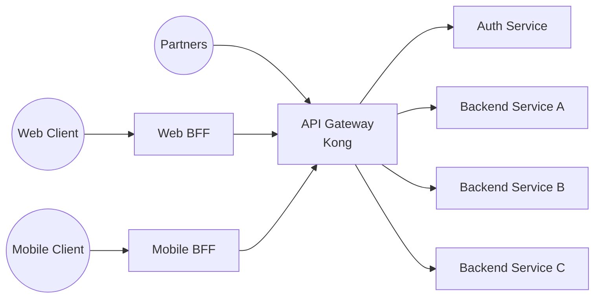
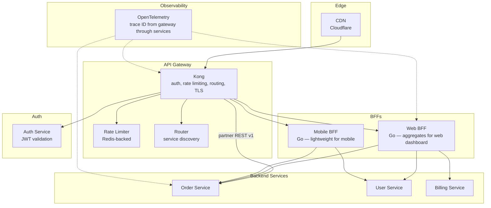

# Pattern: API Gateway + BFF (Backend for Frontend)

!!! info "Quick facts"
    - **Category:** Backend & Distributed Systems
    - **Maturity:** Adopt
    - **Typical team size:** 1-2 engineers
    - **Typical timeline to MVP:** 2-4 weeks
    - **Last reviewed:** 2026-05-03 by Architecture Team

## 1. Context

**Use this pattern when:**

- Multiple client types (web app, mobile app, partner API consumers) share backend services but have meaningfully different data shape and latency requirements
- Cross-cutting concerns — authentication, rate limiting, request routing, SSL termination — should be handled once, not duplicated in every service
- The API surface exposed to external consumers should be stable and versioned, even as internal services are refactored

**Do NOT use this pattern when:**

- There is only one client type and one backend — a single REST API without a gateway is simpler and has fewer moving parts
- You are just starting out with a monolith — add the gateway when you have multiple services or client types, not before
- GraphQL Federation already handles client-specific aggregation for your stack — that is a different (but related) pattern

## 2. Problem it solves

A web client needs a dashboard that aggregates data from four services in one round trip. A mobile client needs the same data but lighter — smaller payload, fewer fields, different pagination. A partner integration needs a stable, versioned API that does not break when internal services are refactored. Without a gateway and BFF layer, each service must implement auth and rate limiting independently, or every client makes multiple round trips and assembles the data itself. The gateway centralises cross-cutting concerns; the BFF gives each client the exact API shape it needs.

## 3. Solution overview

### System context (C4 Level 1)

### Container view (C4 Level 2)

## 4. Technology stack

| Layer | Primary choice | Alternatives | Notes |
|---|---|---|---|
| API gateway | Kong | AWS API Gateway, nginx (simple routing only), Envoy | Kong is open-source, Kubernetes-native, and has a rich plugin ecosystem; AWS API Gateway for Lambda-heavy AWS-native deployments; nginx for static routing with no dynamic config |
| BFF language | Go | Node.js (TypeScript), NestJS | Go for low-latency aggregation with small memory footprint; Node.js if the frontend team already works in TypeScript and will own the BFF |
| Authentication | JWT validation at gateway (Kong JWT plugin) | OAuth2 proxy, AWS Cognito authoriser | Validate tokens once at the gateway boundary; services inside the perimeter trust the gateway-issued identity header |
| Rate limiting | Kong Rate Limiting plugin (Redis-backed) | AWS WAF, custom middleware | Redis-backed rate limiting functions correctly across multiple gateway replicas; in-memory rate limiting breaks with more than one pod |
| API versioning | URL path versioning (`/v1/`, `/v2/`) | Header-based versioning (`Accept: application/vnd.api.v2+json`) | Path versioning is the most visible, most cacheable, and least surprising; add a `Sunset` header to deprecated versions |
| API contract | OpenAPI 3.x | GraphQL (for heterogeneous data needs), gRPC-gateway | OpenAPI for external REST APIs; consider GraphQL Federation when clients have highly variable sub-field needs |
| Observability | OpenTelemetry — inject trace ID at gateway | Datadog APM | Trace ID injected at the gateway must be propagated through every BFF and backend service; test this before the first service goes to production |

## 5. Non-functional characteristics

| Concern | Profile |
|---|---|
| **Scalability** | Kong is stateless (rate-limit state in Redis) — scale horizontally with no coordination. BFFs scale per client type independently. Each BFF replica is stateless. |
| **Availability target** | 99.99% for the gateway — it is in the critical path of every request. Deploy ≥ 3 Kong replicas; configure pod disruption budgets; health-check every replica every 10 seconds; use circuit breakers at the gateway for downstream service failures. |
| **Latency target** | Gateway overhead: < 5 ms. BFF aggregation adds one additional service round-trip latency. Target: p95 < 100 ms for gateway pass-through; p95 < 300 ms for BFF-aggregated responses including service calls. |
| **Security posture** | TLS termination at the gateway; mTLS between gateway and internal services. API keys for partner access managed and rotated at the gateway — never stored in partner application code long-term. Gateway access logs retained for 90 days minimum. |
| **Data residency** | Gateway and BFFs are stateless — no data at rest. Gateway access logs may contain PII in query parameters; ensure log scrubbing or redaction is applied. |
| **Compliance fit** | SOC 2 ✓ — gateway access logs provide a complete audit trail of every API call. GDPR: ensure gateway logs do not retain PII in request paths beyond your retention policy. PCI-DSS: gateway must not log card data in any form. |

## 6. Cost ballpark

Indicative monthly USD cost. Gateway is low-cost; BFF compute scales with request volume.

| Scale | API requests / month | Monthly cost | Cost drivers |
|---|---|---|---|
| Small | < 10M | $100 - $600 | Kong on 2-3 K8s pods, Redis for rate limiting, small BFF instances |
| Medium | 10M - 500M | $600 - $4,000 | More Kong replicas, Redis cluster, BFF autoscaling, Datadog APM |
| Large | 500M+ | $4,000 - $20,000 | Kong Enterprise licence, CDN with WAF, DDoS protection, multiple BFF regional deployments |

## 7. LLM-assisted development fit

| Aspect | Rating | Notes |
|---|---|---|
| Kong configuration (declarative YAML / deck) | ★★★★★ | Excellent — Kong plugin configuration patterns are well-represented. |
| BFF aggregation handler code | ★★★★ | Good; data shape decisions (what to include, how to nest) require product input — the LLM does not know your domain. |
| OpenAPI specification generation | ★★★★★ | Excellent — generates accurate OpenAPI 3.x specs from a description. |
| Rate limiting strategy and threshold design | ★★★ | Knows the patterns; per-tenant vs per-IP vs per-endpoint thresholds require product and business decisions. |
| Architecture decisions | ★ | Don't outsource. Use ADRs. |

**Recommended workflow:** Start with Kong as a simple reverse proxy (routing + TLS + auth). Add rate limiting and the first BFF for the web client only. Add the mobile BFF once the web BFF stabilises. Never add business logic to a BFF — if you are querying a database from a BFF, extract that logic into a backend service.

## 8. Reference implementations

- **Public reference:** [Kong/kong](https://github.com/Kong/kong) — the Kong API gateway; `spec/` and `kong/plugins/` show the plugin architecture; the declarative config format (`deck`) is the recommended management approach (200 OK ✓)
- **Public reference:** [envoyproxy/envoy](https://github.com/envoyproxy/envoy) — Envoy proxy used as the data plane for Istio; reference for advanced gateway patterns including gRPC transcoding and circuit breaking (200 OK ✓)
- **Internal case study:** _Add your anonymised internal example here_

## 9. Related decisions (ADRs)

- _No ADRs recorded yet. Candidate: Kong vs AWS API Gateway vs nginx — record when your organisation makes a committed infrastructure decision._

## 10. Known risks & gotchas

- **BFF accumulates business logic and becomes a bottleneck** — the web BFF starts with aggregation, then someone adds a DB query, then some transformation logic, and it becomes the most complex service in the system. Mitigation: enforce a strict rule — BFFs only aggregate, transform, and filter data from upstream services; no database access, no business logic, no direct dependency on internal data stores.
- **Gateway as a single point of failure** — Kong is in the critical path of every user request; a bad deployment or misconfiguration stops all traffic. Mitigation: ≥ 3 Kong replicas with pod disruption budgets; canary-deploy Kong config changes via `deck sync` with rollback capability; never apply config changes during peak hours.
- **API versioning ignored until a breaking change is forced** — `v1` accumulates technical debt but nobody creates `v2` until an external partner complains about a breaking change they received without notice. Mitigation: define an API versioning and deprecation policy before first external consumer goes live; add `Sunset` and `Deprecation` headers to `/v1` when `/v2` ships; give partners ≥ 6 months' notice.
- **Rate limits miscalibrated** — too strict: blocks legitimate traffic during a product launch spike; too loose: allows API abuse. Mitigation: set initial rate limits at 10× the expected peak per-user; tune based on real traffic patterns in the first 90 days; always have a per-authenticated-user rate limit even if per-route limits are generous.
- **Distributed tracing not wired through the gateway** — a request fails in a backend service; Kong logs a 502 with no trace context; the root cause requires checking 4 log streams manually. Mitigation: instrument the gateway to inject a `traceparent` header on every request as a day-one requirement; every downstream service must propagate it; verify in a pre-launch smoke test.
