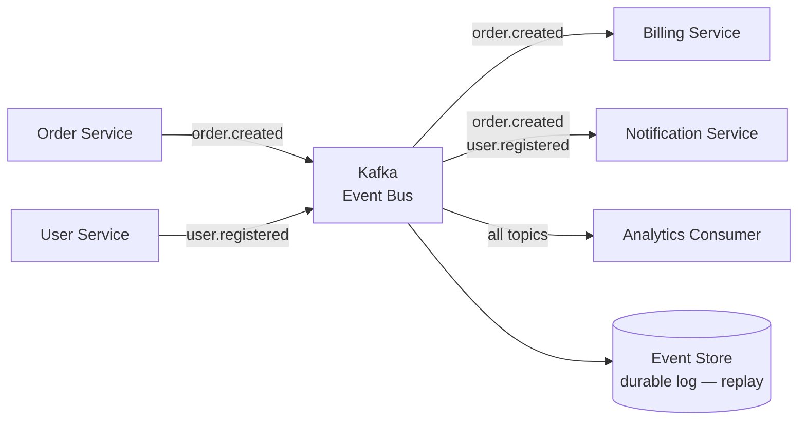
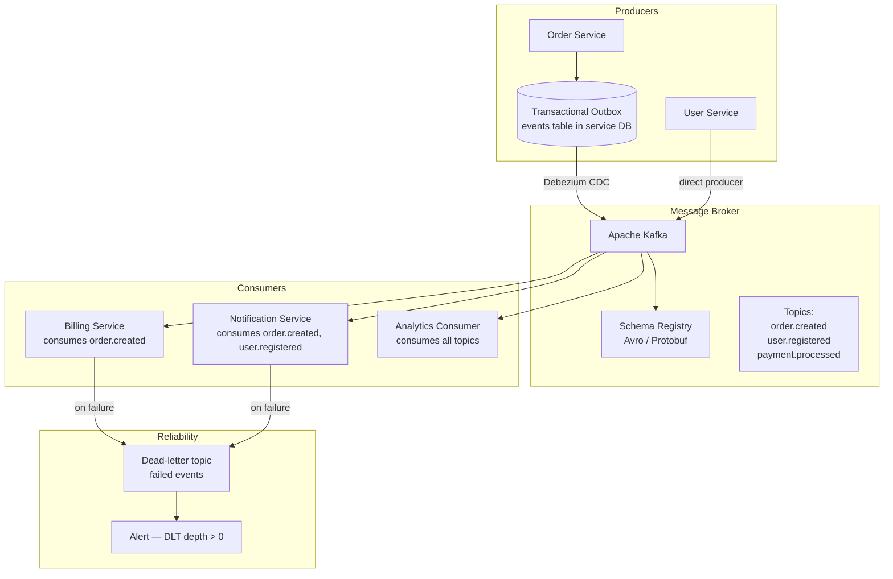

# Pattern: Event-Driven Architecture

!!! info "Quick facts"
    - **Category:** Backend & Distributed Systems
    - **Maturity:** Trial
    - **Typical team size:** 2-4 engineers
    - **Typical timeline to MVP:** 6-10 weeks
    - **Last reviewed:** 2026-05-03 by Architecture Team

## 1. Context

**Use this pattern when:**

- Services need to react to state changes in other services without tight coupling — the producer should not know or care which consumers exist
- Business workflows involve multiple asynchronous steps that can be processed at different speeds
- Auditability is valuable — a durable, replayable log of everything that happened is a first-class requirement
- The system must tolerate downstream service unavailability without losing data

**Do NOT use this pattern when:**

- Simple synchronous request-response is sufficient (user login, data retrieval) — events add latency and complexity with no benefit
- Immediate consistency is required — event-driven systems are inherently eventually consistent; if the UI must reflect an update the instant it is made, this pattern requires extra care
- The team is not yet comfortable operating Kafka — starting with a simpler durable queue (AWS SQS) before adopting the full event-driven pattern reduces operational risk

## 2. Problem it solves

When a service calls another service synchronously, it inherits the other service's availability and latency profile. If the billing service is slow, the orders service becomes slow. If the notifications service is down, order confirmation emails are blocked. Event-driven architecture decouples these services through a durable event log: the orders service publishes an `order.created` event and moves on; billing and notifications consume it independently, at their own pace, and can retry without involving the producer.

## 3. Solution overview

### System context (C4 Level 1)

### Container view (C4 Level 2)

## 4. Technology stack

| Layer | Primary choice | Alternatives | Notes |
|---|---|---|---|
| Message broker | Apache Kafka | AWS SQS/SNS, NATS, RabbitMQ | Kafka for durable event sourcing and replay; SQS for simpler task queues where replay is not needed; NATS for low-latency internal pub/sub without persistence |
| Schema format | Apache Avro + Schema Registry | Protocol Buffers, JSON | Avro with Schema Registry enforces backward-compatible schema evolution; prevents malformed events from silently corrupting consumers |
| Transactional outbox | Debezium CDC on producer DB | Polling-based outbox, transactional outbox libraries | The outbox pattern (write to DB + events table in one transaction, then CDC to Kafka) is the correct solution for producer exactly-once semantics |
| Consumer libraries | Language-native Kafka client (confluent-kafka-go, confluent-kafka-python) | Spring Kafka, Flink (streaming) | Use the official Confluent client; avoid heavyweight frameworks for simple consumers |
| Dead-letter handling | Dead-letter topic (DLT) per consumer + alert | Manual triage queue | Every consumer must configure a DLT; alert on any event in the DLT within 5 minutes |
| Event catalog | AsyncAPI specification | CloudEvents spec | AsyncAPI documents every topic's schema, producers, and consumers — the OpenAPI equivalent for event-driven systems |
| Observability | Kafka consumer lag (Prometheus exporter) + OpenTelemetry | Datadog Kafka integration | Consumer lag is the primary health signal; trace context propagated through Kafka message headers |

## 5. Non-functional characteristics

| Concern | Profile |
|---|---|
| **Scalability** | Kafka scales by adding partitions and brokers. Consumers scale by adding instances within a consumer group (limited by partition count). Scale each consumer group independently based on its own throughput requirements. |
| **Availability target** | 99.9%+ with Kafka replication factor ≥ 3. Producer failures don't block consumers (events buffer in Kafka). Consumer failures don't affect producers. Kafka retention means slow consumers can catch up after recovery. |
| **Latency target** | Eventually consistent by design. Event-to-consumer processing: p95 < 1 s at steady state. Design UX and dependent systems for eventual consistency: show "processing" states, poll for updates, or use webhooks for completion notifications. |
| **Security posture** | mTLS between all producers/consumers and Kafka brokers; topic-level ACLs (one authorised producer per topic enforced as a convention). Schema Registry authenticated. Events containing PII use field-level encryption. |
| **Data residency** | Events persist in Kafka for the configured retention window. Topics containing PII must have explicit retention policies; delete retention (rather than compact) ensures old sensitive events expire. |
| **Compliance fit** | GDPR — events may contain PII; apply pseudonymisation at the producer, or use crypto-shredding (encrypt PII fields with a per-user key; delete the key on erasure request). SOC 2 ✓ — Kafka provides an immutable, timestamped event log as an audit trail. |

## 6. Cost ballpark

Indicative monthly USD cost. Kafka cluster compute is the dominant cost.

| Scale | Events / day | Monthly cost | Cost drivers |
|---|---|---|---|
| Small | < 1M | $300 - $1,000 | 3-node Kafka cluster (m5.large), Schema Registry, consumer compute |
| Medium | 1M - 100M | $1,200 - $6,000 | Larger Kafka cluster, MSK managed option, consumer fleet, observability |
| Large | 100M+ | $6,000 - $30,000 | Multi-broker Kafka with high replication, dedicated consumer fleets, Confluent Platform licences |

## 7. LLM-assisted development fit

| Aspect | Rating | Notes |
|---|---|---|
| Kafka producer and consumer boilerplate | ★★★★★ | Excellent — Kafka client patterns for Go, Python, and Java are very well-represented. |
| Avro schema design and evolution rules | ★★★★ | Good; verify backward/forward compatibility and the `default` field rules for nullable additions. |
| Transactional outbox implementation | ★★★ | Gets the pattern right; subtle race conditions in the CDC vs direct-publish tradeoff require manual review. |
| Saga and compensating transaction design | ★★ | Understands the concept; correctness of multi-step compensating chains requires careful human design and extensive testing. |
| Architecture decisions | ★ | Don't outsource. Use ADRs. |

**Recommended workflow:** Start with a single topic and a single consumer before adding fan-out. Test the dead-letter queue path before launch — not after the first production incident. Publish your AsyncAPI spec before other teams start consuming your topics.

## 8. Reference implementations

- **Public reference:** [ThreeDotsLabs/watermill](https://github.com/ThreeDotsLabs/watermill) — Go library for event-driven applications; shows publisher, subscriber, router, and dead-letter patterns with Kafka and other backends (200 OK ✓)
- **Public reference:** [cloudevents/spec](https://github.com/cloudevents/spec) — the CloudEvents specification for standardising event envelope format across producers and brokers (200 OK ✓)
- **Public reference:** [apache/kafka](https://github.com/apache/kafka) — Kafka source; `examples/` covers the producer, consumer, and Streams API patterns (200 OK ✓)
- **Internal case study:** _Add your anonymised internal example here_

## 9. Related decisions (ADRs)

- _No ADRs recorded yet. Candidates: Kafka vs SQS broker choice, schema format (Avro vs Protobuf), transactional outbox vs direct producer — record when your organisation makes a committed decision._

## 10. Known risks & gotchas

- **Missing transactional outbox causes lost or ghost events** — a service writes to its DB and then publishes to Kafka as two separate operations; a crash between them either loses the event or publishes an event for a transaction that rolled back. Mitigation: use the transactional outbox pattern with Debezium CDC from day one; never produce directly to Kafka from application code without the outbox.
- **Schema evolution breaks consumers silently** — a producer adds a non-nullable field without a default; consumers on the old schema fail to deserialise with an obscure error. Mitigation: enforce `BACKWARD_COMPATIBLE` mode in Schema Registry; only add fields with defaults; never rename or remove a field — add a new one and deprecate the old one.
- **Event ordering is partition-local only** — events on different partitions arrive out of order at the consumer. A payment event and a refund event for the same order can arrive in the wrong order if they land on different partitions. Mitigation: use the entity ID (order ID, user ID) as the Kafka partition key so all events for the same entity are guaranteed to arrive in order.
- **Dead-letter queue accumulates silently** — a consumer has a deserialisation bug; it pushes every event to the DLT; the DLT grows for three days before anyone notices. Mitigation: alert on DLT depth > 0 immediately; treat any DLT event as a P2 incident; include DLT depth in the team's on-call dashboard.
- **Consumer group rebalancing pauses processing** — scaling up or deploying a consumer service triggers a Kafka consumer group rebalance that briefly pauses all instances in the group. Mitigation: use static group membership (`group.instance.id`) to reduce rebalance frequency; prefer rolling deploys and graceful shutdown (flush in-flight messages before shutdown).
