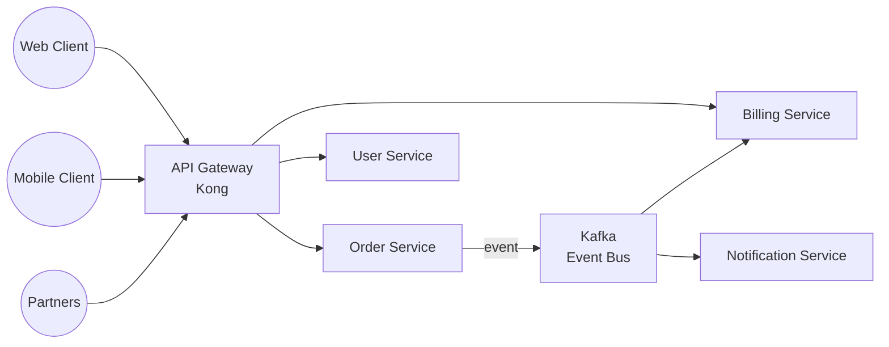
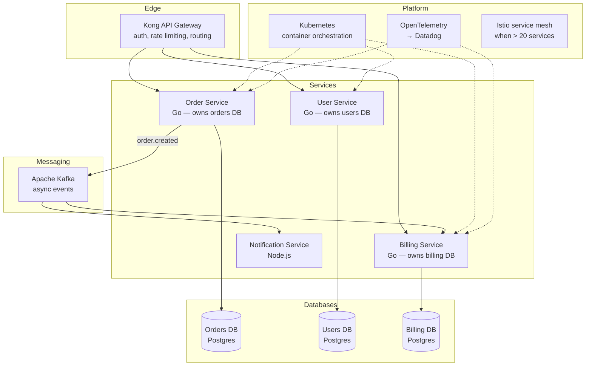

# Pattern: Microservices

!!! info "Quick facts"
    - **Category:** Backend & Distributed Systems
    - **Maturity:** Trial
    - **Typical team size:** 8+ engineers across multiple teams
    - **Typical timeline to MVP:** 12-20 weeks for the first set of services
    - **Last reviewed:** 2026-05-03 by Architecture Team

## 1. Context

**Use this pattern when:**

- The organisation has 8+ independent product teams who genuinely need to deploy to production without coordinating with each other
- Domain boundaries are well-understood — ideally because you have already run a modular monolith for a year and the natural service cuts have revealed themselves
- Specific services have measured, proven scaling requirements that differ materially from the rest of the system
- Different parts of the system need different release cadences, technology choices, or compliance boundaries

**Do NOT use this pattern when:**

- Starting a new system — begin with a Modular Monolith and extract services only when a genuine operational need is proven (see [ADR-0008](../../decisions/0008-modular-monolith-default.md))
- The team is fewer than 8 engineers — the operational overhead of a microservices platform (K8s, service mesh, distributed tracing, multiple CI pipelines) will consume the majority of the team's capacity
- Domain boundaries are still unclear — premature decomposition means rewriting services and all their consumers when you discover the wrong boundary

## 2. Problem it solves

At large engineering scale, a single deployable unit becomes a bottleneck: the payments team cannot deploy without coordinating with the billing team; the notifications service must scale up with the order service even though it handles 10× less traffic; a single slow test suite blocks all releases. Microservices give each team a deployable unit they own end-to-end, letting them release, scale, and evolve independently — at the cost of distributed systems complexity that requires mature platform engineering to manage.

## 3. Solution overview

### System context (C4 Level 1)

### Container view (C4 Level 2)

## 4. Technology stack

| Layer | Primary choice | Alternatives | Notes |
|---|---|---|---|
| Language | Go | Java (Spring Boot), Node.js (NestJS), .NET | Go for new services: small binaries, low memory, excellent concurrency, fast cold starts; Java if the team has deep Spring expertise |
| Sync communication | gRPC (internal) + REST (external) | REST only, GraphQL Federation | gRPC for internal service-to-service calls (typed, efficient); REST + OpenAPI for external-facing endpoints |
| Async communication | Apache Kafka | AWS SQS/SNS, NATS | Kafka for durable event streaming and replay; SQS for simpler task queues with no replay requirement |
| API gateway | Kong | AWS API Gateway, nginx | Kong for cloud-agnostic; AWS API Gateway for Lambda-heavy AWS-native deployments |
| Container orchestration | Kubernetes (EKS / GKE) | AWS ECS, Nomad | K8s is the standard; ECS for teams wanting managed control plane without K8s operational depth |
| Service mesh | None (< 20 services); Istio (> 20 services) | Linkerd | Avoid the complexity until the service count justifies it; Linkerd is simpler than Istio for mTLS + observability |
| Observability | OpenTelemetry → Datadog | Grafana + Tempo + Prometheus | OpenTelemetry as the vendor-neutral instrumentation standard; every service must emit traces from day one |
| Container registry | AWS ECR | GHCR, Docker Hub | ECR integrates with EKS IAM; Docker Hub rate-limits unauthenticated pulls |

## 5. Non-functional characteristics

| Concern | Profile |
|---|---|
| **Scalability** | Each service scales independently based on its own metrics. Design: measure before scaling; never pre-emptively over-provision based on assumptions about which service is the bottleneck. |
| **Availability target** | 99.9% per service; 99.5% for the system as a whole (failure modes multiply across services). Implement circuit breakers at service boundaries; a downstream outage must not cascade into an upstream outage. |
| **Latency target** | p95 < 50 ms for internal gRPC calls; p95 < 300 ms for external API responses including gateway overhead. Set explicit timeout budgets on every outbound call; never rely on a downstream service's default timeout. |
| **Security posture** | mTLS between all services (enforced by Istio when deployed). Zero-trust network policy — services communicate only with explicitly allowed peers. Separate IAM role and Kubernetes ServiceAccount per service. |
| **Data residency** | Each service owns its own database; cross-service data is accessible only via the owning service's API — never via direct DB access from another service. |
| **Compliance fit** | SOC 2 ✓ — distributed tracing provides full request lineage. GDPR: right-to-erasure requires coordinated deletion across every service that stores user data; design a `user.deletion_requested` event and implement a subscriber in each service before going live with personal data. |

## 6. Cost ballpark

Indicative monthly USD cost. Significantly higher than a modular monolith for the same functional scope due to platform overhead.

| Scale | Number of services | Monthly cost | Cost drivers |
|---|---|---|---|
| Small | 5 - 10 | $600 - $3,000 | K8s cluster, per-service Postgres, API gateway, Datadog |
| Medium | 10 - 30 | $3,000 - $15,000 | Larger K8s fleet, Datadog ($1,000–3,000/month), Kafka, Istio, dedicated platform SRE time |
| Large | 30+ | $15,000 - $60,000+ | Full platform engineering team, multi-region K8s, security scanning tooling, self-service developer portal |

## 7. LLM-assisted development fit

| Aspect | Rating | Notes |
|---|---|---|
| Individual service CRUD boilerplate (Go, NestJS) | ★★★★★ | Excellent — per-service code is self-contained and well-represented in training data. |
| gRPC `.proto` definition and stub generation | ★★★★ | Good; verify field numbering, backwards-compatibility rules, and API versioning strategy. |
| Kubernetes manifests and Helm charts | ★★★★ | Good; always review RBAC permissions and resource limits — generated limits are often wrong for production. |
| Distributed saga and compensating transaction design | ★★ | Understands the concept; the correctness of compensating transactions requires careful human design and explicit testing. |
| Architecture decisions | ★ | Don't outsource — particularly the "should we use microservices at all?" question. Use ADRs. |

**Recommended workflow:** Extract one service at a time from a working modular monolith using the Strangler Fig pattern. Never start with microservices. Validate that the extracted service can operate, deploy, and recover independently before extracting the next one.

## 8. Reference implementations

- **Public reference:** [GoogleCloudPlatform/microservices-demo](https://github.com/GoogleCloudPlatform/microservices-demo) — Online Boutique: 11-service e-commerce application in Go, Python, and Node; shows gRPC internal communication, Kubernetes deployment, and distributed tracing (200 OK ✓)
- **Public reference:** [dotnet/eShop](https://github.com/dotnet/eShop) — Microsoft's reference microservices architecture in .NET; covers event-driven patterns, API gateway, and service-to-service communication (200 OK ✓)
- **Public reference:** [open-telemetry/opentelemetry-collector](https://github.com/open-telemetry/opentelemetry-collector) — the OTel Collector used to ship traces and metrics from every service to any backend (200 OK ✓)
- **Internal case study:** _Add your anonymised internal example here_

## 9. Related decisions (ADRs)

- [ADR-0008: Modular Monolith as the default starting architecture](../../decisions/0008-modular-monolith-default.md)

## 10. Known risks & gotchas

- **"Distributed monolith" anti-pattern** — services are technically separate deployables but share a database and make synchronous call chains 5 services deep. You get all the operational cost with none of the team autonomy benefits. Mitigation: enforce "database per service" as a hard rule; use asynchronous events for non-critical coupling; keep synchronous call depth to ≤ 2.
- **GDPR right-to-erasure is harder than it looks** — user data is scattered across 15 services; a deletion request requires coordinating 15 independent delete operations. Mitigation: design a `user.deletion_requested` event on day one; every service implements a deletion subscriber; test the full flow annually.
- **Observability is non-negotiable** — a 500 error in the gateway originates in the 4th service in a call chain; without distributed tracing you cannot debug it. Mitigation: OpenTelemetry instrumentation is a launch prerequisite, not a nice-to-have; never deploy a new service to production without verifying traces propagate correctly.
- **Service boundary drawn too fine** — a "nano-service" does one thing and requires 5 synchronous calls to serve a single user request; latency adds up and the call graph becomes unmaintainable. Mitigation: a service should be ownable by a single team end-to-end; if it is too small for one team, it is too small to exist as a service.
- **Kubernetes operational overhead is substantial** — pods get evicted, nodes run out of memory, ingress controllers need upgrades, certificates expire. Mitigation: use a managed K8s offering (EKS, GKE); invest in a dedicated platform SRE before reaching 10 services; if the team does not have this capacity, stay on ECS or a managed PaaS.
