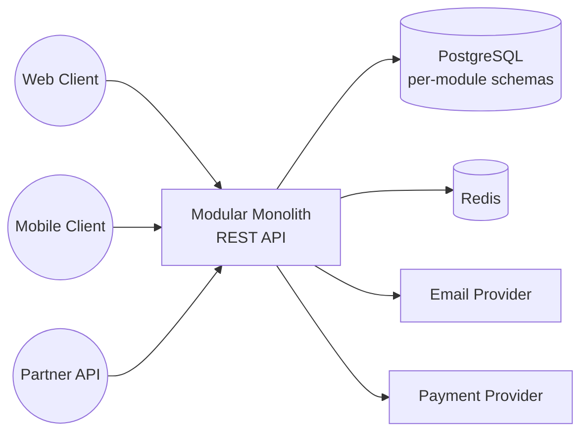

# Pattern: Modular Monolith

!!! info "Quick facts"
    - **Category:** Backend & Distributed Systems
    - **Maturity:** Adopt
    - **Typical team size:** 2-8 engineers
    - **Typical timeline to MVP:** Start from sprint one; ongoing architectural practice
    - **Last reviewed:** 2026-05-03 by Architecture Team

## 1. Context

**Use this pattern when:**

- Starting a new backend system and the team is fewer than 10 engineers
- Domain boundaries are not yet well-understood — you have not yet built the system, so you do not know where the right service cuts are
- Deployment simplicity and fast iteration are more important than the ability to scale individual subsystems independently
- The system is a monolith in practice but you want to enforce clean internal structure so that future decomposition is possible

**Do NOT use this pattern when:**

- The organisation already has 10+ independent product teams who must deploy autonomously — Conway's Law applies and independent services are the right answer
- Different parts of the system have genuinely incompatible runtime requirements (one module needs Python + GPU, another needs Go + low latency)
- You are joining an existing microservices architecture — do not consolidate; improve the services you have

## 2. Problem it solves

Engineers default to microservices on greenfield projects because "it scales better." In practice, premature decomposition creates distributed systems complexity — network failures, distributed tracing, eventual consistency — before the team understands the domain well enough to draw service boundaries correctly. Re-drawing a wrong boundary means rewriting two services and updating all their consumers. A modular monolith enforces clean module boundaries in code, keeps all the operational benefits of a single deployable, and preserves the option to extract a service later once a genuine need is proven.

## 3. Solution overview

### System context (C4 Level 1)



### Container view (C4 Level 2)

```mermaid
flowchart TB
    subgraph Monolith — single deployable unit
        APILayer[API Layer\nREST + OpenAPI]
        ModOrders[Orders Module\nservice + repository + domain]
        ModUsers[Users Module\nservice + repository + domain]
        ModBilling[Billing Module\nservice + repository + domain]
        SharedKernel[Shared Kernel\nDTOs, value objects, interfaces]
        InternalBus[Internal Event Bus\nin-process only]
    end
    subgraph Data
        DB[(PostgreSQL\nschemas: orders.* users.* billing.*)]
        Cache[(Redis\nsession + cache)]
    end
    subgraph External
        Email[Email]
        PaymentsAPI[Payments API]
    end

    APILayer --> ModOrders
    APILayer --> ModUsers
    APILayer --> ModBilling
    ModOrders --> SharedKernel
    ModUsers --> SharedKernel
    ModBilling --> SharedKernel
    ModOrders -->|publishes event| InternalBus
    InternalBus -->|subscribes| ModBilling
    ModOrders --> DB
    ModUsers --> DB
    ModBilling --> DB
    APILayer --> Cache
    ModBilling --> PaymentsAPI
    ModUsers --> Email
```

## 4. Technology stack

| Layer | Primary choice | Alternatives | Notes |
|---|---|---|---|
| Language / framework | NestJS (Node.js + TypeScript) | Go (clean architecture), Java (Spring Boot), .NET | NestJS has a first-class module system that enforces boundaries in code; Go for performance-critical backends without framework overhead |
| Module boundary enforcement | NestJS `@Module` with explicit exports | Go package visibility, Java package-private | The golden rule: a module may only use another module's published interface — never its internal services or repositories directly |
| Database | PostgreSQL with per-module schemas | MySQL | Per-module schemas (`orders`, `users`, `billing`) enforce data ownership at the DB layer; cross-module SQL joins are forbidden |
| In-process events | NestJS `EventEmitter2` | MediatR (.NET), custom observer | For decoupled reactions within the monolith; keeps modules unaware of each other while still communicating |
| Cache | Redis | In-process (single instance only) | Redis works correctly when the monolith scales to multiple replicas; in-process caches do not |
| API contract | REST + OpenAPI (auto-generated) | tRPC (TypeScript-only), GraphQL | REST for external consumers; tRPC for end-to-end type safety when the frontend is also TypeScript |
| Observability | OpenTelemetry → Datadog / Grafana | Prometheus + Grafana | Tag every trace with `module` name from day one — critical for diagnosing which module is slow and for future decomposition |
| CI/CD | GitHub Actions — single build + test + deploy | GitLab CI | Single pipeline; far simpler than microservices CI |

## 5. Non-functional characteristics

| Concern | Profile |
|---|---|
| **Scalability** | Horizontal scaling of the whole monolith handles most workloads. A single Postgres instance with proper indexing handles tens of millions of rows comfortably. When a specific module genuinely needs 10× more compute than others — and you have measured this — that is the signal to extract it as a service. |
| **Availability target** | 99.9%. Single deployment unit — a crash affects all modules. Mitigations: process supervisor (systemd, PM2), Kubernetes health checks, rolling deploys with ≥ 2 replicas behind a load balancer. |
| **Latency target** | p95 < 200 ms for API calls. All module interactions are in-process function calls — no network hop, no serialisation overhead between modules. |
| **Security posture** | Single auth boundary applied at the API layer (JWT validation). Per-module Postgres schema permissions prevent cross-schema SQL access even within the monolith. Secrets in environment variables or a secrets manager, never in code. |
| **Data residency** | All data in one Postgres instance in one region. Simple posture, but all modules share the same residency and compliance requirements — plan accordingly if modules have different data classification needs. |
| **Compliance fit** | GDPR ✓ — right-to-erasure is a single coordinated deletion across modules in one transaction. SOC 2 ✓ — simpler audit surface than microservices. HIPAA ✓ with encrypted Postgres + BAA on infrastructure. |

## 6. Cost ballpark

Indicative monthly USD cost. Significantly lower than microservices for equivalent functionality.

| Scale | MAU | Monthly cost | Cost drivers |
|---|---|---|---|
| Small | < 10,000 | $100 - $500 | 2 app instances + 1 Postgres + Redis; all on modest EC2/ECS sizes |
| Medium | 10k - 500k | $500 - $3,000 | Larger app instances, Postgres with read replica, observability |
| Large | 500k+ | $2,000 - $10,000 | Multiple app replicas, autoscaling, Postgres read replicas; at this scale evaluate whether any module needs extraction |

## 7. LLM-assisted development fit

| Aspect | Rating | Notes |
|---|---|---|
| CRUD service, repository, and controller scaffolding | ★★★★★ | Excellent — well-structured NestJS and Go module patterns are very well-represented. |
| Module boundary and interface design | ★★★ | Generates structurally sound code; domain boundary decisions (which module owns which concept) require human domain expertise. |
| Database schema and migration | ★★★★ | Generates correct SQL; review destructive migrations manually before running against production. |
| In-process event wiring | ★★★★ | Clean patterns generate correctly; verify event ordering assumptions and failure handling by hand. |
| Architecture decisions | ★ | Don't outsource — specifically the decision to start with a monolith rather than microservices has long-term consequences. Use ADRs. |

**Recommended workflow:** Define module boundaries as named directories with explicit public interface files before generating any code. Generate CRUD scaffolding per module; review cross-module calls in every PR to enforce the "no direct cross-module DB access" rule.

## 8. Reference implementations

- **Public reference:** [kgrzybek/modular-monolith-with-ddd](https://github.com/kgrzybek/modular-monolith-with-ddd) — canonical .NET reference implementing a modular monolith with Domain-Driven Design, explicit module APIs, and per-module schemas (200 OK ✓)
- **Public reference:** [dotnet/eShop](https://github.com/dotnet/eShop) — Microsoft's reference e-commerce application showing a transition from monolith toward services; useful for understanding what module extraction looks like in practice (200 OK ✓)
- **Internal case study:** _Add your anonymised internal example here_

## 9. Related decisions (ADRs)

- [ADR-0008: Modular Monolith as the default starting architecture](../../decisions/0008-modular-monolith-default.md)

## 10. Known risks & gotchas

- **"Distributed monolith" anti-pattern** — the monolith is split into separate deployables (e.g., separate Kubernetes pods per module) but they still share a database and make synchronous HTTP calls to each other. You get all the operational complexity of microservices with none of the benefits. Mitigation: if modules are deployed separately, they must own separate databases and communicate only via APIs or events — not shared tables.
- **Shared database becomes a coupling point** — Module B directly queries Module A's schema (`SELECT * FROM orders.line_items`). Any change to that schema breaks Module B. Mitigation: enforce a "module owns its schema" rule in code review; cross-module data access must go through the owning module's service layer.
- **Big-bang rewrite pressure** — the monolith grows large; a new engineer proposes rewriting in microservices. Mitigation: use the Strangler Fig pattern — extract modules one at a time, starting with the one causing the most operational pain (deployment conflicts, scaling, team boundary mismatch). Never do a big bang.
- **Deployment conflicts between teams** — two teams need to deploy changes to the same monolith on the same day and one blocks the other. Mitigation: trunk-based development with feature flags; avoid long-lived feature branches; treat deployment conflict frequency as a signal that a specific module is ready to be extracted.
- **Test suite becomes slow as the monolith grows** — integration tests spin up the entire application for every test. Mitigation: write unit tests at module service interfaces; reserve integration tests for critical cross-module flows; use test containers with parallel execution.
