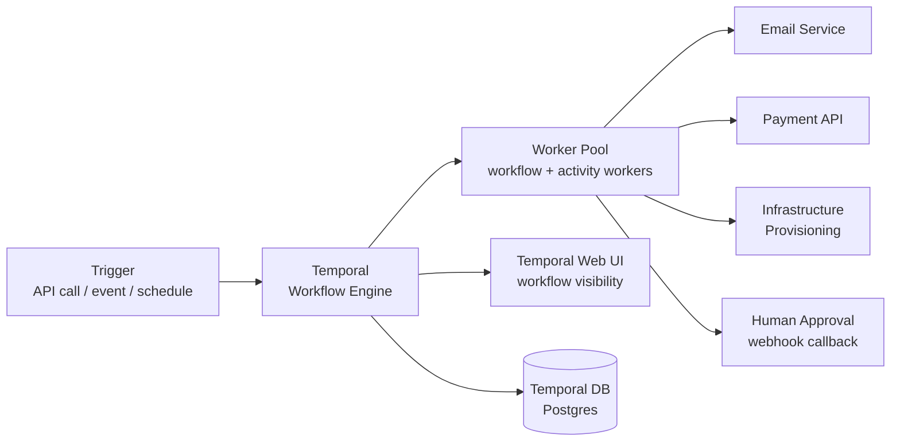

# Pattern: Workflow Orchestration

!!! info "Quick facts"
    - **Category:** Backend & Distributed Systems
    - **Maturity:** Trial
    - **Typical team size:** 1-3 engineers
    - **Typical timeline to MVP:** 4-8 weeks
    - **Last reviewed:** 2026-05-03 by Architecture Team

## 1. Context

**Use this pattern when:**

- Business processes span multiple sequential or parallel steps, each of which can fail independently and needs retry semantics
- A process runs for minutes to days — payment processing, user onboarding, data migration, approval chains
- Human-in-the-loop steps or external callbacks (waiting for a webhook, a Stripe event, a human decision) are required mid-process
- Compensating transactions are needed: if step 5 fails, steps 1-4 must be rolled back in a defined order

**Do NOT use this pattern when:**

- The process is a single, fast, synchronous API call — no orchestration layer needed
- Simple fire-and-forget background tasks (send an email, resize an image) — a job queue (BullMQ, Celery, SQS) is sufficient and simpler
- The process is purely data-pipeline work — use the ETL/ELT Job or ML Training Pipeline patterns instead

## 2. Problem it solves

A business process like "onboard a new enterprise customer" involves 12 steps across 6 services — create account, provision infrastructure, send welcome email, schedule an onboarding call, wait for the customer to complete setup, then enable billing. Implementing this as a chain of Kafka events or a cron-polled state machine is brittle: each step can fail silently, retries must be re-implemented from scratch for every flow, and debugging a stuck workflow requires trawling through logs across six services. Workflow orchestration gives each execution a durable, observable state machine with automatic retries, timeouts, and a complete execution history in a single UI.

## 3. Solution overview

### System context (C4 Level 1)



### Container view (C4 Level 2)

```mermaid
flowchart TB
    subgraph Temporal Server
        Frontend[Frontend Service\nAPI entrypoint]
        History[History Service\ndurable event sourcing]
        Matching[Matching Service\ntask queue dispatch]
        TemporalDB[(PostgreSQL\nworkflow history)]
    end
    subgraph Workers — user code
        WfWorker[Workflow Worker\norchestration logic only]
        ActWorker[Activity Worker\nside-effect implementations]
    end
    subgraph Activities
        EmailAct[Email Activity]
        PaymentAct[Payment Activity]
        InfraAct[Infrastructure Activity]
        HumanAct[Human Approval\nSignal listener]
    end
    subgraph Ops
        WebUI[Temporal Web UI]
        OTel[OpenTelemetry traces]
        Alerts[Alerts\non workflow timeout / failure]
    end

    Trigger --> Frontend
    Frontend --> Matching --> WfWorker
    WfWorker --> History
    WfWorker --> ActWorker
    ActWorker --> EmailAct
    ActWorker --> PaymentAct
    ActWorker --> InfraAct
    ActWorker --> HumanAct
    History --> TemporalDB
    Frontend --> WebUI
    WfWorker --> OTel
    History --> Alerts
```

## 4. Technology stack

| Layer | Primary choice | Alternatives | Notes |
|---|---|---|---|
| Workflow engine | Temporal | AWS Step Functions, Apache Airflow, Netflix Conductor | See [ADR-0009](../../decisions/0009-workflow-engine.md); Temporal for code-first, durable, language-native workflows; Step Functions for AWS-native simple state machines; Airflow for data pipeline orchestration |
| Worker language | Python | Go, Java, TypeScript | Python for data-heavy or ML activities; Go for high-throughput, low-latency workers; all have official Temporal SDKs |
| Temporal database | PostgreSQL | Apache Cassandra | Postgres for most deployments (simpler to operate); Cassandra for global multi-cluster deployments with very high workflow volume (> 10k starts/second) |
| Temporal hosting | Temporal Cloud | Self-hosted on Kubernetes | Temporal Cloud eliminates the operational overhead of running Temporal Server; evaluate cost vs operational burden |
| Activity retries | Temporal `RetryPolicy` (exponential backoff, max attempts, non-retryable errors) | Custom retry in activity code | Configure retry policy at the activity level; never implement retry logic inside an activity implementation — let Temporal handle it |
| Human-in-the-loop | Temporal Signal | Temporal Update (newer, for synchronous response) | Signal allows external systems (human approval UI, webhook receiver) to resume a waiting workflow asynchronously |
| Testing | Temporal `TestWorkflowEnvironment` with time-skipping | End-to-end integration tests | Temporal's test environment lets you fast-forward time, making tests for "wait 7 days" steps run in milliseconds |
| Observability | Temporal Web UI + OpenTelemetry | Datadog APM | Temporal Web UI shows full execution history per workflow; add OpenTelemetry for cross-service traces |

## 5. Non-functional characteristics

| Concern | Profile |
|---|---|
| **Scalability** | Temporal workers scale horizontally — add worker pods to increase concurrent workflow executions. Temporal Server itself requires careful horizontal scaling for > 1,000 workflow starts/second (add History shards). Activity workers are stateless and scale independently. |
| **Availability target** | 99.9%+ with Temporal Server HA deployment (multiple frontend and history replicas). A Temporal Server outage delays new workflow starts; in-progress workflows resume from their last durable checkpoint automatically on recovery — no data is lost. |
| **Latency target** | Temporal overhead per activity dispatch: 10–50 ms. Total workflow duration is the sum of activity execution times plus queue delays. Design for the happy-path duration; add explicit timeout budgets at the activity and workflow level to bound the worst case. |
| **Security posture** | Temporal Server behind an internal load balancer — no public exposure. mTLS between workers and the Temporal Frontend service. Namespace-level isolation in Temporal for multi-tenant deployments. Workflow history containing PII uses a Data Converter to encrypt payloads at rest. |
| **Data residency** | Workflow history (including activity inputs and outputs) persists in Temporal's Postgres database. If activities exchange PII, use a custom Data Converter that encrypts payloads before storage. |
| **Compliance fit** | SOC 2 ✓ — Temporal provides a complete, tamper-evident execution history with timestamps for every step. GDPR: configure namespace history retention (the default 72 hours is too short for most business workflows; set to 30–90 days and encrypt PII payloads). HIPAA ✓ with encrypted Postgres + Data Converter + BAA on infrastructure. |

## 6. Cost ballpark

Indicative monthly USD cost. Temporal Cloud pricing is per "workflow action" (each activity schedule, start, completion, signal counts).

| Scale | Workflow executions / month | Monthly cost | Cost drivers |
|---|---|---|---|
| Small | < 10,000 | $200 - $700 | Self-hosted Temporal on 2 K8s pods + Postgres, or Temporal Cloud free tier |
| Medium | 10k - 1M | $700 - $5,000 | Temporal Cloud (~$0.002/action), worker compute, larger Postgres |
| Large | 1M+ | $5,000 - $20,000 | Temporal Cloud at scale, or self-hosted K8s fleet + Cassandra, dedicated worker fleet |

## 7. LLM-assisted development fit

| Aspect | Rating | Notes |
|---|---|---|
| Workflow definition scaffolding | ★★★★★ | Excellent — Temporal SDK patterns for Go, Python, and TypeScript are well-represented in training data. |
| Activity implementation boilerplate | ★★★★★ | Excellent — activity code is ordinary Go/Python; generate freely and review business logic. |
| RetryPolicy and timeout configuration | ★★★★ | Good; timeout values require domain knowledge (how long should a payment API call be allowed to take?). |
| Compensating transaction (saga) design | ★★★ | Understands the pattern; the correctness of multi-step rollback chains requires careful human design and explicit tests for every failure branch. |
| Architecture decisions | ★ | Don't outsource. Use ADRs. |

**Recommended workflow:** Start with a three-step workflow (start → one activity → complete) to validate the Temporal setup end-to-end before building complex flows. Write the compensating transaction path before the happy path — if you design the happy path first, the compensation is often an afterthought that breaks under real failures.

## 8. Reference implementations

- **Public reference:** [temporalio/temporal](https://github.com/temporalio/temporal) — the Temporal server; architecture documentation and the Go SDK reference (200 OK ✓)
- **Public reference:** [temporalio/samples-python](https://github.com/temporalio/samples-python) — official Python SDK samples covering child workflows, signals, timers, human-in-the-loop, and saga patterns (200 OK ✓)
- **Internal case study:** _Add your anonymised internal example here_

## 9. Related decisions (ADRs)

- [ADR-0009: Temporal as the default workflow orchestration engine](../../decisions/0009-workflow-engine.md)

## 10. Known risks & gotchas

- **Non-deterministic workflow code breaks replay** — Temporal reconstructs workflow state by replaying execution history; if workflow code contains `time.Now()`, random numbers, or direct API calls (not wrapped as activities), replay produces a different result and the workflow panics with a non-determinism error. Rule: workflow functions must be deterministic; every side effect and every external call goes in an activity.
- **Activity timeouts not set cause permanent hangs** — an activity calls an external API with no timeout; the API hangs indefinitely; the workflow waits forever with no alert. Mitigation: every activity must set a `StartToCloseTimeout` (maximum time for a single attempt) and a `ScheduleToCloseTimeout` (maximum total time including retries); treat timeout omission as a code review failure.
- **Workflow history grows too large for long-running processes** — a monthly billing workflow that accumulates thousands of events across a year causes replay to slow to seconds. Mitigation: use `ContinueAsNew` to reset workflow history periodically in any workflow that runs for more than a few days.
- **Human approval step with no timeout waits forever** — a workflow waits for a Signal (human clicks "approve"); the human is on holiday; the workflow blocks the associated business object for weeks. Mitigation: always pair a Signal wait with a timer; automatically escalate to a secondary approver or cancel with a notification after a configured timeout.
- **Worker deployment removes a registered activity** — a rolling deploy removes an activity function that in-flight workflows are currently calling; those workflows get stuck with "activity type not registered" errors. Mitigation: use Temporal's versioning API (`workflow.GetVersion` in Go, `workflow.patched` in Python) to branch logic on version; keep old activity implementations deployed until all in-flight workflows using them complete.
