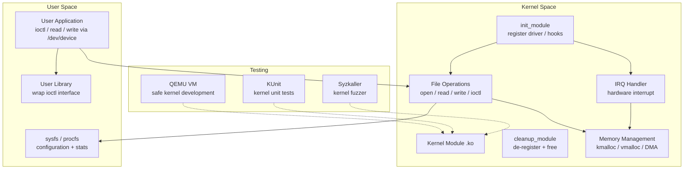

# Pattern: Custom OS Component / Kernel Module

!!! info "Quick facts"
    - **Category:** Systems & Infrastructure
    - **Maturity:** Hold
    - **Typical team size:** 2-5 engineers (kernel and systems expertise required)
    - **Typical timeline to MVP:** 12-24 months
    - **Last reviewed:** 2026-05-03 by Architecture Team

## 1. Context

!!! warning "Consider eBPF first"
    Before writing a kernel module, evaluate whether **eBPF** can solve the problem. eBPF runs safely in the kernel with verifier-enforced memory safety, no kernel build dependency, and live-patching without reboots. It is the correct solution for most observability, networking, and security use cases that previously required a kernel module.

**Use this pattern when:**

- You have exhausted eBPF, FUSE, and userspace alternatives and a kernel module is genuinely the only way to meet the requirement
- Building a device driver for novel hardware with no existing kernel support
- Implementing a custom filesystem, network protocol driver, or scheduler extension that requires kernel-level access

**Do NOT use this pattern when:**

- The goal is observability (tracing, profiling, metrics) — use eBPF (bcc, bpftrace, Cilium)
- The goal is custom networking (firewall rules, load balancing, packet manipulation) — use eBPF XDP
- The goal is custom filesystem semantics — use FUSE (Filesystem in Userspace) first; it is slower but safe and not kernel version-dependent
- The team has not written kernel code before — the learning curve, debugging difficulty, and blast radius of mistakes (system crashes, data corruption, security vulnerabilities) are substantially higher than any userspace development

## 2. Problem it solves

Certain problems require kernel-level access: a device driver for hardware that the OS does not know about, a custom network protocol that must be processed before packets reach userspace, or a specialised scheduler policy. When userspace, eBPF, and FUSE cannot solve the problem — and the team has verified this carefully — a kernel module provides the necessary privilege level.

## 3. Solution overview

### System context (C4 Level 1)

```mermaid
flowchart LR
    Hardware[Hardware\ndevice / peripheral] --> Driver[Kernel Module\ndevice driver / subsystem]
    UserApp[User Application] -->|syscall / ioctl| Driver
    Driver -->|kernel API| Kernel[Linux Kernel\nsubsystems]
    Driver --> ProcFS[/proc or /sys\nstats + config]
```

### Container view (C4 Level 2)



## 4. Technology stack

| Layer | Primary choice | Alternatives | Notes |
|---|---|---|---|
| Language | C (Linux kernel standard) | Rust (in-tree since Linux 6.1) | C is the only universally accepted language for Linux kernel modules; Rust is available for in-tree drivers in Linux 6.1+ but is still maturing — evaluate per-project |
| Kernel API | Linux Kernel API (stable only) | DKMS for out-of-tree modules | Use only stable, documented kernel APIs; avoid internal APIs that change between kernel versions |
| Build system | Kernel Makefiles (Kbuild) | DKMS (auto-rebuild on kernel update) | DKMS for out-of-tree modules that must survive kernel upgrades |
| Development environment | QEMU (KVM) VM | Physical test machine, live USB | Never develop kernel modules on your primary machine; use a QEMU VM with a snapshot for safe crash recovery |
| Debugging | KGDB + gdb via serial | printk + /proc, ftrace | KGDB for step-through debugging of kernel code; ftrace for production performance tracing |
| Testing | KUnit (kernel unit testing framework) | custom kernel test modules | KUnit runs unit tests in-kernel; supplement with Syzkaller fuzzing before production deployment |
| eBPF alternative | bcc, bpftrace, Cilium | libbpf (low-level) | For observability and networking, use eBPF before committing to a kernel module |
| Memory | kmalloc (< 128KB contiguous), vmalloc (large virtual), DMA API | slab/slub allocators | Never use userspace memory allocation APIs in kernel context |

## 5. Non-functional characteristics

| Concern | Profile |
|---|---|
| **Scalability** | Kernel modules run in the highest privilege ring and can access all hardware resources. Scalability concerns are about being a good kernel citizen: release locks quickly, avoid blocking in interrupt context, minimise allocations in hot paths. |
| **Availability target** | A kernel module bug can cause an instant system crash (kernel panic) or silent data corruption with no process boundary to contain it. Availability = "the kernel does not panic due to the module." Test with Syzkaller and crash injection before any production deployment. |
| **Latency target** | Interrupt handlers must complete in microseconds. Deferred work (bottom halves, work queues) must not block for extended periods. Profile with `perf` and ftrace on realistic workloads. |
| **Security posture** | A kernel module runs in ring 0 with unrestricted memory access. A security bug in a kernel module is a full system compromise. Code review by a kernel security expert is mandatory. Use Smatch, sparse, and Coccinelle static analysers. Consider Rust for new in-tree drivers precisely for memory safety guarantees. |
| **Data residency** | Kernel modules access all system memory and I/O; they have no inherent data residency boundary. Encryption and access control must be implemented explicitly. |
| **Compliance fit** | GPL licence required for in-tree Linux kernel modules (Linux is GPL v2). Out-of-tree proprietary modules are legal but cannot use GPL-only symbols. Kernel modules for safety-critical systems require additional certification — see Safety-Critical patterns. |

## 6. Cost ballpark

Custom kernel modules are an engineering investment; infrastructure costs are minimal.

| Scale | Deployment | Monthly cost | Cost drivers |
|---|---|---|---|
| Embedded / single device | 1 device | $0 | No additional infrastructure |
| On-premises fleet | 100-10,000 machines | $100 - $2,000 | DKMS packaging, kernel update testing, signing infrastructure |
| Cloud / large fleet | 10,000+ VMs | $1,000 - $10,000 | Signing, DKMS build pipeline, OS image management |

## 7. LLM-assisted development fit

| Aspect | Rating | Notes |
|---|---|---|
| Kernel module skeleton (init/exit, Makefile) | ★★★★ | Generates correct boilerplate; always review against the current kernel version's API. |
| Character device and file operations scaffolding | ★★★ | Knows the patterns; locking, reference counting, and memory management correctness requires expert review. |
| eBPF program scaffolding (bcc, libbpf) | ★★★★ | Good — eBPF patterns are well-represented; verify the verifier will accept the program. |
| Interrupt handling and DMA setup | ★★ | Knows the API surface; hardware-specific timing and memory barrier requirements require expert knowledge. |
| Architecture decisions | ★ | Never outsource kernel architecture decisions. |

**Recommended workflow:** Prototype in QEMU before touching any hardware. Write the eBPF version first to validate that the approach works; only proceed to a kernel module if eBPF cannot meet the requirement. Fuzz with Syzkaller before production deployment.

## 8. Reference implementations

- **Public reference:** [iovisor/bcc](https://github.com/iovisor/bcc) — BCC toolkit: eBPF-based Linux performance analysis tools; the correct starting point for most use cases that would otherwise require a kernel module (200 OK ✓)
- **Internal case study:** _Add your anonymised internal example here_

## 9. Related decisions (ADRs)

- [ADR-0011: Rust as the default language for new systems and infrastructure code](../../decisions/0011-systems-language.md)

## 10. Known risks & gotchas

- **Kernel panic in production causes immediate downtime** — a NULL pointer dereference in a kernel module crashes the entire machine; no process boundary protects the OS. Mitigation: stage deployments carefully; keep the kernel module out of critical path initially; use `crash` + kdump to capture crash dumps for post-mortem analysis.
- **Kernel API breakage on upgrade** — an out-of-tree module compiled against kernel 5.15 breaks on 6.x when an internal API changes. Mitigation: use DKMS to auto-rebuild on kernel updates; write an automated test that boots a new kernel and runs module smoke tests before updating production machines.
- **Memory leak in kernel space exhausts the system** — `kmalloc` without a corresponding `kfree` in the cleanup path is never reclaimed until reboot. Mitigation: use the kernel's memory debugging tools (kmemleak, KASAN) in development; every allocation must have an owner and a deallocation path in all code branches.
- **Race condition in interrupt handler corrupts data** — a shared data structure is accessed from both process context and an interrupt handler without proper locking; the corruption is intermittent and hard to reproduce. Mitigation: use `spin_lock_irqsave` / `spin_lock_irqrestore` for any data shared with an interrupt handler; use lockdep (kernel lock dependency validator) to detect deadlock-prone locking patterns.
- **Module signing bypass allows rootkit installation** — an unsigned kernel module is loaded via `insmod`; an attacker uses this path to load a rootkit. Mitigation: enable Secure Boot and kernel module signing (`CONFIG_MODULE_SIG_FORCE`); require all production modules to be signed with a key enrolled in the machine's MOK database.
