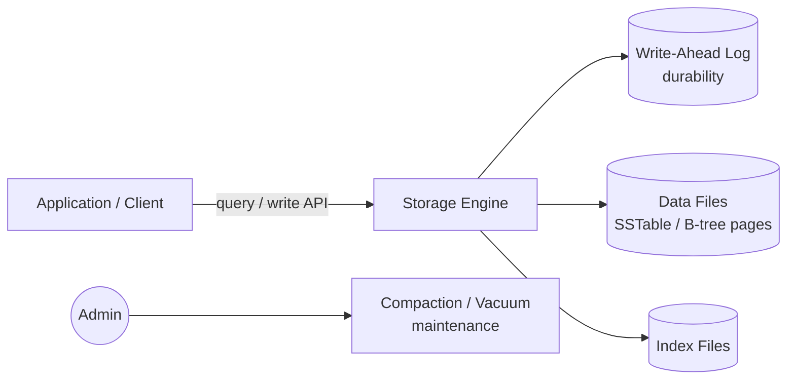
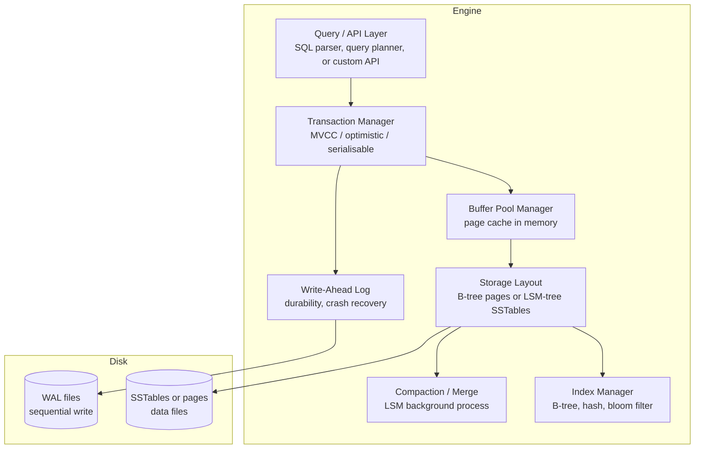

# Pattern: Database Engine / Storage Layer

!!! info "Quick facts"
    - **Category:** Systems & Infrastructure
    - **Maturity:** Assess
    - **Typical team size:** 3-8 engineers (requires deep systems and database internals expertise)
    - **Typical timeline to MVP:** 6-18 months
    - **Last reviewed:** 2026-05-03 by Architecture Team

## 1. Context

**Use this pattern when:**

- An existing database engine does not meet the specific performance, query model, or data model requirements of a high-volume specialised workload (time-series, vector search, columnar analytics, graph)
- You are building infrastructure that other software uses as a storage primitive — a caching layer, an append-only log, an embedded key-value store
- The deployment environment prohibits external database dependencies (embedded device, offline, air-gapped) and a custom storage layer is required

**Do NOT use this pattern when:**

- An existing database (Postgres, RocksDB, DuckDB, ClickHouse, SQLite) meets your requirements — use it; building a database engine is one of the hardest software engineering problems and should be a last resort
- The team lacks deep experience with B-trees, LSM-trees, MVCC, WAL, and storage engine internals — the investment to build this expertise is substantial
- This is an application-level "storage problem" — most application storage challenges are solved by schema design, indexing, and query optimisation, not by building a new engine

## 2. Problem it solves

General-purpose databases make trade-offs that favour the average workload. A time-series database with billions of write events per day needs a storage engine optimised for append-heavy sequential writes and range queries over time — not the random read/write balance Postgres optimises for. When the specific access pattern is known and extreme, a purpose-built storage layer can be 10–100× more efficient than a general-purpose alternative.

## 3. Solution overview

### System context (C4 Level 1)

### Container view (C4 Level 2)

## 4. Technology stack

| Layer | Primary choice | Alternatives | Notes |
|---|---|---|---|
| Implementation language | Rust | C++, Go, Java (RocksDB-JNI) | Rust for memory safety without GC — critical for a storage engine where use-after-free and data corruption are catastrophic; C++ for teams with existing storage engine codebases |
| Storage structure | LSM-tree (for write-heavy) | B-tree (for read-balanced), Copy-on-Write B-tree | LSM for append-heavy time-series or log workloads; B-tree for random read/write balance; measure your read:write ratio before choosing |
| Existing embeddable engine (if not building from scratch) | RocksDB | LevelDB, WiredTiger, LMDB | RocksDB is the most feature-complete embeddable LSM engine; consider embedding it rather than building a new storage layer — this is almost always the right choice |
| WAL format | Custom append-only log | SQLite WAL, Kafka-style segment files | Always separate the WAL from data files; WAL writes must be sequential and durable (fsync or O\_DSYNC) |
| Memory management | Custom arena allocator | jemalloc, mimalloc | Arena allocators eliminate fragmentation in long-running processes; jemalloc as a drop-in replacement for the system allocator improves RocksDB throughput by 10–15% |
| Concurrency | MVCC (multi-version concurrency control) | Optimistic locking, OCC | MVCC for reader-writer concurrency without blocking; requires careful version GC to avoid unbounded version chain growth |
| Testing | Property-based testing (`proptest` Rust) + KLEE symbolic execution | Jepsen (distributed), SQLite's own test harness | Storage engines require adversarial testing: crash injection, fsync failure simulation, bit-flip testing |

## 5. Non-functional characteristics

| Concern | Profile |
|---|---|
| **Scalability** | Vertical scaling (more RAM for buffer pool, faster NVMe) is the primary lever. Horizontal scaling via sharding requires partitioning logic above the storage layer. Design the storage layer to be single-node correct first. |
| **Availability target** | 99.999% — storage engines are the foundation; their availability is the ceiling for everything above them. WAL + checkpointing must enable crash recovery with zero data loss; measure MTTR from crash to operational with automated tests. |
| **Latency target** | Write path (WAL append): < 100 μs per transaction (fsync dominates; consider group commit to amortise). Read path (buffer pool hit): < 10 μs. Read path (disk read): 100 μs–1 ms depending on NVMe vs HDD. |
| **Security posture** | Validate all deserialized data from disk — a corrupted page must not cause undefined behaviour or a crash. Implement checksums on every page; verify on read. Encryption at rest: implement page-level encryption in the buffer pool, not at the filesystem layer. |
| **Data residency** | The storage layer controls where bytes are written; data residency is a deployment-time concern. Implement transparent encryption to support regulated deployments without changing the engine. |
| **Compliance fit** | Storage engines used in regulated contexts (medical devices, financial systems) must demonstrate crash-safe durability (provable WAL recovery) and integrity verification (per-page checksums). Formal verification of critical invariants (using TLA+, Coq, or Lean) is expected at this level. |

## 6. Cost ballpark

Building a database engine is primarily an engineering investment, not infrastructure cost.

| Scale | Storage volume | Monthly infra cost | Cost drivers |
|---|---|---|---|
| Small / embedded | < 10 GB | $0 - $100 | Embedded in application, no separate infrastructure |
| Medium / server | 10 GB - 1 TB | $200 - $2,000 | NVMe-attached servers or cloud block storage |
| Large / distributed | 1 TB+ | $2,000 - $20,000 | High-IOPS NVMe fleet, replication bandwidth |

## 7. LLM-assisted development fit

| Aspect | Rating | Notes |
|---|---|---|
| RocksDB integration and configuration | ★★★★ | Good — RocksDB API usage is well-documented; tuning parameters require benchmarking for your workload. |
| WAL append and recovery scaffolding | ★★★ | Understands the pattern; durability correctness (fsync, group commit, crash recovery) requires expert review and extensive crash testing. |
| B-tree page format and split/merge logic | ★★ | Knows the algorithms; implementation correctness for edge cases (concurrent splits, page overflow) requires deep expertise. |
| Property-based test scaffolding (proptest) | ★★★★ | Good at generating property strategies; defining the invariants to test requires deep domain knowledge. |
| Architecture decisions | ★ | Never outsource storage engine design decisions. |

**Recommended workflow:** Use RocksDB as an embedded storage engine rather than building from scratch unless you have a specific, measured reason that RocksDB cannot meet. If building from scratch, implement and thoroughly test crash recovery before any other feature.

## 8. Reference implementations

- **Public reference:** [facebook/rocksdb](https://github.com/facebook/rocksdb) — RocksDB: the most widely deployed embeddable LSM storage engine; study the architecture docs in `docs/` before building anything (200 OK ✓)
- **Internal case study:** _Add your anonymised internal example here_

## 9. Related decisions (ADRs)

- [ADR-0011: Rust as the default language for new systems and infrastructure code](../../decisions/0011-systems-language.md)

## 10. Known risks & gotchas

- **Silent data corruption from missing fsync** — writing without fsync leaves data in the OS page cache; a power loss loses it; the WAL incorrectly indicates it was persisted. Mitigation: always fsync the WAL after each transaction (or use group commit); test durability by simulating power loss with a test harness that kills the process mid-write.
- **Write amplification in LSM-tree destroys NVMe lifetime** — heavy compaction writes data 10–30× before it settles; an NVMe drive with 600 TBW is exhausted in months. Mitigation: monitor write amplification factor (WAF) as a first-class metric; tune compaction strategy for your write rate.
- **Buffer pool thrash under mixed read/write** — a large scan evicts hot pages from the buffer pool; subsequent random reads miss and go to disk. Mitigation: implement LRU-K or ARC eviction policy rather than simple LRU; pin frequently-accessed index pages.
- **Version chain unbounded growth under long-running transactions** — an MVCC engine accumulates old versions; a long-running read transaction prevents GC; memory grows until OOM. Mitigation: track the oldest active transaction; enforce a maximum transaction age; abort transactions that hold snapshot references beyond the threshold.
- **Testing a storage engine is harder than building it** — a bug in the WAL recovery path surfaces only in specific crash scenarios at specific points in the write sequence. Mitigation: build a crash-injection test harness that kills the process at every possible fsync boundary; verify that re-opening the engine after each crash returns a consistent state.
