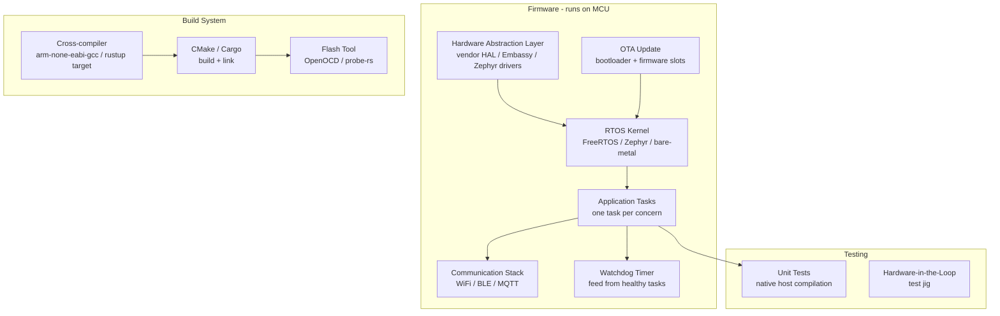

# Pattern: Embedded Firmware

!!! info "Quick facts"
    - **Category:** Systems & Infrastructure
    - **Maturity:** Adopt
    - **Typical team size:** 1-4 engineers
    - **Typical timeline to MVP:** 8-20 weeks (hardware dependency)
    - **Last reviewed:** 2026-05-03 by Architecture Team

## 1. Context

**Use this pattern when:**

- Writing software that runs directly on microcontrollers (MCUs) or microprocessors in IoT devices, embedded controllers, or hardware peripherals
- The execution environment has severe resource constraints: kilobytes of RAM, no MMU, no operating system (bare metal) or a small RTOS
- Deterministic timing and hardware I/O control (GPIO, SPI, I2C, UART, ADC) are first-class requirements

**Do NOT use this pattern when:**

- The target is a general-purpose Linux SBC (Raspberry Pi, BeagleBone) — use standard Linux application development patterns; this pattern is for MCU-class devices
- The firmware controls a safety-critical function (medical device, automotive ECU) — see the Safety-Critical patterns; those require certification that this pattern does not cover
- A high-level scripting runtime is acceptable — MicroPython or Lua on ESP32 may be sufficient for simple IoT sensors

## 2. Problem it solves

Embedded firmware runs on hardware with kilobytes of RAM, no virtual memory, and often no OS. Code must fit in flash, execute deterministically, respond to hardware events in microseconds, and run reliably for years without a reboot. This pattern captures the toolchain, RTOS choices, and architectural decisions that enable a small team to produce correct, maintainable firmware for a constrained device.

## 3. Solution overview

### System context (C4 Level 1)

```mermaid
flowchart LR
    Hardware((Hardware\nMCU + peripherals)] --> Firmware[Firmware\nC / Rust on RTOS]
    Firmware -->|UART / SPI / I2C| Sensors[Sensors & Actuators]
    Firmware -->|WiFi / BLE / LoRa| Cloud[Cloud Backend\nor gateway]
    DevPC((Developer)) --> Debugger[Debug Probe\nJ-Link / CMSIS-DAP]
    Debugger --> Firmware
```

### Container view (C4 Level 2)



## 4. Technology stack

| Layer | Primary choice | Alternatives | Notes |
|---|---|---|---|
| Language | C (with MISRA guidelines) | Rust (Embassy / Zephyr), C++ (embedded) | C is the universal embedded language with the most tooling, HAL support, and examples; Rust for new projects where the team can invest in the learning curve — see [ADR-0011](../../decisions/0011-systems-language.md) |
| RTOS | FreeRTOS | Zephyr RTOS, bare metal, ThreadX (Azure) | FreeRTOS for ARM Cortex-M devices: small footprint, well-documented, vast community; Zephyr for complex multi-radio IoT (BLE + WiFi + LoRa in one OS) |
| HAL | Vendor HAL (STM32 HAL, ESP-IDF) | CMSIS (ARM), Embassy (Rust async HAL) | Use the vendor-provided HAL for peripheral drivers; Embassy for Rust targets provides an async-native HAL |
| Build system | CMake | Zephyr's west / CMake, Cargo (Rust) | CMake is the standard for C embedded projects; west is Zephyr's meta-tool (wraps CMake) |
| Debug probe | CMSIS-DAP (open standard) | J-Link (Segger), ST-Link | CMSIS-DAP with OpenOCD for an open-source toolchain; J-Link for commercial projects needing the best trace/profiling support |
| OTA updates | MCUboot (open-source bootloader) | Vendor OTA (ESP-IDF OTA, STM32 OTA) | MCUboot provides A/B firmware slots with cryptographic signature verification; always support rollback |
| Communication | MQTT over WiFi / LTE | CoAP, custom binary protocol | MQTT for constrained devices publishing to cloud brokers (AWS IoT Core, HiveMQ); CoAP for very constrained devices |
| Testing | Unity test framework (C) + native host build | CTest, Ceedling | Compile and run unit tests on the host (x86) to avoid hardware dependency; supplement with hardware-in-the-loop (HIL) tests |

## 5. Non-functional characteristics

| Concern | Profile |
|---|---|
| **Scalability** | No scalability dimension — each device runs one firmware instance. Fleet scalability (managing millions of devices) is a backend/OTA concern, not a firmware concern. |
| **Availability target** | Firmware must not hang or crash; design for 99.999% uptime (< 5 minutes downtime per year). Watchdog timer: any task that stops feeding the watchdog triggers a reset. Brownout detection: handle power loss gracefully. |
| **Latency target** | Interrupt handlers: < 10 μs for safety-critical or real-time tasks. Application task response: < 1 ms for sensor polling. Hard real-time requirements require careful task priority assignment and interrupt latency analysis. |
| **Security posture** | Disable JTAG/SWD in production builds (readback protection). Sign firmware images (MCUboot with Ed25519). Encrypt sensitive data in flash (device key in OTP). Never ship debug/test code in production builds. Implement secure boot. |
| **Data residency** | Data on device (flash, EEPROM) is physically in the device. If the device is deployed in the EU and collects personal data (location, biometrics), GDPR applies — the device must be able to erase local PII on command. |
| **Compliance fit** | CE / FCC certification required for RF devices before sale; involves hardware testing, not just software. IEC 62304 (medical) and ISO 26262 (automotive) impose process requirements — see Safety-Critical patterns if applicable. PSA Certified (Platform Security Architecture) for IoT security baseline. |

## 6. Cost ballpark

Firmware development cost is primarily engineering time; hardware BOM and test equipment are separate.

| Scale | Devices deployed | Monthly cost (ops) | Cost drivers |
|---|---|---|---|
| Small | < 1,000 | $50 - $500 | OTA server hosting, cloud backend, IoT broker |
| Medium | 1k - 100k | $500 - $5,000 | IoT platform (AWS IoT Core), OTA CDN, device management |
| Large | 100k+ | $5,000 - $30,000 | IoT platform at scale, fleet management, firmware signing infrastructure |

## 7. LLM-assisted development fit

| Aspect | Rating | Notes |
|---|---|---|
| Peripheral driver boilerplate (SPI, I2C, UART init) | ★★★★ | Good — vendor HAL patterns are represented; verify against the specific device datasheet. |
| FreeRTOS task and queue scaffolding | ★★★★ | Good; priority inversion and deadlock scenarios need careful manual review. |
| MQTT client integration (e.g., wolfMQTT, Paho) | ★★★★ | Good for standard connect/subscribe/publish patterns. |
| Interrupt service routine (ISR) design | ★★★ | Knows the constraints (no blocking, minimal work in ISR); correctness of shared state between ISR and tasks requires expert review. |
| Architecture decisions | ★ | Don't outsource. Use ADRs. |

**Recommended workflow:** Start with a blinking LED to validate the toolchain and debug probe before adding any application logic. Write host-compilable unit tests for all business logic from day one — hardware-dependent tests are expensive to run.

## 8. Reference implementations

- **Public reference:** [zephyrproject-rtos/zephyr](https://github.com/zephyrproject-rtos/zephyr) — Zephyr RTOS; `samples/` covers BLE, WiFi, sensor drivers, shell, and OTA for dozens of hardware targets (200 OK ✓)
- **Public reference:** [embassy-rs/embassy](https://github.com/embassy-rs/embassy) — Embassy: async Rust embedded framework; `examples/` covers ARM Cortex-M, STM32, nRF, and RP2040 targets with async tasks and HAL drivers (200 OK ✓)
- **Internal case study:** _Add your anonymised internal example here_

## 9. Related decisions (ADRs)

- [ADR-0011: Rust as the default language for new systems and infrastructure code](../../decisions/0011-systems-language.md)

## 10. Known risks & gotchas

- **Watchdog timer not fed by all tasks** — one task blocks waiting for a resource; the watchdog is only fed by other tasks; the device resets in production. Mitigation: each task must feed its own watchdog token; use a watchdog aggregator that resets the hardware watchdog only after all tasks have checked in.
- **Stack overflow in task silently corrupts memory** — an RTOS task overflows its stack; memory corruption follows with unpredictable behaviour. Mitigation: use stack overflow detection (FreeRTOS `configCHECK_FOR_STACK_OVERFLOW`); fill stacks with a sentinel pattern; measure actual stack usage during testing with the HWM (high water mark).
- **Flash wear causes corruption on high-frequency writes** — writing to the same flash page (log, counter, config) thousands of times per day exceeds the flash endurance (10k–100k erase cycles). Mitigation: use a wear-levelling flash file system (LittleFS); never write to raw flash directly for frequently updated data.
- **OTA update interrupted by power loss bricks the device** — partial firmware write renders the device unbootable. Mitigation: always use A/B firmware slots (MCUboot); never overwrite the running slot; only switch to the new slot after the full image is written and verified by CRC/signature.
- **JTAG left enabled in production firmware** — an attacker with physical access reads the flash and extracts firmware or secrets. Mitigation: write a production build script that enables readback protection (RDP Level 2 on STM32); verify RDP status in the CI release pipeline before signing.
