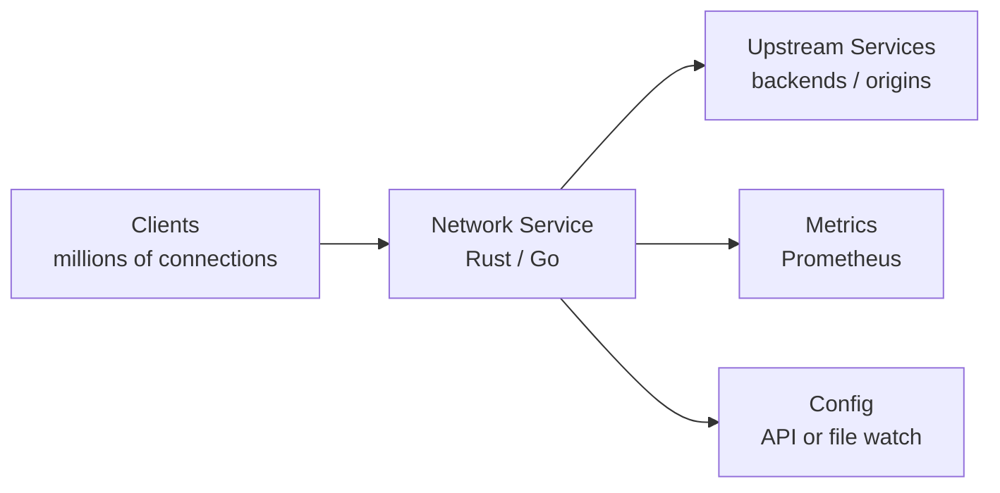
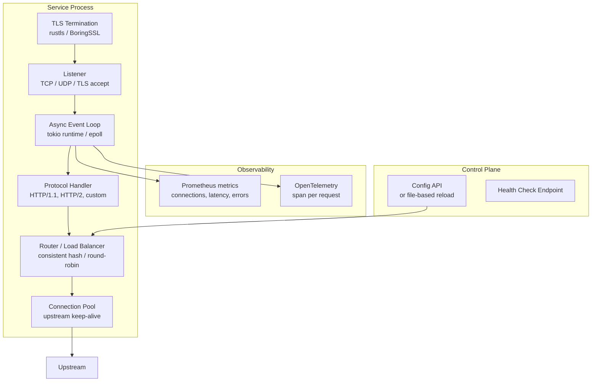

# Pattern: High-performance Network Service

!!! info "Quick facts"
    - **Category:** Systems & Infrastructure
    - **Maturity:** Trial
    - **Typical team size:** 2-5 engineers
    - **Typical timeline to MVP:** 8-16 weeks
    - **Last reviewed:** 2026-05-03 by Architecture Team

## 1. Context

**Use this pattern when:**

- Building a proxy, load balancer, API gateway, protocol gateway, or custom network service where throughput (Gbps), connection count (millions of concurrent), or tail latency (p99 < 1ms) are the primary constraints
- A garbage-collected language's pause times (Go GC, JVM GC) are measurably impacting tail latency at production traffic levels
- The service must handle millions of concurrent connections on a small number of CPU cores

**Do NOT use this pattern when:**

- Go is sufficient — Go's goroutine model and sub-millisecond GC pauses handle most network services well; reach for Rust only when Go's overhead is a measured problem, not a hypothetical one
- The bottleneck is downstream (database, API) rather than the service itself — optimising the network layer will not help
- The team has no systems programming experience — the complexity of async Rust or C++ network programming is substantial

## 2. Problem it solves

High-traffic network services — proxies, load balancers, protocol translators, streaming servers — must handle millions of concurrent connections while keeping tail latency low and memory usage bounded. Garbage-collected languages introduce unpredictable pause times under GC pressure. Async I/O frameworks built on the OS event loop (epoll, kqueue, io\_uring) allow a small number of threads to handle millions of concurrent connections without blocking. This pattern captures the architectural decisions for building a service at this performance tier.

## 3. Solution overview

### System context (C4 Level 1)

### Container view (C4 Level 2)

## 4. Technology stack

| Layer | Primary choice | Alternatives | Notes |
|---|---|---|---|
| Language | Rust | Go, C++ | Rust for highest performance and memory safety without GC; Go for services that don't require Rust-level performance (handles millions of RPS with acceptable tail latency); C++ for teams with existing expertise |
| Async runtime | Tokio (Rust) | async-std (Rust), Go runtime (built-in) | Tokio is the de-facto Rust async runtime; `tokio::net` for TCP/UDP, `tokio-tungstenite` for WebSocket |
| HTTP framework | Axum (Rust) | Hyper (lower-level), Actix-web | Axum is built on Hyper (the fastest Rust HTTP library) with a higher-level router; use Hyper directly for custom protocol work |
| TLS | rustls | BoringSSL (via `boring` crate), native-tls | rustls is a pure-Rust TLS implementation with no C dependencies; lower attack surface than OpenSSL |
| I/O model | `io_uring` (Linux 5.1+) via Tokio's `io_uring` support | epoll (standard), kqueue (macOS) | `io_uring` reduces syscall overhead significantly for very high connection counts; epoll is the safe default |
| Observability | Prometheus metrics (`metrics` crate) + OpenTelemetry | Custom metrics, StatsD | Export metrics via `/metrics` endpoint; instrument every request with a counter, histogram, and error rate |
| Configuration | TOML file + SIGHUP reload | etcd/Consul dynamic config, environment variables | File-based config with hot reload via SIGHUP is simpler than a distributed config store for most services |

## 5. Non-functional characteristics

| Concern | Profile |
|---|---|
| **Scalability** | Single-process async services scale vertically (more CPU cores via Tokio work-stealing) and horizontally (multiple instances behind a load balancer). Target: saturate a 10 Gbps NIC on a single machine before adding horizontal replicas. |
| **Availability target** | 99.99% — network infrastructure services have higher availability requirements than application services. Graceful shutdown: drain in-flight requests before terminating; never drop connections on SIGTERM. |
| **Latency target** | p50 < 100 μs, p99 < 1 ms for a simple proxy (not including upstream latency). Profile with `wrk2` or `hey` at realistic concurrency levels; never report p50 latency only. |
| **Security posture** | Input validation on all protocol fields — malformed inputs must be rejected before they reach business logic. TLS everywhere with certificate rotation without restart. Rate limiting at the service layer. Memory safety is a first-class goal; prefer Rust over C/C++ for new services. |
| **Data residency** | Stateless proxy — data passes through but is not stored. Logs may contain request metadata (IPs, headers); apply log scrubbing for PII. |
| **Compliance fit** | FIPS 140-2 compliance may be required for TLS in government or financial contexts; verify your TLS library's certification status. TLS 1.3 minimum in 2026; disable TLS 1.1 and below. |

## 6. Cost ballpark

High-performance network services are typically the cheapest tier — they do little computation and scale vertically.

| Scale | Peak RPS | Monthly cost | Cost drivers |
|---|---|---|---|
| Small | < 10,000 | $50 - $300 | 2-4 small instances, minimal memory footprint |
| Medium | 10k - 1M | $300 - $3,000 | Larger instances (c5.xlarge), load balancer, Prometheus |
| Large | 1M+ | $2,000 - $20,000 | High-memory high-CPU instances, dedicated NIC, network-optimised instances |

## 7. LLM-assisted development fit

| Aspect | Rating | Notes |
|---|---|---|
| Tokio async Rust scaffolding (TCP listener, connection handler) | ★★★★ | Good — Tokio patterns are well-represented; verify lifetime and borrow checker issues manually. |
| HTTP/2 and WebSocket handling with Axum/Hyper | ★★★★ | Good; edge cases in stream multiplexing need explicit testing. |
| Custom binary protocol parsing (zero-copy with `bytes` crate) | ★★★ | Understands the patterns; correctness of bitfield parsing and error handling requires careful review. |
| Performance tuning (connection pooling, backpressure, buffer sizing) | ★★ | Knows the terminology; optimal values require load testing with your specific workload. |
| Architecture decisions | ★ | Don't outsource. Use ADRs. |

**Recommended workflow:** Implement the happy-path connection handler first, then load test with `wrk2` to establish a baseline. Add TLS, then re-test. Profile with `perf` or `flamegraph` before optimising; never guess the bottleneck.

## 8. Reference implementations

- **Public reference:** [tokio-rs/tokio](https://github.com/tokio-rs/tokio) — Tokio async Rust runtime; `examples/` covers TCP echo server, mini-Redis, and chat server with full async patterns (200 OK ✓)
- **Internal case study:** _Add your anonymised internal example here_

## 9. Related decisions (ADRs)

- [ADR-0011: Rust as the default language for new systems and infrastructure code](../../decisions/0011-systems-language.md)

## 10. Known risks & gotchas

- **Head-of-line blocking in HTTP/1.1 connection pools** — an upstream service is slow; all pooled connections wait behind slow requests; throughput collapses. Mitigation: use HTTP/2 multiplexing to upstream services where possible; implement per-upstream connection pool limits and timeouts.
- **Memory growth under high connection count** — allocating a large per-connection buffer for 1M connections consumes hundreds of GB. Mitigation: use small initial buffers with dynamic growth; use arena allocators for hot paths; measure actual per-connection memory with `heaptrack` or Valgrind massif.
- **TLS certificate expiry takes down the service** — a certificate expires; new connections fail; the service appears up but is effectively down. Mitigation: monitor certificate expiry 30 days in advance; implement SIGHUP-triggered certificate reload without connection drops; use ACME automation (Let's Encrypt, cert-manager).
- **Backpressure not implemented causes memory exhaustion** — an upstream is slower than inbound traffic; in-memory queues grow until OOM. Mitigation: implement explicit backpressure (stop reading from new connections when the upstream queue is full); return 503 rather than accepting unbounded work.
- **Graceful shutdown drops in-flight requests** — SIGTERM kills the process immediately; all in-flight requests fail. Mitigation: on SIGTERM, stop accepting new connections; wait for in-flight requests to complete (with a configurable drain timeout, e.g., 30 s); then exit.
