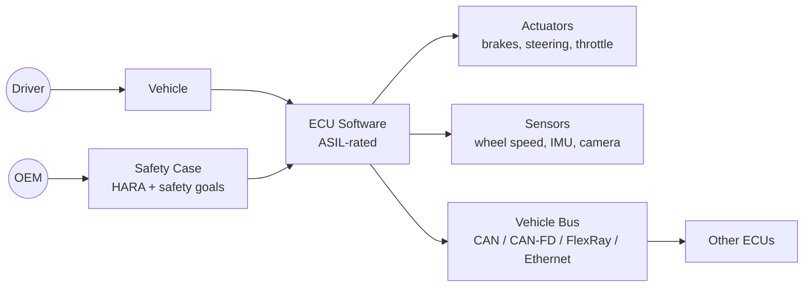
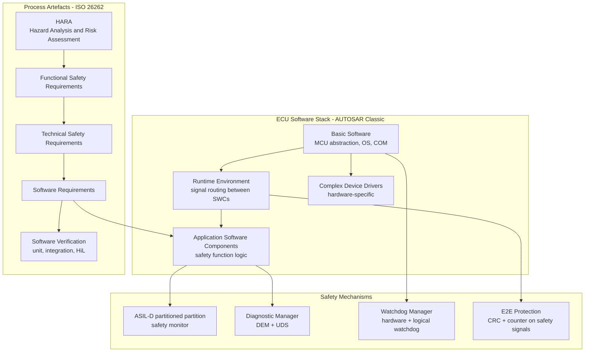

# Pattern: Automotive ECU Software

!!! danger "Domain expertise and functional safety certification required"
    This pattern provides a high-level architectural overview **only**. Automotive ECU software is governed by ISO 26262 (functional safety) and AUTOSAR (software architecture standards). Development requires certified tools, qualified processes, ASIL (Automotive Safety Integrity Level) determination, and extensive verification evidence. **Do not begin an automotive ECU project based solely on this material.** Engage a functional safety engineer and an ISO 26262 assessor before starting development.

!!! info "Quick facts"
    - **Category:** Safety-Critical Systems
    - **Maturity:** Adopt
    - **Typical team size:** 5-20 engineers + functional safety manager and assessors
    - **Typical timeline to MVP (first validated build):** 24-48 months
    - **Last reviewed:** 2026-05-03 by Architecture Team

## 1. Context

**Use this pattern when:**

- Writing software for an Electronic Control Unit (ECU) in a road vehicle that controls a safety-relevant function: braking (ABS, ESC), steering (EPS), powertrain, ADAS, or occupant protection
- The function has an ASIL rating (A through D) under ISO 26262 Part 6
- The software must be certified before vehicle homologation and type approval

**Do NOT use this pattern when:**

- The ECU controls only non-safety-relevant functions (infotainment, climate control) — lower-assurance AUTOSAR Classic or Adaptive patterns apply
- The system is a prototype or research vehicle outside of type approval — still apply good engineering practice but the full ISO 26262 process is not legally required

## 2. Problem it solves

A software bug in a braking ECU can prevent a car from stopping. A fault in an EPS controller can cause unexpected steering. ISO 26262 provides a systematic process to identify, classify, and mitigate software-related hazards in vehicles — ensuring that the software contributes acceptably low risk to vehicle occupants and other road users, to a rigorous, internationally accepted standard.

## 3. Solution overview

### System context (C4 Level 1)

### Container view (C4 Level 2)

## 4. Technology stack

| Layer | Primary choice | Alternatives | Notes |
|---|---|---|---|
| Language | C with MISRA C:2012 | C++ with MISRA C++:2008, Ada/SPARK | MISRA C is mandatory for ISO 26262 software (rule compliance required for ASIL C/D); C++ allowed for lower ASIL levels with restrictions; Ada/SPARK for highest-assurance components |
| Software architecture | AUTOSAR Classic Platform | AUTOSAR Adaptive (Linux-based, for connected functions), proprietary | AUTOSAR Classic for real-time ECUs; AUTOSAR Adaptive for high-compute ADAS/AD ECUs running Linux |
| RTOS | AUTOSAR OS (OSEK/VDX-based) | EB tresos, ETAS ISOLAR, Vector MICROSAR | AUTOSAR OS provides task scheduling, ISR management, and OS Application partitioning required for ASIL |
| Static analysis | Polyspace Code Prover | Astrée, LDRA | Tool qualification (ISO 26262 Part 8 §11) required for analysis tools used as verification evidence |
| Compiler | Tasking, GreenHills, IAR | GCC (with qualification kit) | Qualified compilers for ASIL D; standard compilers require a qualification kit and additional testing to use as verification tool |
| Model-based design (optional) | Simulink / Embedded Coder | MATLAB/Simulink with IEC Certification Kit | Widely used for control algorithm development with automatic MISRA-compliant C code generation |
| HIL testing | dSPACE, NI VeriStand | ETAS LABCAR, Vector CANoe | Hardware-in-the-Loop (HIL) testing is required for system-level validation of real-time ECU behaviour |
| Calibration / diagnostics | Vector CANalyzer + AUTOSAR UDS (ISO 14229) | ETAS INCA, PEAK tools | UDS (Unified Diagnostic Services) is the standard for ECU flashing, calibration, and fault code reading |

## 5. Non-functional characteristics

| Concern | Profile |
|---|---|
| **Scalability** | Not applicable in the traditional sense. Resource constraints are strict: MCU flash, RAM, and CPU budget are fixed at hardware selection. Every software change must be assessed for timing impact on safety-critical task deadlines. |
| **Availability target** | Defined by the ASIL level and safety goal. An ASIL-D safety function (e.g., ABS) may require a residual risk of < 10⁻⁹ hazardous events per hour of operation (IEC 61508 SIL 3 equivalent). This demands hardware redundancy, diagnostic coverage > 99%, and systematic failure avoidance through the full process. |
| **Latency target** | Cycle time (task period) is a hard real-time requirement: ABS control cycles at 1ms, ADAS sensor fusion at 10ms. Worst-case execution time (WCET) analysis is required for all safety tasks; timing violations are a safety defect. |
| **Security posture** | UNECE R155/R156 (UN Regulation on Cybersecurity, effective July 2024 in EU) requires a Vehicle Cybersecurity Management System and software update management before type approval. Secure boot, firmware signing, key management, and intrusion detection are now regulatory requirements, not optional features. |
| **Data residency** | ECU operates offline; data residency in the cloud sense does not apply. Diagnostic data (DTCs, freeze frames) stored in NVM follows vehicle privacy regulations. GDPR applies to any connected data that flows from the vehicle to backend systems. |
| **Compliance fit** | ISO 26262:2018 (functional safety), AUTOSAR (architecture), MISRA C:2012 (coding standard), UNECE R155/R156 (cybersecurity), ISO/SAE 21434 (cybersecurity engineering). Type approval (WVTA in EU, FMVSS in US) is the final gate. |

## 6. Cost ballpark

Software development is a fraction of overall vehicle programme cost. Ballpark for the software component only.

| Scale | ASIL level | Software development cost (total) | Drivers |
|---|---|---|---|
| Small | ASIL A/B | $500k - $3M | Simpler requirements, lighter verification |
| Medium | ASIL C | $2M - $10M | Extensive testing, tool qualification, assessor fees |
| Large | ASIL D | $5M - $30M+ | Full process, redundancy architecture, independent safety assessment |

## 7. LLM-assisted development fit

| Aspect | Rating | Notes |
|---|---|---|
| MISRA C compliant boilerplate | ★★★ | Generates structurally correct code; MISRA compliance must be verified by a qualified static analyser, not by the LLM. |
| AUTOSAR SWC and RTE interface scaffolding | ★★★ | Knows the AUTOSAR concepts; generated code must be validated against the AUTOSAR schema and tool chain. |
| Control algorithm design (PID, state observers) | ★★★ | Reasonable starting point; algorithm correctness and stability analysis require a control engineer. |
| Safety analysis (HARA, FMEA, FTA) | ★ | **Never outsource safety analysis to an LLM.** Safety analysis requires engineering judgement and accountability. |
| Regulatory strategy | ★ | **Never outsource regulatory decisions.** Engage an ISO 26262 assessor. |

## 8. Reference implementations

- **Public reference:** _There are no public reference implementations for production automotive ECU software; all are proprietary OEM or Tier 1 supplier IP._
- **Industry resource:** ISO 26262:2018 — the functional safety standard; required reading before project start
- **Industry resource:** AUTOSAR Classic Platform specifications — available at autosar.org
- **Internal case study:** _Add your anonymised internal example here if applicable_

## 9. Related decisions (ADRs)

- _Architectural decisions for ASIL-rated ECUs must be documented in the Safety Case and Technical Safety Report, not in this general catalog._

## 10. Known risks & gotchas

- **ASIL decomposition done incorrectly** — splitting an ASIL-D function into two ASIL-B channels assumes independence that does not exist (common-cause failure); the decomposition is invalid and the safety goal is not met. Mitigation: ASIL decomposition requires a qualified functional safety engineer; it is not a software architecture decision that can be made without formal analysis.
- **Shared-cause failures between redundant channels** — two redundant channels share a common power supply, ground, or software component; a single fault disables both. Mitigation: independence analysis (ISO 26262 Part 9) must be performed for all redundant elements; hardware independence reviews require hardware and software collaboration.
- **Calibration parameter outside validated range deployed to production** — an OTA calibration update sets a parameter value outside its validated range; the safety function behaves unexpectedly. Mitigation: validate all calibration parameter ranges in the software (upper/lower bound checks); treat out-of-range calibration as a safety-relevant fault.
- **Memory protection unit (MPU) not configured** — an application stack overflow corrupts safety-critical data; no MPU trap fires. Mitigation: configure the MCU's MPU/MMU to isolate ASIL partitions; test stack overflow explicitly in the HiL test bench.
- **Cybersecurity vulnerability in UDS diagnostic interface** — a researcher discovers an exploit in the UDS stack that allows arbitrary firmware flashing without authentication; recall required. Mitigation: authentication is mandatory for all reprogramming services (SID 0x34/0x36) per UNECE R156; penetration test the diagnostic interface before start of production.
