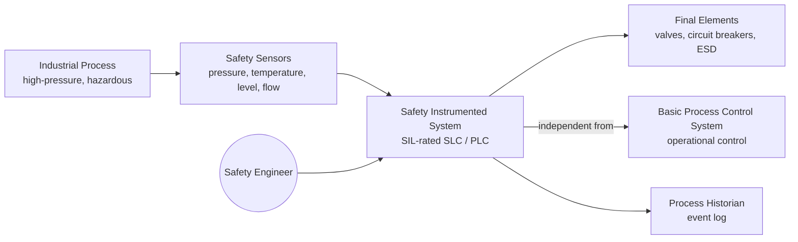
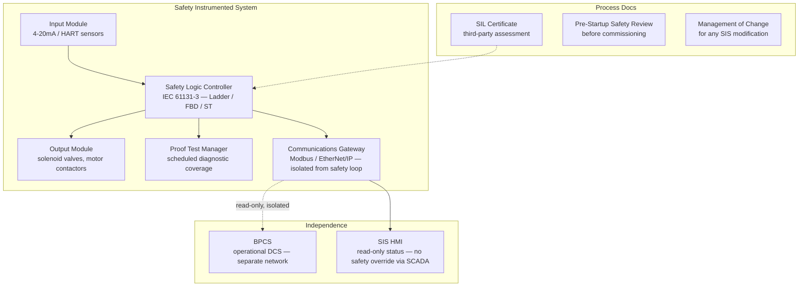

# Pattern: Industrial Control System

!!! danger "Domain expertise and functional safety certification required"
    This pattern provides a high-level architectural overview **only**. Industrial control systems are governed by IEC 61508 (functional safety of electrical/electronic/programmable electronic safety-related systems) and derived standards (IEC 62061 for machinery, ISO 13849 for machine safety). Development requires certified engineers, SIL (Safety Integrity Level) determination, formal hazard analysis, and third-party assessment. **Do not design or deploy a safety instrumented function based solely on this material.** Engage a TÜV-qualified functional safety engineer and an assessment body before starting.

!!! info "Quick facts"
    - **Category:** Safety-Critical Systems
    - **Maturity:** Adopt
    - **Typical team size:** 3-10 engineers + process safety engineer and assessor
    - **Typical typical timeline to MVP (first validated SIS):** 18-36 months
    - **Last reviewed:** 2026-05-03 by Architecture Team

## 1. Context

**Use this pattern when:**

- Developing a Safety Instrumented System (SIS), programmable logic controller (PLC) application, or distributed control system (DCS) that performs a safety instrumented function (SIF) with a defined SIL target
- The system monitors or controls physical processes where equipment failure or process deviation can cause fire, explosion, toxic release, or serious injury (oil & gas, chemical, power generation, water treatment, manufacturing)
- SIL assessment (IEC 61511 for process industry, IEC 61508 for general) is required

**Do NOT use this pattern when:**

- The control system does not perform a safety function — it is a Basic Process Control System (BPCS) for operational efficiency; standard industrial automation patterns apply
- The system is purely monitoring with no actuation authority over a safety barrier

## 2. Problem it solves

Industrial processes involve hazardous materials and conditions — high-pressure vessels, flammable gases, toxic chemicals, high-voltage equipment — where a process deviation can cause a major accident. A Safety Instrumented System continuously monitors process variables, and when a dangerous condition is detected, brings the process to a defined safe state automatically and reliably, independent of the basic process control system. This pattern describes how to structure that software safely.

## 3. Solution overview

### System context (C4 Level 1)

### Container view (C4 Level 2)

## 4. Technology stack

| Layer | Primary choice | Alternatives | Notes |
|---|---|---|---|
| Safety PLC / SLC | Siemens S7-300F / S7-400F (SIL 3) | Rockwell AADvance, Triconex (Schneider), Yokogawa ProSafe | Use only TÜV-certified Safety PLCs; the hardware certification is the foundation of the SIL claim |
| Programming language | IEC 61131-3 Structured Text (ST) or Function Block Diagram (FBD) | Ladder Diagram (LD) for legacy | Use the language supported by your certified tool; restrict to certified function blocks from the vendor library |
| Engineering tool | Siemens TIA Portal Safety | Rockwell Studio 5000, Triconex TriStation | Tool qualification is part of the SIL claim; use only the tool version for which the SIL certificate is valid |
| Network isolation | Unidirectional data diode (Waterfall Security) | Air gap | The SIS process network must be isolated from the corporate IT network; a data diode enforces unidirectional flow |
| Cybersecurity | IEC 62443 (industrial cybersecurity standard) | NERC CIP (power sector) | IEC 62443 defines security levels for ICS; cybersecurity must be integrated with functional safety (coengineering) |
| Alarm management | ISA-18.2 (alarm management standard) | Vendor-specific alarm systems | Alarm rationalisation before deployment; alarm flooding during an abnormal situation is a well-documented accident contributor |
| Historian / logging | OSIsoft PI (now AVEVA PI) | Honeywell Uniformance, AspenTech | Process historians provide tamper-evident long-term event logs required for incident investigation |

## 5. Non-functional characteristics

| Concern | Profile |
|---|---|
| **Scalability** | Not applicable. SIS capacity is determined at design time based on the number of safety instrumented functions (SIFs). Changes to scope require a Management of Change (MOC) process and may require re-assessment. |
| **Availability target** | Defined by SIL target and Safety Availability (SA) calculation. SIL 2 requires PFD (Probability of Failure on Demand) < 10⁻². High Demand mode SIS may require PFH < 10⁻⁷/hour. Proof test intervals are calculated to maintain these targets. |
| **Latency target** | Process response time (PRT) must be less than the process safety time (PST). If a high-pressure vessel can reach a dangerous pressure in 5 seconds, the SIS must detect, logic-solve, and actuate within that window. Calculate PST during HAZOP. |
| **Security posture** | ICS cybersecurity is a life-safety concern (Stuxnet, Triton/TRISIS demonstrated this). Network segmentation (Purdue model zones), air gaps or data diodes between IT and OT, no remote access to safety PLC without procedural controls, disable all unused network ports. |
| **Data residency** | Process data and safety event logs are operational technology data; keep on-premises or in an approved industrial cloud (AWS Industrial). Never route raw sensor data through the corporate IT network to the SIS logic. |
| **Compliance fit** | IEC 61508 (general functional safety), IEC 61511 (process industry SIS), IEC 62061 (machinery safety), ISO 13849 (machine safety — PLr), ATEX/IECEx (explosive atmospheres), OSHA PSM (US), COMAH (UK). SIL certificate from a notified body (TÜV, Exida) required before commissioning. |

## 6. Cost ballpark

Highly variable by process complexity and SIL target. Software is a subset of a larger capital project.

| Scale | SIF count / SIL target | Software + engineering cost | Drivers |
|---|---|---|---|
| Small | 5-20 SIFs, SIL 1/2 | $200k - $1M | Basic SIS programming, HAZOP support, SIL verification |
| Medium | 20-100 SIFs, SIL 2/3 | $1M - $5M | Extended HAZOP, SIL 3 architecture (redundancy), third-party assessment |
| Large | 100+ SIFs, SIL 3 | $5M - $30M+ | Full SIL 3 process, TMR architecture, exida/TÜV assessment, commissioning verification |

## 7. LLM-assisted development fit

| Aspect | Rating | Notes |
|---|---|---|
| IEC 61131-3 Structured Text boilerplate | ★★★ | Knows the language syntax; safety function logic requires process-specific domain knowledge and certification. |
| SCADA / HMI screen layout | ★★★★ | Good for standard P&ID display layouts. |
| Standard alarm rationalisation documentation templates | ★★★ | Useful starting point; alarm rationalisation requires process safety expertise. |
| Hazard analysis (HAZOP, LOPA, SIL determination) | ★ | **Never outsource safety analysis to an LLM.** HAZOP is a facilitated multi-discipline study with legal accountability. |
| SIL verification calculations | ★ | **Never outsource SIL calculations to an LLM.** These are engineering calculations with direct safety implications. |

## 8. Reference implementations

- **Public reference:** _There are no appropriate public reference implementations for Safety Instrumented Systems. All production SIS code is proprietary and subject to process confidentiality._
- **Industry resource:** IEC 61511:2016 — Functional safety: Safety Instrumented Systems for the process industry sector; required reading
- **Industry resource:** CCPS Guidelines for Safe Automation of Chemical Processes (AIChE) — industry best-practice reference
- **Internal case study:** _Add your anonymised internal example here if applicable_

## 9. Related decisions (ADRs)

- _Architectural and design decisions for SIS must be documented in the Safety Requirements Specification and Safety Validation Plan, not in this general catalog._

## 10. Known risks & gotchas

- **SIS and BPCS on the same network** — an operator can inadvertently (or an attacker can deliberately) override a safety setpoint from the BPCS HMI. Mitigation: IEC 61511 requires independence between the SIS and BPCS; enforce network separation with a firewall or data diode; the SIS PLC must never accept write commands from the BPCS network.
- **Bypasses and inhibits left in place** — a safety valve bypass installed for maintenance is never removed; the SIF is unavailable during a process upset. Mitigation: time-limited bypass management in the SIS logic; any bypass beyond a configured duration triggers an alarm and a work order; track all inhibits in the safety management system.
- **Proof tests not performed on schedule** — the SIL claim depends on proof tests at specified intervals (often annually); skipped tests mean the PFD exceeds the SIL target without anyone knowing. Mitigation: proof test procedures must be scheduled in a maintenance management system; the SIS historian provides evidence of test completion; re-calculate PFD if tests are overdue.
- **Management of Change not followed for SIS modifications** — a technician edits a setpoint or logic rung without a formal MOC; the change invalidates the SIL certificate and may introduce a new hazard. Mitigation: PLC programming tools must require authentication; all SIS changes go through MOC including HAZOP review for anything beyond minor setpoint adjustments.
- **Common-cause failure between redundant sensors** — two pressure transmitters in a 1oo2 (one-out-of-two) voting configuration share the same tapping point; a plugged impulse line puts both in a failed state simultaneously. Mitigation: diverse sensor mounting, diverse measurement principles, and physical separation of redundant sensors are part of the SIS design, not just the software.
