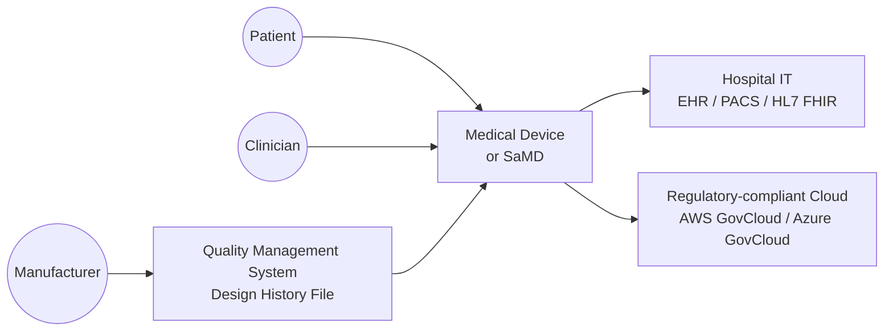
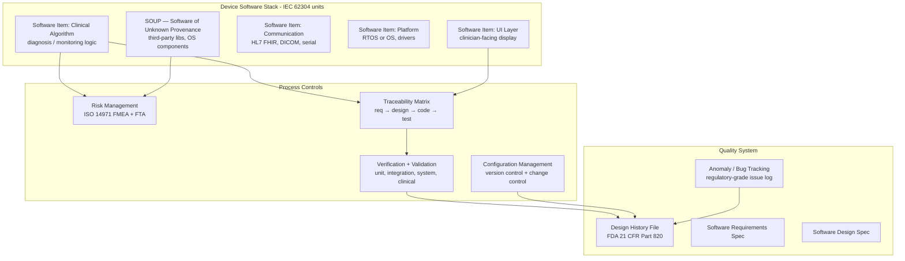

# Pattern: Medical Device Software

!!! danger "Domain expertise and regulatory certification required"
    This pattern provides a high-level architectural overview **only**. Medical device software development is a certified engineering discipline governed by IEC 62304, FDA 21 CFR Part 820/11, EU MDR 2017/745, and ISO 14971. It requires qualified engineers, a documented Quality Management System (QMS), formal risk management, design history files, and regulatory submission. **Do not begin a medical device software project based solely on this material.** Engage a regulatory consultant and a notified body before starting development.

!!! info "Quick facts"
    - **Category:** Safety-Critical Systems
    - **Maturity:** Adopt
    - **Typical team size:** 4-12 engineers + regulatory, quality, and clinical specialists
    - **Typical timeline to MVP:** 18-36 months (including regulatory approval)
    - **Last reviewed:** 2026-05-03 by Architecture Team

## 1. Context

**Use this pattern when:**

- Developing software that is itself a medical device (SaMD — Software as a Medical Device) or software that is a component of a physical medical device
- The software will be used for diagnosis, monitoring, treatment, or life support
- Regulatory approval (FDA 510(k)/PMA, CE marking under MDR) is required before deployment

**Do NOT use this pattern when:**

- The software is general wellness or fitness tracking with no diagnostic or therapeutic claims — different, lighter regulatory regime applies
- The software is purely administrative (hospital scheduling, billing) with no clinical decision support — standard enterprise software patterns apply

## 2. Problem it solves

Medical device software directly affects patient safety. A bug in insulin pump firmware can deliver a fatal dose. An error in a diagnostic algorithm can lead to wrong treatment. This pattern describes the architectural building blocks, process controls, and verification practices that allow a team to build software whose safety and effectiveness can be demonstrated to regulators and, most importantly, to patients.

## 3. Solution overview

### System context (C4 Level 1)

### Container view (C4 Level 2)

## 4. Technology stack

| Layer | Primary choice | Alternatives | Notes |
|---|---|---|---|
| Language (Class C firmware) | C with MISRA C:2012 compliance | Ada/SPARK (highest assurance), Rust (emerging) | MISRA C eliminates the most dangerous C constructs; Ada/SPARK for formal verification requirements; Rust adoption in medical is emerging but not yet mainstream |
| RTOS (embedded) | FreeRTOS (with safety addendum) | VxWorks, QNX, INTEGRITY, Zephyr | Use an RTOS with a published safety certification basis (IEC 61508, DO-178C) if the device requires it; FreeRTOS SafeRTOS is the certified variant |
| SaMD backend | Standard cloud backend (AWS, Azure) with compliance configuration | On-premises | AWS GovCloud or Azure Government for US federal; standard regions with HIPAA BAA for commercial; SOC 2 + ISO 27001 minimum |
| Medical interoperability | HL7 FHIR R4 | HL7 v2, DICOM | FHIR for modern EHR integration; DICOM for imaging |
| Requirements management | Jama Software, Polarion | Jira (with plugins), Doors | Requirements must be uniquely identified, version-controlled, and traceable to tests; spreadsheets are not acceptable for Class B/C |
| Static analysis | Polyspace (MathWorks) | Coverity, Astrée, PC-lint | Mandatory for Class B/C software; tool qualification may be required (IEC 62304 §8) |
| Test management | PractiTest, TestRail (validated) | Jama Test, Polarion | Test evidence must be preserved in an auditable form for the DHF |
| Risk management | ISO 14971 process (tool-agnostic) | Medtech-specific FMEA tools | Risk management is a process, not a tool; the output is an auditable Risk Management File |

## 5. Non-functional characteristics

| Concern | Profile |
|---|---|
| **Scalability** | Not the primary concern. Patient safety, reliability, and traceability take precedence over scalability. Design for the clinically validated use envelope; changes outside it require re-validation. |
| **Availability target** | Life-support devices: 99.999% (hardware redundancy, fail-safe modes). Diagnostic SaMD: 99.9%+ with defined safe degraded modes. Unplanned downtime must be reported as a Device Malfunction (FDA MDR / EU EUDAMED). |
| **Latency target** | Defined by clinical use case. An alert for a life-threatening arrhythmia must trigger in < 1 s. A background analysis algorithm may have minutes of acceptable latency. Every latency requirement must be documented and verified. |
| **Security posture** | Medical devices are high-priority targets for cyberattack (patient safety, ransomware). FDA pre-market cybersecurity guidance (2023) is mandatory for US submissions. Implement: SBOM (Software Bill of Materials), secure boot, encrypted comms, penetration testing, post-market vulnerability monitoring. |
| **Data residency** | Patient health data is PHI under HIPAA (US) and special category data under GDPR (EU). Strict region selection, BAA, and data processing agreements required. |
| **Compliance fit** | IEC 62304 (software lifecycle), ISO 14971 (risk management), IEC 62443 (cybersecurity), IEC 60601-1 (general safety), HIPAA/GDPR (data protection). US: FDA 21 CFR Part 820 / QSR. EU: MDR 2017/745. Engage a regulatory consultant before starting. |

## 6. Cost ballpark

Indicative total programme cost including regulatory work. Infrastructure cost is a small fraction.

| Scale | Device class | Estimated total programme cost | Drivers |
|---|---|---|---|
| Small | Class I / SaMD Class I | $200k - $1M | Basic QMS, limited clinical evidence |
| Medium | Class II / SaMD Class II | $1M - $5M | 510(k) submission, clinical studies, notified body fees |
| Large | Class III / SaMD Class III | $5M - $50M+ | PMA submission, pivotal clinical trial, post-market surveillance |

## 7. LLM-assisted development fit

| Aspect | Rating | Notes |
|---|---|---|
| Boilerplate documentation templates (SRS, SDS) | ★★★ | Useful starting point; every document requires expert review and regulatory sign-off. |
| Unit test scaffolding for clinical algorithms | ★★★★ | Good; test coverage requirements (MC/DC for Class C) must be verified by a human. |
| FHIR resource parsing and HL7 integration | ★★★★ | Good for standard resource types; clinical data semantics require clinical informatics expertise. |
| Clinical algorithm design and validation | ★ | **Never outsource clinical algorithm design to an LLM.** Algorithm validation requires clinical evidence, not code generation. |
| Regulatory strategy and submission | ★ | **Never outsource regulatory decisions.** Engage a regulatory consultant. |

## 8. Reference implementations

- **Public reference:** _There are no appropriate public reference implementations for regulated medical device software. Commercial implementations are proprietary and subject to regulatory confidentiality._
- **Industry resource:** IEC 62304:2006+AMD1:2015 — the standard itself; required reading before any development
- **Industry resource:** FDA Guidance on Software as a Medical Device (SaMD) — available at fda.gov
- **Internal case study:** _Add your anonymised internal example here if applicable_

## 9. Related decisions (ADRs)

- _ADRs for medical device software must be documented within the Design History File (DHF) as design decisions, not in this general catalog._

## 10. Known risks & gotchas

- **Software classification error** — underclassifying the software (treating Class C as Class A) results in insufficient development rigor; regulators will reject the submission and require rework at enormous cost. Mitigation: perform IEC 62304 software classification analysis with a regulatory expert before writing a single line of code.
- **Traceability gaps discovered at submission** — requirements lack unique identifiers; tests cannot be traced back to design; regulators issue a deficiency letter requiring months of rework. Mitigation: establish a traceability matrix in your requirements management tool from the first requirement; every item has an ID, and every test references it.
- **SOUP not adequately evaluated** — an open-source library (a compression codec, a JSON parser) is used without evaluating its failure modes under IEC 62304 §8; regulators require a full SOUP evaluation addendum. Mitigation: document every third-party component as SOUP on first use; evaluate failure modes and impact in the risk management file.
- **Cybersecurity not planned from the start** — the FDA's 2023 cybersecurity guidance requires a Software Bill of Materials (SBOM) and a plan for post-market vulnerability monitoring; adding these retroactively is expensive. Mitigation: generate the SBOM from your build system automatically (SPDX / CycloneDX); subscribe to NVD CVE feeds for all SOUP components.
- **Post-market obligations ignored** — after CE marking or FDA clearance, field complaints must be evaluated, vigilance reports filed for serious incidents, and periodic safety update reports submitted. Mitigation: plan and budget for post-market surveillance before approval; it is an ongoing regulatory obligation, not a one-time event.
