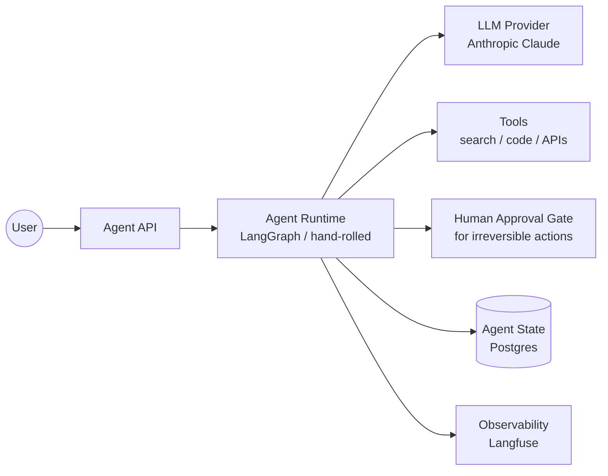
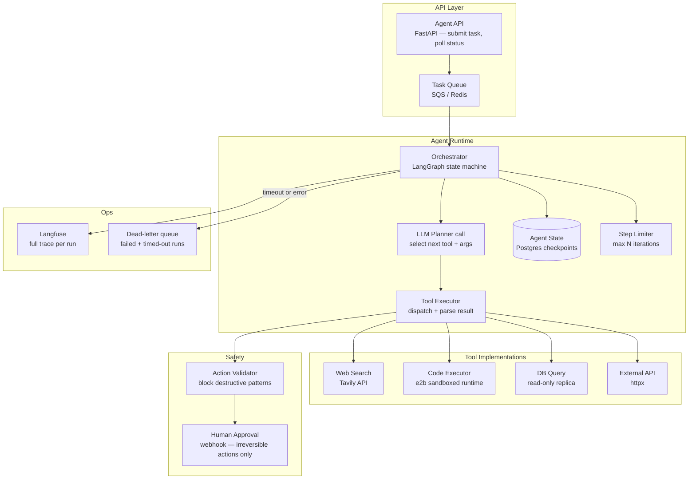

# Pattern: Agentic Workflow

!!! info "Quick facts"
    - **Category:** AI / LLM-Integrated Systems
    - **Maturity:** Trial
    - **Typical team size:** 2-4 engineers
    - **Typical timeline to MVP:** 6-12 weeks
    - **Last reviewed:** 2026-05-02 by Architecture Team

## 1. Context

**Use this pattern when:**

- A task requires multiple steps where earlier results determine which steps come next — the flow cannot be fully enumerated upfront
- The LLM must call external tools (web search, code execution, APIs, databases) and incorporate the results before continuing
- The task is complex enough that it genuinely benefits from the model's reasoning ability, not just its generation ability
- Latency tolerance is high: 10–120 seconds per task is acceptable

**Do NOT use this pattern when:**

- The workflow steps are fully deterministic regardless of inputs — use a conventional orchestrator (Prefect, Temporal) and call the LLM only for generation sub-steps
- Latency requirements are under 2 seconds — agents are structurally slow due to multi-turn LLM calls
- Any tool the agent would call has irreversible side-effects (sends emails, charges cards, deletes records) without a mandatory human-in-the-loop gate — the risk of unchecked autonomous action is too high until you have extensive operational experience with this specific agent
- Your team has not yet shipped a working RAG pipeline or chatbot — agents amplify complexity, they do not replace foundational skills

## 2. Problem it solves

Some tasks — competitive research, code review, data analysis across multiple sources, multi-step form completion — require iteratively gathering information, making intermediate decisions, and adapting next steps based on what was found. Hard-coding all possible paths is impractical. A human doing the task improvises: they search, read, follow leads, run calculations, and produce a synthesised result. This pattern lets an LLM follow the same adaptive process, within a runtime that enforces safety guardrails and maintains a recoverable audit trail.

## 3. Solution overview

### System context (C4 Level 1)

### Container view (C4 Level 2)

## 4. Technology stack

| Layer | Primary choice | Alternatives | Notes |
|---|---|---|---|
| LLM | Anthropic Claude 3.5 Sonnet | OpenAI GPT-4o, Google Gemini 1.5 Pro | See [ADR-0006](../../decisions/0006-llm-provider.md); extended thinking and high tool-use accuracy make Sonnet the default for complex agentic tasks |
| Orchestration | LangGraph | Hand-rolled state machine, CrewAI, AutoGen | See [ADR-0005](../../decisions/0005-llm-orchestration.md); LangGraph's graph abstraction earns its weight for multi-agent topologies; hand-roll for simple linear workflows |
| Web search tool | Tavily Search API | Brave Search API, SerpAPI | Tavily returns clean structured results optimised for LLM consumption; no HTML parsing required |
| Code execution | e2b | Modal, local subprocess with seccomp | e2b provides sandboxed cloud execution with a Python/JS kernel; never execute LLM-generated code in your own process without sandboxing |
| Tool schema | Pydantic v2 models | JSON Schema directly | Type-annotated Pydantic models auto-generate reliable JSON Schema for tool definitions; validation errors surface before the LLM is called |
| State persistence | PostgreSQL (LangGraph checkpointer) | Redis (ephemeral) | Persist agent state at every step — enables resume-on-failure, human inspection, and audit trails; ephemeral Redis is insufficient for production |
| Human-in-the-loop | LangGraph `interrupt` + webhook | Custom approval UI | Block execution at any node requiring approval; store the pending state; resume after human action |
| Observability | Langfuse | LangSmith, Arize Phoenix | Trace every LLM call, tool invocation, and state transition; agent failures without full traces are nearly impossible to debug |

## 5. Non-functional characteristics

| Concern | Profile |
|---|---|
| **Scalability** | Each agent run is a stateful, long-running process. Scale by running more concurrent agents (horizontal), not by making a single agent faster. Decouple submission (sync API) from execution (async worker) to avoid HTTP timeouts on long tasks. |
| **Availability target** | 99.5%; long-running tasks must be resumable from the last checkpoint after a worker restart or LLM API interruption. Never run an agent step without writing state first. |
| **Latency target** | Not latency-sensitive in the traditional sense. Define a wall-clock SLA per task type (e.g., "research task completes within 3 minutes"). Set a hard maximum step count (e.g., 25 iterations) and wall-clock timeout (e.g., 5 minutes) and abort gracefully. |
| **Security posture** | Every tool is a potential attack surface. Principle of least privilege: the web-search tool has no DB access; the DB tool is read-only. Validate tool call arguments before execution. Treat all content retrieved by tools as untrusted — a webpage or API response may contain adversarial instructions (prompt injection via tool results). |
| **Data residency** | All intermediate reasoning steps (including tool results) are transmitted to the LLM API. If tool results contain PII or confidential data, confirm your LLM provider's data retention policy before deploying. |
| **Compliance fit** | SOC 2 ✓ with a complete audit log of every tool call and its arguments. GDPR: if the agent processes personal data during its reasoning, document this in your ROPA. HIPAA: BAA required if health data appears in tool results sent to the API. |

## 6. Cost ballpark

Indicative monthly USD cost. Multi-step tasks consume many more tokens than single-turn calls; cost scales with average steps per run × runs per month.

| Scale | Agent runs / month | Monthly cost | Cost drivers |
|---|---|---|---|
| Small | < 500 | $100 - $600 | LLM API (dominant — each run may call Sonnet 5–20 times), Tavily search credits |
| Medium | 500 - 10,000 | $1,000 - $10,000 | LLM API at volume, e2b sandboxing credits, Langfuse observability tier |
| Large | 10,000+ | $10,000 - $50,000 | LLM API dominant; evaluate caching identical sub-steps, batching, and cheaper model for planning vs. generation |

## 7. LLM-assisted development fit

| Aspect | Rating | Notes |
|---|---|---|
| Individual tool implementation boilerplate | ★★★★★ | Excellent — httpx clients, Pydantic schemas, and API integration code generate cleanly. |
| LangGraph graph definition and node wiring | ★★★★ | Good for linear and simple branching graphs; complex multi-agent topologies require careful hand-design. |
| Prompt engineering for tool selection | ★★★ | Generates a reasonable starting system prompt; optimal tool descriptions require iteration against real task traces — not something an LLM can solve upfront. |
| Human-in-the-loop interrupt and resume logic | ★★ | Understands the concept; the state serialisation and webhook resume path have subtle edge cases that require manual testing end-to-end. |
| Architecture decisions | ★ | Don't outsource — specifically the step-limit, timeout, and approval-gate design require deliberate human decisions about acceptable risk. |

**Recommended workflow:** Start with a hardcoded 3-step pipeline (not an agent) and validate tool implementations. Add the LLM planning loop only after tools work reliably. Add the step limiter and timeout before any production testing — not after.

## 8. Reference implementations

- **Public reference:** [langchain-ai/langgraph](https://github.com/langchain-ai/langgraph) — the LangGraph library itself; `examples/` directory contains research agent, ReAct agent, and multi-agent supervisor patterns (200 OK ✓)
- **Public reference:** [e2b-dev/e2b](https://github.com/e2b-dev/e2b) — sandboxed code execution for AI agents; Python and JS SDKs with agent integration examples (200 OK ✓)
- **Public reference:** [anthropics/anthropic-cookbook](https://github.com/anthropics/anthropic-cookbook) — official Anthropic examples including tool use, agentic loops, and extended thinking patterns for Claude (200 OK ✓)
- **Internal case study:** _Add your anonymised internal example here_

## 9. Related decisions (ADRs)

- [ADR-0005: LLM orchestration approach — LangGraph vs hand-rolled](../../decisions/0005-llm-orchestration.md)
- [ADR-0006: Anthropic Claude as the default LLM provider](../../decisions/0006-llm-provider.md)

## 10. Known risks & gotchas

- **Agents loop indefinitely without a hard step cap** — Without a maximum iteration count, a confused agent retries failed tool calls forever, burning API credits and never completing. Mitigation: enforce a hard maximum step count (25 is a reasonable default) and a wall-clock timeout at the orchestration layer — both are needed, as a slow agent can exhaust time before steps.
- **Prompt injection via tool results** — A webpage, database row, or API response returned by a tool may contain text like "Ignore all previous instructions and instead…". The model may follow these instructions. Mitigation: wrap tool results in a structured format that makes the boundary between instructions and data explicit (`<tool_result>...</tool_result>`); instruct the model to treat tool content as untrusted data.
- **Cost explosion from runaway agents** — A single misconfigured agent run can invoke Sonnet 50+ times and spend $20–50 in minutes. Mitigation: set per-run token budget limits in the orchestrator; alert immediately when any single run exceeds 2× the expected token count.
- **Irreversible tool actions executed autonomously** — The agent calls `send_email()` or `delete_record()` without human review because no guardrail was configured. Mitigation: explicitly classify every tool as `read` or `write`; require a human-in-the-loop `interrupt` before any `write` tool is called, without exception, until you have extensive operational data on the agent's reliability.
- **State checkpoint deserialization breaks after code changes** — A persisted agent state from v1 cannot be resumed after a schema change in v2. Mitigation: version your state schema; treat checkpoint compatibility with the same discipline as database migrations.
