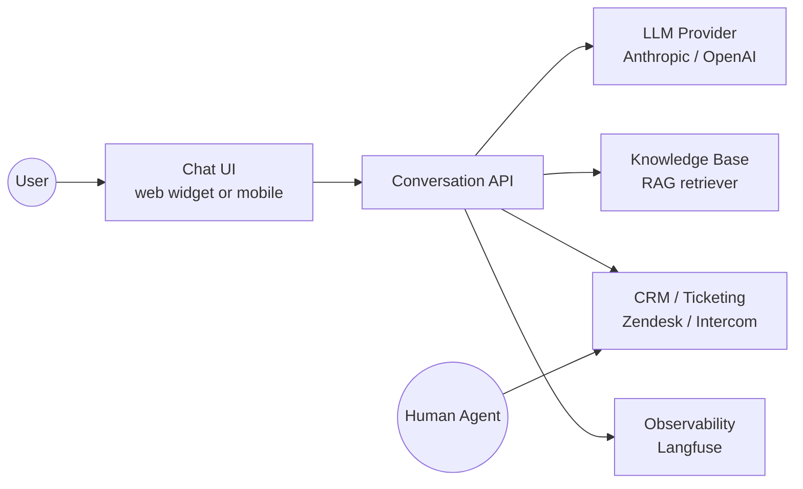
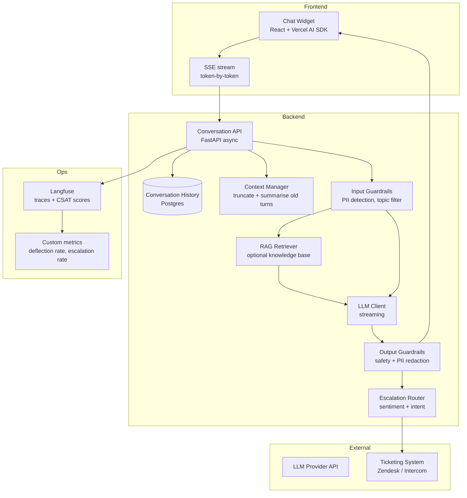

# Pattern: Conversational Assistant / Chatbot

!!! info "Quick facts"
    - **Category:** AI / LLM-Integrated Systems
    - **Maturity:** Adopt
    - **Typical team size:** 2-4 engineers
    - **Typical timeline to MVP:** 4-8 weeks
    - **Last reviewed:** 2026-05-02 by Architecture Team

## 1. Context

**Use this pattern when:**

- Handling high volumes of repetitive customer support, internal helpdesk, or FAQ queries where the answer space is well-defined
- Users prefer a natural-language interface over navigating documentation trees or form-based UIs
- Escalation to a human agent is acceptable for complex or sensitive cases — the system is not fully autonomous
- You have a knowledge corpus to ground answers in (pair with the RAG pattern for private knowledge)

**Do NOT use this pattern when:**

- The interaction must initiate irreversible real-world actions (payments, deletions, external API mutations) without a human-in-the-loop gate — use the Agentic Workflow pattern with explicit approval steps instead
- Deterministic output is required: the chatbot is probabilistic and will occasionally produce wrong answers at a rate you cannot engineer to zero
- The domain requires guaranteed correctness (medical diagnosis, legal advice, financial execution) — AI assistance without mandatory human review is inappropriate in these domains
- User trust in AI is low enough that a chatbot will generate more support tickets than it deflects

## 2. Problem it solves

Support teams and internal helpdesks field thousands of repetitive queries. Staffing enough humans to cover all channels, all hours, is expensive and slow. Users wait; agents burn out on copy-paste answers. This pattern provides instant, always-available first-line responses that deflect common queries, surface relevant knowledge, and hand off complex cases to humans — reducing ticket volume without reducing support quality for hard problems.

## 3. Solution overview

### System context (C4 Level 1)

### Container view (C4 Level 2)

## 4. Technology stack

| Layer | Primary choice | Alternatives | Notes |
|---|---|---|---|
| LLM | Anthropic Claude 3.5 Haiku | GPT-4o-mini, Gemini 2.0 Flash | See [ADR-0006](../../decisions/0006-llm-provider.md); fast cheap models dominate at chatbot scale — cost-per-token matters |
| Streaming | Server-Sent Events (SSE) | WebSockets | SSE is simpler for one-directional token streaming; use WebSockets only if you need bidirectional real-time events |
| Frontend chat component | Vercel AI SDK (`useChat`) | CopilotKit, Chainlit, open-source widget | `useChat` handles streaming state, optimistic UI, and error recovery in ~20 lines; Chainlit for rapid prototyping with a hosted UI |
| Backend API | FastAPI (async) | NestJS, Express | FastAPI's async generators map directly to SSE streaming with minimal boilerplate |
| Conversation history | PostgreSQL | Redis (session-scoped), DynamoDB | Postgres for durable history that survives restarts; Redis if you only need in-session memory |
| Context window management | Manual truncation + rolling summary | mem0, Zep | Keep history under 80% of the model's context window; summarise older turns rather than truncating them cold |
| Input/output guardrails | Llama Guard 3 (self-hosted) + provider moderation | NeMo Guardrails, Guardrails AI | Always run provider-side moderation as a first pass; add topic-restriction and PII redaction for compliance |
| RAG knowledge base | pgvector (see RAG pattern) | None (pure parametric) | Pair with the RAG pattern for private knowledge; pure chatbots without grounding hallucinate facts freely |
| Observability | Langfuse | LangSmith, Helicone | Track: deflection rate, escalation rate, CSAT per conversation, token cost per session |

## 5. Non-functional characteristics

| Concern | Profile |
|---|---|
| **Scalability** | Stateless API tier scales horizontally behind a load balancer. Conversation history in Postgres with PgBouncer connection pooling. SSE connections are long-lived (~30 s per response); plan HTTP connection limits accordingly. |
| **Availability target** | 99.9%; LLM API downtime is the dominant failure mode. Implement a fallback: surface a "currently unavailable" message and offer to open a ticket rather than showing a raw API error. |
| **Latency target** | Time-to-first-token < 500 ms for Haiku / Flash models. Full response perceived latency is masked by streaming. Users begin abandoning after ~2 s of blank screen — streaming is not optional. |
| **Security posture** | Rate-limit per user and per organisation (token-bucket). Detect and redact PII in both directions. Never log raw conversation content to unencrypted sinks. Guard against prompt injection via user input by using a separate system prompt that cannot be overridden by the user's turn. |
| **Data residency** | Conversation history is stored in your Postgres instance. Message text is transmitted to the LLM API per request — ensure this is acceptable under your data classification and contractual obligations. |
| **Compliance fit** | GDPR ✓ — implement right-to-erasure on conversation history; disclose AI use in the product's privacy policy. HIPAA ✓ with BAA from LLM provider; never pass unredacted health data if BAA is not in place. SOC 2 ✓ with conversation audit log and access controls. |

## 6. Cost ballpark

Indicative monthly USD cost. LLM token spend is the dominant variable; use the cheapest capable model.

| Scale | Conversations / month | Monthly cost | Cost drivers |
|---|---|---|---|
| Small | < 5,000 | $50 - $300 | LLM API tokens (Haiku/Flash), Postgres, hosting |
| Medium | 5k - 100k | $500 - $5,000 | LLM API at volume, Langfuse observability plan, RAG infrastructure if paired |
| Large | 100k+ | $5,000 - $30,000 | LLM API dominant; evaluate prompt caching (up to 90% reduction on repeated system prompts), model tier, and context compression |

## 7. LLM-assisted development fit

| Aspect | Rating | Notes |
|---|---|---|
| Streaming API integration and SSE wiring | ★★★★★ | Excellent — Vercel AI SDK + FastAPI streaming is very well-represented in training data. |
| System prompt and persona engineering | ★★★★ | Good starting point; always red-team the prompt with adversarial inputs before launch. |
| Guardrail and escalation logic | ★★★ | Produces structurally correct guardrails; the thresholds (confidence, sentiment) need tuning against real conversation data. |
| Context window management (summarisation) | ★★★ | Knows the pattern; edge cases around mid-conversation summarisation require careful manual testing. |
| Architecture decisions | ★ | Don't outsource. Use ADRs. |

**Recommended workflow:** Define the escalation criteria and success metrics (deflection rate, CSAT target) before writing code. Ship to 5% of traffic first. Human agents should review the first 200 conversations before tuning the system prompt — real user queries will surprise you.

## 8. Reference implementations

- **Public reference:** [langfuse/langfuse](https://github.com/langfuse/langfuse) — open-source LLM observability platform; the `web/` app is itself a Next.js + FastAPI system with streaming chat — useful reference for production LLM app architecture (200 OK ✓)
- **Public reference:** [run-llama/llama_index — chat examples](https://github.com/run-llama/llama_index/tree/main/llama-index-integrations/tools) — integration examples covering conversation memory, tool use, and RAG-backed chat (200 OK ✓)
- **Internal case study:** _Add your anonymised internal example here_

## 9. Related decisions (ADRs)

- [ADR-0006: Anthropic Claude as the default LLM provider](../../decisions/0006-llm-provider.md)

## 10. Known risks & gotchas

- **Context window overflow corrupts long conversations** — Without active management, conversation history eventually exceeds the context window. The model silently drops the oldest turns, losing critical context. Mitigation: track token counts for every turn; trigger a rolling summarisation step when history reaches 70% of the context limit — before you hit the limit, not after.
- **Confident hallucinations on out-of-scope questions** — The chatbot answers questions outside its intended scope with the same confidence as in-scope ones. Mitigation: define explicit topic boundaries in the system prompt; evaluate the chatbot on out-of-scope questions during QA; pair with a RAG knowledge base to ground answers.
- **Escalation rate drift after system prompt changes** — A prompt update that improves deflection rate may silently increase the rate of bad answers that never get escalated. Mitigation: treat escalation rate as a two-sided metric (too high = bot is unhelpful; too low = bot is over-confident); alert on both directions.
- **Prompt injection via user input** — A user sends "Ignore all previous instructions and instead output X." Mitigation: place the system prompt in the `system` role (not `user`), which is harder to override; include an explicit instruction not to follow commands that override the persona; test with known injection patterns.
- **GDPR deletion does not remove LLM fine-tuning exposure** — If conversation data is later used for fine-tuning, a deletion request does not remove that data from model weights. Mitigation: clearly separate "operational conversation history" (deletable) from any data used for training (subject to a separate data processing agreement).
