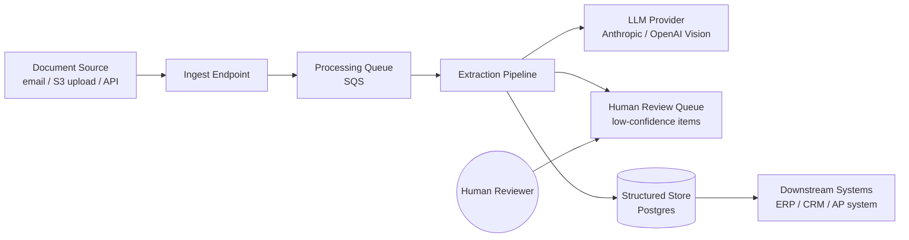
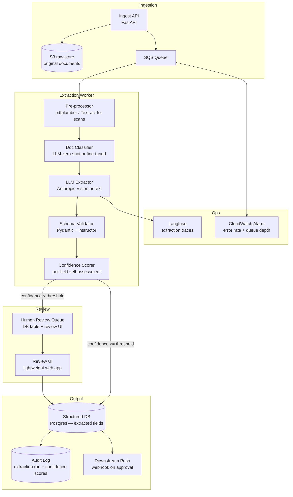

# Pattern: Document Processing / Extraction

!!! info "Quick facts"
    - **Category:** AI / LLM-Integrated Systems
    - **Maturity:** Adopt
    - **Typical team size:** 1-3 engineers
    - **Typical timeline to MVP:** 3-6 weeks
    - **Last reviewed:** 2026-05-02 by Architecture Team

## 1. Context

**Use this pattern when:**

- Extracting structured fields (amounts, dates, parties, line items) from unstructured documents that arrive in varied layouts: invoices, purchase orders, contracts, insurance claims, identity documents
- Traditional OCR + regex rules are brittle — they break on every new template variant and require constant maintenance
- Volume is too high for manual data entry but too variable in format for template-based parsing
- A human-review queue for low-confidence extractions is acceptable (and often required for compliance)

**Do NOT use this pattern when:**

- Documents have a fixed, machine-generated format (CSV exports, JSON payloads, structured PDFs with consistent form fields) — template-based extraction is cheaper, faster, and 100% deterministic
- Output must be certified 100% accurate with no human review step — LLM extraction has an error rate; for regulated documents, treat LLM output as a first pass that humans must confirm
- Documents contain no text layer at all and are very low quality (sub-200 DPI photos, heavily skewed) — pre-process with a dedicated document AI service (AWS Textract, Azure Document Intelligence) before feeding to an LLM

## 2. Problem it solves

Organisations receive thousands of documents per day in formats no two vendors produce identically. Building and maintaining a rules engine for every layout variant consumes engineering time proportional to supplier diversity, and breaks silently when a supplier changes their template. LLMs can read a document the same way a human does — understanding layout, context, and implicit field relationships — and extract structured data from arbitrary formats with a single generalisable prompt, dramatically reducing the per-format maintenance burden.

## 3. Solution overview

### System context (C4 Level 1)

### Container view (C4 Level 2)

## 4. Technology stack

| Layer | Primary choice | Alternatives | Notes |
|---|---|---|---|
| LLM | Anthropic Claude 3.5 Sonnet (vision) | OpenAI GPT-4o (vision), Google Gemini 1.5 Pro | See [ADR-0006](../../decisions/0006-llm-provider.md); multimodal models handle scanned documents and mixed image/text layouts directly — no separate OCR step required |
| PDF / image pre-processing | pdfplumber (text-layer PDFs) | AWS Textract, Azure Document Intelligence | pdfplumber is free and accurate for digital PDFs; use Textract/Document Intelligence for scanned documents, handwriting, or complex multi-column layouts |
| Structured output | `instructor` library + Pydantic v2 | JSON mode (OpenAI), tool use (Anthropic) | `instructor` wraps any LLM call to coerce output to a Pydantic model with automatic retry on validation failure |
| Document classification | LLM zero-shot prompt | Fine-tuned classifier, keyword rules | LLM zero-shot handles 10–20 document types accurately; fine-tune only if you have > 1,000 labelled examples per class and zero-shot accuracy is insufficient |
| Processing queue | AWS SQS | RabbitMQ, Redis Streams | SQS for durable async processing that absorbs inbound spikes; documents must never block the ingest endpoint |
| Raw document store | AWS S3 | Azure Blob, GCS | Always store the original unmodified document before processing — required for audit trails and reprocessing after model updates |
| Human review UI | Custom lightweight React app | Scale AI, Labelbox, Amazon A2I | Build a minimal approval UI early; human review is not a future nice-to-have, it is a day-one requirement for regulated documents |
| Observability | Langfuse | Custom Postgres metrics table | Track: extraction accuracy per document type, confidence score distribution, human-override rate |

## 5. Non-functional characteristics

| Concern | Profile |
|---|---|
| **Scalability** | Processing is embarrassingly parallel — scale by adding SQS consumers. One worker handles ~20–60 documents per minute depending on document size and model latency. Provision for inbound spikes (month-end invoice batches, bulk uploads). |
| **Availability target** | 99.5%; the SQS queue buffers inbound documents so ingest availability is decoupled from processing availability. A processing outage means delayed extraction, not lost documents. |
| **Latency target** | Async batch processing: target end-to-end from upload to structured record in under 60 seconds per document. If synchronous extraction is required (e.g., real-time form submission), accept a 3–10 second p95 latency and implement streaming status updates. |
| **Security posture** | Documents frequently contain PII, financial data, and confidential contracts. Encrypt S3 bucket with SSE-KMS. Restrict IAM access to the extraction worker role only. Purge raw files from S3 after the retention period. Never log raw document content. Apply data classification labels to all extracted records in Postgres. |
| **Data residency** | Document content (including PII) is transmitted to the LLM provider API for extraction. Confirm this is permissible under your data processing agreements and applicable regulation before going live with sensitive document types. For GDPR-sensitive documents, use a provider with EU data residency and a Data Processing Agreement. |
| **Compliance fit** | GDPR ✓ with EU region + DPA; right-to-erasure deletes both the S3 original and the Postgres extracted record. HIPAA ✓ with BAA — required for medical documents; do not process without it. PCI-DSS: never extract or store full PANs; mask to last 4 digits in the schema. SOC 2 ✓ with audit log (every extraction + human override recorded). |

## 6. Cost ballpark

Indicative monthly USD cost. LLM token spend (especially vision) is the dominant cost; vision tokens are ~5× more expensive than text tokens.

| Scale | Documents / month | Monthly cost | Cost drivers |
|---|---|---|---|
| Small | < 5,000 | $100 - $500 | LLM API (vision tokens), SQS, ECS worker, S3 |
| Medium | 5k - 100k | $1,000 - $8,000 | LLM API dominant; evaluate batch inference API (50% cheaper for non-real-time), human review tooling |
| Large | 100k+ | $8,000 - $40,000 | LLM API at scale; consider fine-tuning a smaller model for high-volume document types to reduce per-document cost by 10–50× |

## 7. LLM-assisted development fit

| Aspect | Rating | Notes |
|---|---|---|
| Pydantic schema design and `instructor` wiring | ★★★★★ | Excellent — structured output patterns are very well-represented; generate the extraction schema from a sample document. |
| Pre-processing pipeline (PDF parsing, image prep) | ★★★★ | Good for standard document types; scanned document handling has edge cases requiring manual tuning. |
| Confidence scoring and routing logic | ★★★ | Generates structurally correct code; thresholds require calibration against real documents from your corpus. |
| Human review UI | ★★★★ | Good starting point for a simple review interface; production-grade annotation UIs need UX iteration beyond generated code. |
| Architecture decisions | ★ | Don't outsource — specifically the human-review threshold and data residency decisions have legal consequences. |

**Recommended workflow:** Start with 50 real documents (not synthetic ones) and build the eval harness first. Generate the Pydantic schema from a representative sample, then test extraction accuracy before building any queue or review infrastructure.

## 8. Reference implementations

- **Public reference:** [Unstructured-IO/unstructured](https://github.com/Unstructured-IO/unstructured) — open-source document pre-processing library; handles PDF, DOCX, HTML, images, and tables; widely used as the ingestion layer before LLM extraction (200 OK ✓)
- **Public reference:** [Unstructured-IO/unstructured-api](https://github.com/Unstructured-IO/unstructured-api) — self-hostable REST API wrapper around the unstructured library (200 OK ✓)
- **Public reference:** [anthropics/anthropic-cookbook](https://github.com/anthropics/anthropic-cookbook) — includes vision extraction examples using Claude's multimodal capabilities with structured output (200 OK ✓)
- **Internal case study:** _Add your anonymised internal example here_

## 9. Related decisions (ADRs)

- [ADR-0006: Anthropic Claude as the default LLM provider](../../decisions/0006-llm-provider.md)

## 10. Known risks & gotchas

- **Confident wrong extractions reach downstream systems** — The LLM extracts a plausible but incorrect value (a date from the wrong field, the subtotal instead of the total) with high self-reported confidence. Mitigation: supplement LLM confidence with cross-validation rules (amount fields must be numeric; dates must parse; required fields must be non-null) and route any validation failure to human review regardless of the confidence score.
- **Scanned document quality degrades extraction silently** — A fax, a photo of a document, or a low-resolution scan causes OCR errors that the LLM cannot recover from. Mitigation: measure image quality (DPI, orientation skew) before extraction; route below-threshold quality to a dedicated pre-processing step (deskew, denoise, upscale) before the LLM call.
- **Vision model token costs are 5–10× text tokens** — A 10-page scanned PDF costs significantly more to process as images than as extracted text. Mitigation: always attempt text-layer extraction first (pdfplumber); fall back to vision only when the text layer is absent or garbled.
- **Schema version mismatch when document formats evolve** — A supplier changes their invoice layout; the Pydantic schema no longer maps correctly; extractions silently return `None` for key fields. Mitigation: monitor per-field null rates in production; a sudden spike in nulls for a field indicates a schema or layout change requiring attention.
- **Human review queue grows unboundedly** — If the confidence threshold is set too conservatively, every document goes to human review and the queue never drains. Mitigation: start with a 70% confidence threshold and raise it weekly as you verify LLM accuracy on reviewed samples — track the auto-approval rate as a KPI.
