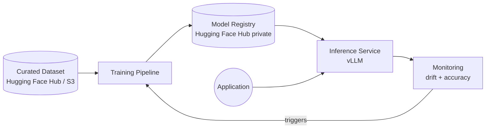
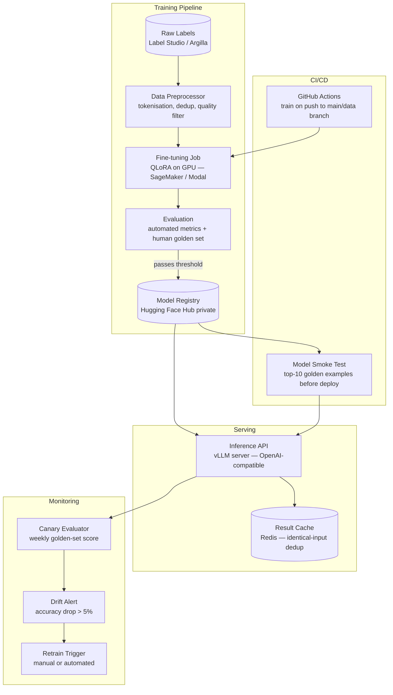

# Pattern: Fine-tuned Domain Model

!!! info "Quick facts"
    - **Category:** AI / LLM-Integrated Systems
    - **Maturity:** Assess
    - **Typical team size:** 3-6 engineers (requires ML engineering expertise)
    - **Typical timeline to MVP:** 8-16 weeks for first model; ongoing to maintain
    - **Last reviewed:** 2026-05-02 by Architecture Team

## 1. Context

**Use this pattern when:**

- A specific, narrow, high-volume task has reached the ceiling of what prompt engineering and RAG can achieve, and quality still falls short of the business requirement
- Inference latency or cost at scale makes cloud API calls impractical: a high-volume task calling Sonnet or GPT-4o may cost 10–100× more than a self-hosted fine-tuned 7B model
- The task requires a domain vocabulary, output format, or reasoning style so specific to your organisation that a general model cannot reliably produce it via prompting alone
- You have ≥ 1,000 high-quality, human-verified training examples per task, and a team member who can own the training pipeline and model operations

**Do NOT use this pattern when:**

- Prompt engineering has not been exhausted — advanced prompting (few-shot, chain-of-thought, system prompt tuning) solves most problems and is 100× cheaper and faster
- Training data is fewer than 500 labelled examples — fine-tuning on a tiny dataset produces an overfit model that performs worse than the base model on realistic inputs
- Task variety is high — fine-tuning optimises for a specific distribution and degrades generalisation; use a general model with RAG instead
- The team has no prior experience training or operating ML models — the operational overhead (GPU infra, CUDA dependencies, model versioning, drift monitoring) is substantial

## 2. Problem it solves

Foundation models are trained on broad internet data and optimised for generality. For a specific, high-volume, predictable task — classifying support tickets into one of 40 internal categories, generating structured extraction output in a proprietary JSON schema, writing product descriptions in an exact brand voice — a smaller, specialised model can match or exceed a large general model's quality at a fraction of the per-inference cost and latency. This pattern captures the pipeline to get there safely.

## 3. Solution overview

### System context (C4 Level 1)

### Container view (C4 Level 2)

## 4. Technology stack

| Layer | Primary choice | Alternatives | Notes |
|---|---|---|---|
| Base model | Llama 3.1 8B or Mistral 7B v0.3 | Phi-3-mini (3.8B), Gemma 2 9B, Qwen 2.5 7B | 7–8B parameter models fine-tune on a single A100 (80 GB) and serve fast; move up to 13B–34B only if 8B quality is insufficient |
| Fine-tuning method | QLoRA (4-bit quantised LoRA) | LoRA (16-bit), full fine-tuning | QLoRA trains a 7B model in < 12 hours on an A100 with a fraction of the VRAM; full fine-tuning only if QLoRA accuracy is insufficient on your eval set |
| Fine-tuning library | Hugging Face TRL + PEFT | Axolotl, LLaMA-Factory, Unsloth | TRL + PEFT is the most actively maintained combination; Axolotl for YAML-config-driven training; Unsloth for 2× faster training on NVIDIA GPUs |
| Training infrastructure | AWS SageMaker Training Jobs | Modal, RunPod, Lambda Labs | SageMaker for teams on AWS — managed, auditable, no GPU instance management; Modal for pay-per-second GPU with simpler Python SDK |
| Dataset management | Hugging Face Datasets + Hub | Label Studio + S3, Argilla | Hugging Face Hub for version-controlled, shareable datasets; Label Studio for annotation workflows; Argilla for LLM-specific feedback collection |
| Evaluation | Custom pytest golden-set harness | Eleuther LM Eval Harness, RAGAS | Maintain a human-verified golden set of 200–500 examples; automated metrics (accuracy, F1, ROUGE) are necessary but not sufficient — sample human review weekly |
| Inference server | vLLM | HuggingFace TGI, llama.cpp, Ollama | vLLM for production: continuous batching delivers 10–20× throughput vs naïve inference; Ollama for local development only |
| Model registry | Hugging Face Hub (private repo) | MLflow Model Registry, W&B Artifacts | Hugging Face Hub integrates natively with training libraries; MLflow if the organisation already uses it for other models |
| Monitoring | Custom accuracy canary on weekly cron | Arize, WhyLabs, Evidently | Run the golden eval set on a weekly schedule; alert immediately on > 5% accuracy drop — this is the primary signal for retraining |

## 5. Non-functional characteristics

| Concern | Profile |
|---|---|
| **Scalability** | vLLM's continuous batching serves a 7B model at 500–2,000 tokens/second on an A10G GPU, handling burst traffic efficiently. Scale horizontally by adding GPU replicas behind a load balancer. Response caching (Redis) handles identical repeated inputs with zero model compute. |
| **Availability target** | 99.5% on self-hosted GPU infrastructure — GPU hardware fails more frequently than managed cloud services. Always run a minimum of 2 GPU replicas in production with health-check-based routing; single-GPU deployments are too fragile. |
| **Latency target** | A 7B model on an A10G GPU: p95 < 400 ms for typical prompts (< 256 output tokens). This is 3–5× faster than calling Claude Haiku and 8–12× faster than Sonnet, which is the primary latency motivation for fine-tuning. |
| **Security posture** | Model weights are proprietary IP — treat them with the same access controls as source code. Restrict access to the model registry and inference endpoint. Fine-tuning data may contain sensitive training examples; apply the same data classification controls as production data. Audit every access to the training dataset. |
| **Data residency** | Inference is entirely within your own cloud account or on-premises — no data leaves your environment. This is the strongest data residency posture of all LLM patterns and is often the primary compliance motivation for fine-tuning over cloud APIs. |
| **Compliance fit** | GDPR ✓ — data stays in your infrastructure; no third-party data processor for inference. HIPAA ✓ — no BAA required for inference (no PHI leaves your network); BAA may still be required for training data sourced from third-party annotators. SOC 2 ✓ with model access audit log and training data lineage. |

## 6. Cost ballpark

Indicative monthly USD cost. GPU compute dominates; fine-tuning is a one-time cost per training run.

| Scale | Inference requests / month | Monthly cost | Cost drivers |
|---|---|---|---|
| Small | < 100,000 | $500 - $2,000 | 1× A10G GPU instance (~$750/month on AWS), one-time training run cost ($50–200) |
| Medium | 100k - 10M | $1,500 - $8,000 | 2–4 GPU instances for redundancy, storage, MLflow/W&B, occasional retraining |
| Large | 10M+ | $5,000 - $30,000 | GPU fleet, autoscaling, full MLOps tooling, dedicated ML engineering time for model maintenance |

## 7. LLM-assisted development fit

| Aspect | Rating | Notes |
|---|---|---|
| Training script scaffolding (TRL + PEFT) | ★★★★ | Good — QLoRA training scripts are well-represented; verify LoRA rank, alpha, and target modules against your specific base model. |
| Dataset formatting and tokenisation | ★★★★ | Generates correct chat-template formatting for Llama/Mistral; verify the EOS token handling, which varies by model family. |
| vLLM serving configuration | ★★★ | Produces working vLLM launch commands and OpenAI-compatible API wrapper; GPU memory fraction and quantisation settings need tuning on actual hardware. |
| Evaluation harness | ★★★ | Scaffolds pytest-based eval runners correctly; defining the right metrics for your task requires domain expertise, not code generation. |
| Architecture decisions | ★ | Don't outsource — specifically the base model selection and fine-tuning method have compounding consequences on quality, cost, and maintenance. |

**Recommended workflow:** Before any training, establish a baseline by measuring a general model (Claude Haiku, GPT-4o-mini) on your eval set with a well-engineered prompt. If the gap between the baseline and your quality target is < 10%, solve it with prompt engineering first. Only fine-tune when the gap is large and the task volume justifies the operational overhead.

## 8. Reference implementations

- **Public reference:** [huggingface/trl](https://github.com/huggingface/trl) — Transformer Reinforcement Learning library; the primary fine-tuning library; `examples/` contains SFT, DPO, and QLoRA training scripts for Llama, Mistral, and Gemma (200 OK ✓)
- **Public reference:** [huggingface/peft](https://github.com/huggingface/peft) — Parameter-Efficient Fine-Tuning library implementing LoRA, QLoRA, and adapter methods; the foundation all QLoRA training builds on (200 OK ✓)
- **Public reference:** [vllm-project/vllm](https://github.com/vllm-project/vllm) — high-throughput inference server with continuous batching; `examples/` covers OpenAI-compatible API, multi-GPU tensor parallelism, and quantisation (200 OK ✓)
- **Internal case study:** _Add your anonymised internal example here_

## 9. Related decisions (ADRs)

- _No ADRs recorded yet. Candidates: base model selection (Llama vs Mistral vs Phi), training infrastructure (SageMaker vs Modal vs RunPod), evaluation framework._

## 10. Known risks & gotchas

- **Training data quality determines model quality — at 7B scale there is no safety net** — A general 70B model tolerates noisy training signals through scale; a 7B model does not. Garbage-in produces a confidently wrong model. Mitigation: invest in data quality before investing in training compute; human-verify a random sample of every training batch before the first training run.
- **Catastrophic forgetting degrades general capability** — Fine-tuning on a narrow task removes the model's ability to handle anything outside that distribution. Mitigation: include a small proportion of general instruction-following examples in the training mix (5–10%); measure performance on a general benchmark (MMLU subset) alongside your task-specific eval.
- **Distribution shift silently degrades production accuracy** — Production inputs drift from training distribution over months; accuracy drops gradually below the detection threshold. Mitigation: run the golden-set eval on a weekly automated schedule and alert on any 5% accuracy regression; do not rely on user complaints as your primary signal.
- **GPU infrastructure is high-ops** — Hardware failures, CUDA version conflicts, out-of-memory errors during training, and driver incompatibilities are routine. Mitigation: use managed training (SageMaker) rather than self-managed GPU instances; containerise training scripts with pinned CUDA/torch versions; document the exact environment that produced the current production model.
- **Model rollback must be under 5 minutes** — A bad model deployed to production needs to revert faster than a bad code deployment. Mitigation: keep the previous model version warm in the registry and scripted for fast swap; test the rollback procedure before it is needed, not during an incident.
