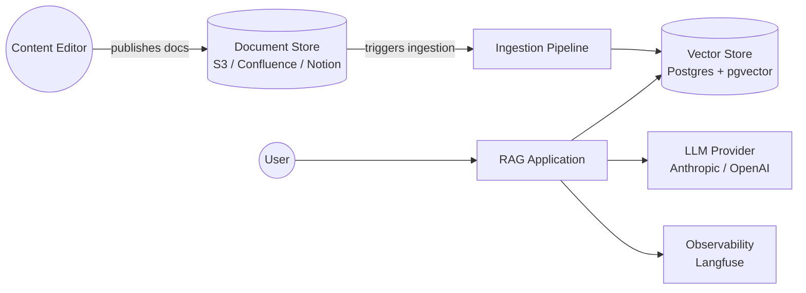
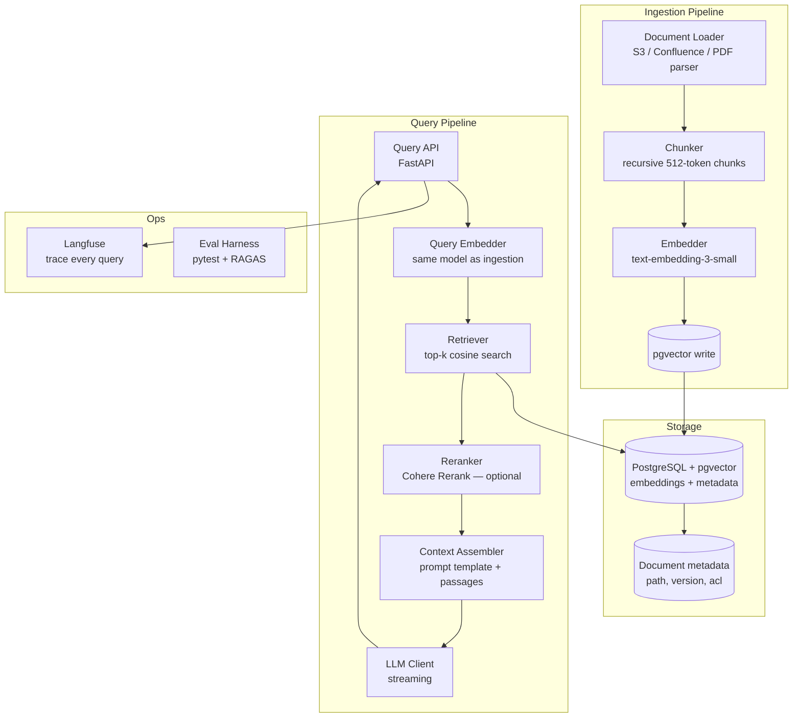

# Pattern: RAG (Retrieval-Augmented Generation)

!!! info "Quick facts"
    - **Category:** AI / LLM-Integrated Systems
    - **Maturity:** Adopt
    - **Typical team size:** 2-4 engineers
    - **Typical timeline to MVP:** 3-6 weeks
    - **Last reviewed:** 2026-05-02 by Architecture Team

## 1. Context

**Use this pattern when:**

- You need an LLM to answer questions over a private or frequently updated corpus that was not in its training data
- Answers must be traceable to a source — citations reduce hallucination risk and build user trust
- The knowledge base changes often enough that baking it into model weights via fine-tuning would produce stale results within months
- The corpus spans thousands to millions of documents: internal wikis, support tickets, contracts, research papers, product documentation

**Do NOT use this pattern when:**

- The entire knowledge base fits comfortably in the model's context window (< 100k tokens, ~200 pages) — just pass it all in; retrieval adds complexity with no benefit
- The task requires reasoning over structured data (tables, metrics) — use a Text-to-SQL pattern or direct database queries instead
- Real-time freshness under 30 seconds is required — vector index update latency is typically minutes
- You have not yet tested whether basic prompting with a large context window already solves the problem — it often does

## 2. Problem it solves

Organisations have vast stores of proprietary knowledge — internal documentation, past decisions, product manuals, support histories — that an LLM was never trained on and cannot access. Feeding this knowledge into the model through fine-tuning is slow and expensive, produces stale results as soon as the corpus updates, and does not give the model the ability to cite its sources. RAG solves this by retrieving only the most relevant passages at query time and including them in the prompt, keeping the LLM grounded in current, auditable content.

## 3. Solution overview

### System context (C4 Level 1)

### Container view (C4 Level 2)

## 4. Technology stack

| Layer | Primary choice | Alternatives | Notes |
|---|---|---|---|
| Language | Python 3.12+ | TypeScript (Node.js) | Python for the ingestion pipeline and API; TypeScript if the frontend team owns the whole stack |
| LLM | Anthropic Claude 3.5 Sonnet | OpenAI GPT-4o, Google Gemini 1.5 Pro | See [ADR-0006](../../decisions/0006-llm-provider.md); Sonnet balances quality and cost for RAG generation |
| Embedding model | OpenAI text-embedding-3-small | Cohere embed-v3, Voyage voyage-3 | text-embedding-3-small is cheap, fast, and accurate for English; Voyage voyage-3 for highest retrieval accuracy |
| Vector store | PostgreSQL + pgvector | Pinecone, Qdrant, Weaviate | See [ADR-0004](../../decisions/0004-vector-store.md); pgvector co-locates with your existing Postgres |
| Orchestration | Hand-rolled Python | LlamaIndex, LangChain | See [ADR-0005](../../decisions/0005-llm-orchestration.md); LlamaIndex is acceptable for RAG-specific pipelines |
| Chunking | Recursive character splitting (512 tok / 50 overlap) | Semantic chunking, document-structure-aware | The boring default works well; tune chunk size empirically on your eval set, not upfront |
| Reranker | Cohere Rerank API | Cross-encoder (local), None | Reranking significantly improves precision at the cost of ~100ms + API fee; add after baseline pipeline works |
| Observability | Langfuse | LangSmith, Helicone, Arize Phoenix | Langfuse is open-source, self-hostable, and tracks traces + eval scores in one place |
| Evaluation | Custom pytest + RAGAS | Braintrust, DeepEval | Always build an eval harness before tuning retrieval parameters — you need a signal |

## 5. Non-functional characteristics

| Concern | Profile |
|---|---|
| **Scalability** | pgvector handles ~1M document chunks with sub-100ms retrieval on a `pg_ivfflats` index; migrate to a dedicated vector DB (Qdrant, Pinecone) above ~10M chunks or if multi-tenancy requires namespace isolation. Ingestion pipeline scales horizontally by partitioning documents across workers. |
| **Availability target** | 99.9% — same as the underlying Postgres. LLM API availability (~99.5% for Anthropic/OpenAI) is typically the binding constraint; implement a fallback error message rather than crashing. |
| **Latency target** | p95 < 2 s for a complete RAG response: embedding ~50 ms, retrieval ~100 ms, reranking ~150 ms, LLM generation ~1–1.5 s (streaming hides this). Time-to-first-token < 600 ms with streaming enabled. |
| **Security posture** | Enforce document-level access control before retrieval — never return chunks the querying user is not permitted to read. Store ACL metadata alongside each chunk in the vector store; filter on it at query time. Treat LLM API calls as data-exfiltration paths: sanitise chunks before including them in prompts. |
| **Data residency** | Document chunks and their embeddings live in your Postgres instance. Every query sends the retrieved passages to the LLM API — ensure this is permissible under your data classification policy before deploying to production. |
| **Compliance fit** | GDPR ✓ with EU region deployment; right-to-erasure requires deleting both source documents and their embeddings (write a clean-up job). HIPAA ✓ with BAA from LLM provider (Anthropic and OpenAI both offer BAAs). SOC 2 ✓ with audit log of every query + source chunks returned. |

## 6. Cost ballpark

Indicative monthly USD cost. LLM token spend is the dominant variable; retrieval infrastructure is cheap.

| Scale | Documents in corpus | Monthly cost | Cost drivers |
|---|---|---|---|
| Small | < 10,000 | $50 - $250 | One-time embedding ingestion cost + ongoing query token spend + Postgres hosting |
| Medium | 10k - 500k | $500 - $3,000 | Larger Postgres instance, higher query volume, optional Cohere Rerank API |
| Large | 500k+ | $3,000 - $15,000 | Dedicated vector DB if migrated from pgvector, high LLM token volume, Langfuse observability at scale |

## 7. LLM-assisted development fit

| Aspect | Rating | Notes |
|---|---|---|
| Ingestion pipeline (load, chunk, embed, upsert) | ★★★★★ | Excellent — patterns are extremely well-represented; generate the skeleton and iterate. |
| Retrieval and prompt assembly | ★★★★ | Good; verify top-k values, prompt template wording, and chunk overlap on your own eval set. |
| Retrieval quality tuning (threshold, reranking, hybrid search) | ★★★ | Knows the levers but optimal values require empirical evaluation on your specific corpus. Do not trust defaults. |
| Evaluation harness and test set generation | ★★★ | Can generate plausible question-answer pairs for eval; domain experts must validate ground-truth answers. |
| Architecture decisions | ★ | Don't outsource. Use ADRs. |

**Recommended workflow:** Build an eval set of 50–100 question-answer pairs from your corpus before writing any retrieval code. Use it to measure every change. Generate ingestion code with the LLM; hand-tune the chunk size and retrieval parameters against eval scores.

## 8. Reference implementations

- **Public reference:** [langchain-ai/rag-from-scratch](https://github.com/langchain-ai/rag-from-scratch) — companion repo to LangChain's RAG from Scratch YouTube series; 18 notebooks covering naive RAG through advanced techniques (200 OK ✓)
- **Public reference:** [run-llama/llama_index](https://github.com/run-llama/llama_index) — LlamaIndex framework; `docs/examples/` contains end-to-end RAG pipeline examples for dozens of vector stores (200 OK ✓)
- **Public reference:** [pgvector/pgvector](https://github.com/pgvector/pgvector) — the pgvector extension itself; README covers index types, distance functions, and performance tuning (200 OK ✓)
- **Internal case study:** _Add your anonymised internal example here_

## 9. Related decisions (ADRs)

- [ADR-0004: pgvector as the default vector store](../../decisions/0004-vector-store.md)
- [ADR-0005: LLM orchestration approach — hand-rolled over frameworks](../../decisions/0005-llm-orchestration.md)
- [ADR-0006: Anthropic Claude as the default LLM provider](../../decisions/0006-llm-provider.md)

## 10. Known risks & gotchas

- **Chunk boundaries split semantic units** — A sentence split across two chunks loses meaning; neither chunk retrieves well. Mitigation: use recursive character splitting with a meaningful overlap (50 tokens); for structured documents (contracts, specs), write a document-structure-aware chunker that respects heading and paragraph boundaries.
- **Access control leakage through retrieval** — The retrieval step returns chunks without checking if the querying user is authorised to read the source document. Mitigation: store the source document's ACL as metadata on every chunk and apply a `WHERE acl_allows($user_id)` filter in the similarity search — not as a post-retrieval step.
- **Stale embeddings after document updates** — If a document is updated but its old chunks are not removed, the index contains contradictory information. Mitigation: implement a delete-and-re-index on every document update keyed on a stable document ID; track the last-embedded version hash.
- **Retrieval precision vs. recall mismatch** — A high top-k returns noisy context that confuses the model; a low top-k misses the relevant passage. Mitigation: measure recall@k on your eval set; add a reranker to improve precision after retrieval rather than tuning top-k alone.
- **LLM answers outside the retrieved context** — The model supplements retrieved chunks with parametric knowledge, producing confident hallucinations. Mitigation: include an explicit instruction in the system prompt ("Answer only from the provided context; if the answer is not present, say so") and verify this instruction is honoured during eval.
