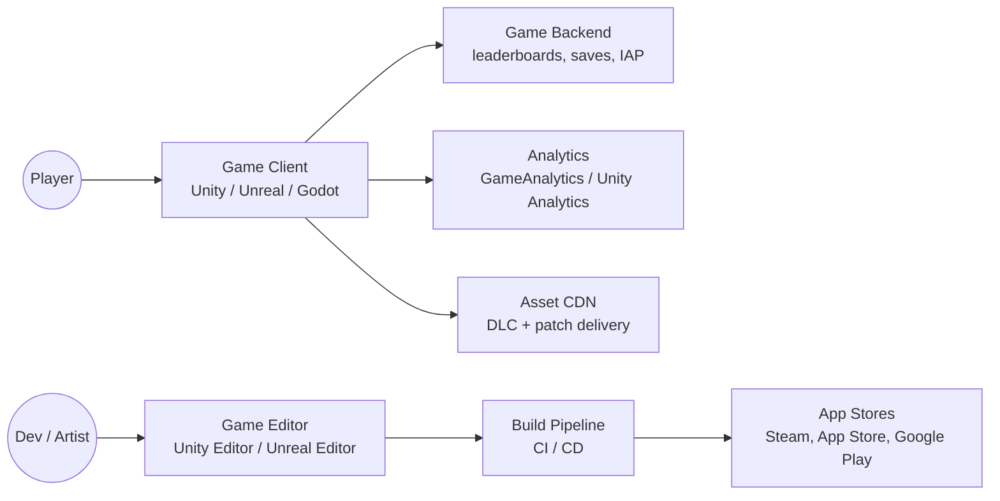
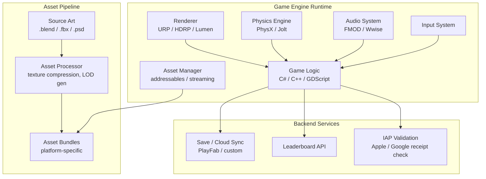

# Pattern: Cross-platform Game (Unity / Unreal / Godot)

!!! info "Quick facts"
    - **Category:** Games & Graphics
    - **Maturity:** Adopt
    - **Typical team size:** 3-15 engineers + artists
    - **Typical timeline to MVP (playable build):** 12-24 weeks
    - **Last reviewed:** 2026-05-03 by Architecture Team

## 1. Context

**Use this pattern when:**

- Building a commercial game that must ship on two or more platforms (PC, console, mobile, web)
- The team needs a real-time 3D renderer, physics engine, and asset pipeline — building these from scratch is not viable
- The project is a game, interactive experience, or simulation where frame budget (16 ms at 60fps) matters

**Do NOT use this pattern when:**

- The game is entirely web-browser-based with no download — use the Web-based Game pattern instead
- The project is a scientific or engineering simulation that prioritises numerical accuracy over real-time rendering — use the Scientific Simulation pattern
- The team is 1-2 people and the game is simple (2D pixel art, puzzle) — Godot's lower overhead may suit better than Unity or Unreal

## 2. Problem it solves

Building a renderer, physics engine, audio system, input manager, and asset pipeline from scratch takes years. Commercial and open-source game engines package these systems so that a team can focus on game design and content. The engine also provides a deployment pipeline to multiple platform targets (Windows, macOS, iOS, Android, consoles) from a single codebase. The choice of engine determines the scripting language, the tool ecosystem, the performance ceiling, and the hiring pool.

## 3. Solution overview

### System context (C4 Level 1)

### Container view (C4 Level 2)

## 4. Technology stack

| Layer | Primary choice | Alternatives | Notes |
|---|---|---|---|
| Engine | Unity (C#) | Unreal Engine (C++ / Blueprints), Godot (GDScript / C#) | See [ADR-0010](../../decisions/0010-game-engine.md); Unity for cross-platform reach and large community; Unreal for AAA-quality graphics; Godot for open-source, lightweight projects |
| Render pipeline (Unity) | Universal Render Pipeline (URP) | High Definition Render Pipeline (HDRP) | URP for mobile + PC cross-platform; HDRP for PC/console high-fidelity only |
| Audio middleware | FMOD | Wwise, Unity Audio | FMOD for complex dynamic audio (adaptive music, 3D spatial audio); Unity's built-in audio for simpler projects |
| Asset streaming | Unity Addressables | Asset bundles (manual), Resources folder | Addressables for any project with more than trivial content volume; Resources folder does not scale |
| Backend / services | Unity Gaming Services (UGS) | PlayFab (Microsoft), custom REST API | UGS for teams already on Unity; PlayFab for cross-engine backends; custom API for full control |
| IAP | Unity IAP | native StoreKit / Google Play Billing | Unity IAP abstracts both stores behind one API; validate receipts server-side — never trust client-side receipt data |
| CI / CD | Unity Build Automation (via UGS) | GitHub Actions + GameCI Docker | GameCI provides open-source Unity build Docker images for self-hosted pipelines |
| Analytics | Unity Analytics | GameAnalytics (free), Amplitude | GameAnalytics is free with a generous tier; Amplitude for richer funnel analysis |

## 5. Non-functional characteristics

| Concern | Profile |
|---|---|
| **Scalability** | The game client is a standalone executable — scaling is a backend concern (leaderboards, matchmaking). Frame rate consistency is the primary "scalability" metric on the client: target a stable frame budget at 60fps without spikes. |
| **Availability target** | Offline play must be supported by default — network unavailability must never crash a single-player session. Online features (leaderboards, cloud save) degrade gracefully. |
| **Latency target** | Frame time budget: 16.6 ms for 60fps, 8.3 ms for 120fps. CPU-side game logic should consume < 6 ms per frame on a target device, leaving the rest for rendering. Profile on the lowest-spec target device, not a developer machine. |
| **Security posture** | Client code is reversible — never trust the client for server-authoritative gameplay (scores, currency, progression). Validate all purchases server-side. Use obfuscation for anti-cheat but do not rely on it alone. |
| **Data residency** | Player save data and PII collected for analytics must comply with GDPR; use a server-side save service that supports data export and deletion. |
| **Compliance fit** | App store guidelines enforce age ratings, content policies, and IAP rules; review before submission. GDPR: disclose analytics data collection; provide opt-out. COPPA (US): children's games have strict data collection limitations. |

## 6. Cost ballpark

Indicative monthly USD cost in production. Development costs (tools, licenses) are separate.

| Scale | MAU | Monthly cost | Cost drivers |
|---|---|---|---|
| Small | < 10,000 | $50 - $400 | Backend hosting, CDN for assets, Unity Gaming Services free tier |
| Medium | 10k - 500k | $400 - $5,000 | Backend compute, CDN bandwidth (large game assets), analytics volume |
| Large | 500k+ | $5,000 - $30,000 | Backend fleet, CDN, Unity Pro/Enterprise licences, dedicated LiveOps |

## 7. LLM-assisted development fit

| Aspect | Rating | Notes |
|---|---|---|
| Gameplay scripting (C#, GDScript) and UI boilerplate | ★★★★★ | Excellent — Unity C# patterns are extensively represented; generate component scaffolding freely. |
| Game design patterns (state machines, observer, object pooling) | ★★★★ | Good; verify the specific implementation is appropriate for your frame budget. |
| Shader code (HLSL, ShaderGraph) | ★★★ | Generates valid shaders for common effects; performance characteristics require profiling. |
| Performance optimisation (draw calls, batching, LOD) | ★★ | Knows the concepts; performance work requires profiling data that an LLM cannot see. |
| Architecture decisions | ★ | Don't outsource. Use ADRs. |

**Recommended workflow:** Establish a performance budget (frame time, draw calls, memory) for the lowest-spec target device before content production begins. Profile weekly — never assume performance; always measure.

## 8. Reference implementations

- **Public reference:** [godotengine/godot](https://github.com/godotengine/godot) — Godot engine source; `demos/` and the Asset Library provide complete working game examples (200 OK ✓)
- **Internal case study:** _Add your anonymised internal example here_

## 9. Related decisions (ADRs)

- [ADR-0010: Game engine selection](../../decisions/0010-game-engine.md)

## 10. Known risks & gotchas

- **Scope creep destroys the frame budget** — each new feature adds CPU and GPU cost; by beta the game runs at 20fps on the target device. Mitigation: set a non-negotiable performance budget per system; profile after every sprint on the lowest-spec device; treat a frame budget overrun as a blocking bug.
- **Asset pipeline is an afterthought** — uncompressed textures and oversized audio files ship in the final build; the game is 4 GB when it should be 500 MB. Mitigation: establish texture compression rules (ASTC for mobile, DXT/BCn for PC) and audio format rules (Vorbis, ADPCM) on day one; run an asset audit before each milestone.
- **Unity licensing surprises** — Unity's runtime fee policy changed in 2023 causing industry disruption; verify the current licensing terms before committing to Unity for a commercial project. Mitigation: review Unity's current Terms of Service; consider Godot (MIT licensed) for projects where licensing risk is unacceptable.
- **Server-side validation not implemented** — a player modifies the client to report a score of 999,999,999 and tops the leaderboard permanently. Mitigation: treat all client-reported gameplay data as untrusted; validate or re-simulate critical metrics server-side.
- **Platform certification requirements are not trivial** — Sony, Microsoft, and Nintendo have extensive Technical Requirements Checklists (TRCs/XRs/LotChecks); failing certification adds weeks to launch. Mitigation: review platform certification requirements at the start of development, not at submission; allocate 4–6 weeks for certification testing.
