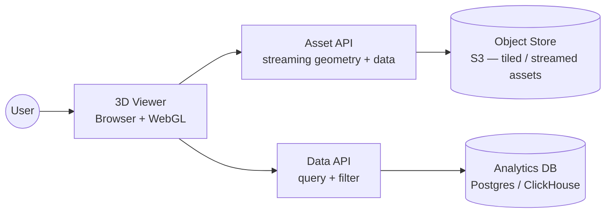
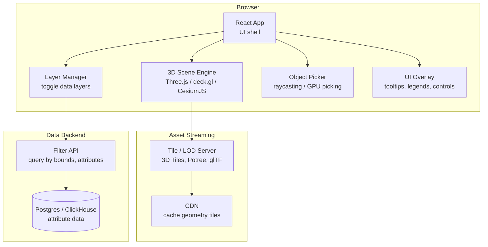

# Pattern: Data Visualisation / 3D Viewer

!!! info "Quick facts"
    - **Category:** Games & Graphics
    - **Maturity:** Adopt
    - **Typical team size:** 1-4 engineers
    - **Typical timeline to MVP:** 3-8 weeks
    - **Last reviewed:** 2026-05-03 by Architecture Team

## 1. Context

**Use this pattern when:**

- Displaying large datasets spatially in a browser: geospatial maps, point clouds, CAD models, molecular structures, medical imaging (DICOM), or engineering simulation results
- Users need to explore data interactively — pan, zoom, rotate, filter — rather than view static charts
- The data has a spatial or 3D structure that standard 2D charting libraries (Recharts, D3.js) cannot represent

**Do NOT use this pattern when:**

- The data is non-spatial and standard 2D charts (line, bar, scatter) are sufficient — Recharts or Chart.js is simpler and lighter
- The rendering is game-quality real-time 3D with complex lighting, physics, and animation — use a game engine pattern instead
- The viewer must be a desktop application (e.g., for large local files) — Electron + Three.js or a native toolkit may be more appropriate

## 2. Problem it solves

Business teams, scientists, and engineers need to understand spatial, volumetric, or large-scale data that cannot be conveyed by tables or 2D charts. A CAD engineer reviewing a product model needs to rotate it. An urban planner needs to overlay building height, traffic flow, and air quality on a map simultaneously. A radiologist needs to scroll through DICOM slices. This pattern brings GPU-accelerated 3D rendering into the browser so these use cases work without plugins or downloads.

## 3. Solution overview

### System context (C4 Level 1)

### Container view (C4 Level 2)

## 4. Technology stack

| Layer | Primary choice | Alternatives | Notes |
|---|---|---|---|
| 3D renderer — general | Three.js | Babylon.js, PlayCanvas | Three.js for custom 3D scenes with full control; Babylon.js if you want a higher-level scene graph with built-in physics |
| Geospatial large-scale | deck.gl | CesiumJS, Mapbox GL, Leaflet + WebGL | deck.gl for large-scale data layers on a 2D/3D map (millions of points, arcs, polygons); CesiumJS for globe-scale 3D terrain and buildings |
| Geospatial globe | CesiumJS | deck.gl with globe projection | CesiumJS for 3D globe with terrain, satellite imagery, and 3D Tiles city models |
| Point cloud rendering | Potree (WebGL) | Three.js + custom instancing | Potree streams and LOD-renders massive point clouds (billions of points) directly in the browser |
| CAD / mesh viewer | Three.js + GLTFLoader | model-viewer (Google), Online3DViewer | glTF is the web standard for 3D models; Three.js GLTFLoader handles most CAD exports |
| Chart overlays (2D) | D3.js | Recharts, Vega-Lite | D3 for custom SVG overlays on top of the 3D canvas; Recharts for simpler associated charts outside the 3D view |
| Streaming / LOD | 3D Tiles (OGC standard) | Potree octree, custom LOD | 3D Tiles enables streaming city-scale 3D content (buildings, point clouds, meshes) with progressive detail |
| State management | Zustand | React Context | Zustand for viewer state (camera position, active layers, selected objects) shared between React and the Three.js render loop |

## 5. Non-functional characteristics

| Concern | Profile |
|---|---|
| **Scalability** | The viewer is a static frontend served from CDN. Large data is streamed progressively via LOD tiling — the server sends only what is visible at the current zoom level. Backend scales based on query load, not viewer count. |
| **Availability target** | 99.9% (CDN); data API availability determines whether dynamic data layers load. Implement graceful layer degradation — show the base 3D scene even when a data layer API fails. |
| **Latency target** | Initial scene load: < 3 s. Interactive frame rate: 30+ fps at target data volume on a mid-range GPU laptop. Tile streaming: tiles for the current view should load in < 500 ms on a fast connection. |
| **Security posture** | WebGL runs in a sandboxed browser context — no filesystem access. If geometry contains IP-sensitive designs (CAD models), serve assets through signed URLs with short expiry rather than public S3 URLs. |
| **Data residency** | Geometry data and attribute data cached in browser memory; cleared on tab close. Large geometry files should not contain unintended metadata (CAD file history, author information); strip before serving. |
| **Compliance fit** | GDPR: if the viewer shows personal location data (tracking, fleet, people counters), treat it as personal data with appropriate access controls and retention limits. Export control: CAD models representing controlled technology must have access restrictions enforced server-side on the asset API. |

## 6. Cost ballpark

Indicative monthly USD cost. Dominated by CDN egress for large geometry files.

| Scale | MAU | Monthly cost | Cost drivers |
|---|---|---|---|
| Small | < 5,000 | $30 - $200 | S3 storage, Cloudflare CDN (low egress cost), small query API |
| Medium | 5k - 100k | $200 - $2,000 | CDN bandwidth (3D tiles can be large), larger DB, backend compute |
| Large | 100k+ | $1,500 - $10,000 | CDN at scale, large point cloud storage (TB-range), tile server compute |

## 7. LLM-assisted development fit

| Aspect | Rating | Notes |
|---|---|---|
| Three.js scene setup, camera, and lighting | ★★★★★ | Excellent — Three.js API is extensively documented and well-represented. |
| deck.gl layer configuration and data bindings | ★★★★ | Good; verify coordinate system (WGS84 vs local) and data format requirements. |
| Custom GLSL shaders for data-driven colour mapping | ★★★ | Generates valid GLSL; performance and precision characteristics need manual review. |
| Progressive LOD / tile streaming architecture | ★★★ | Knows the concepts; tile format specifics (3D Tiles B3DM, I3DM) require consulting the spec. |
| Architecture decisions | ★ | Don't outsource. Use ADRs. |

**Recommended workflow:** Start with a static glTF file loaded in Three.js to validate the rendering pipeline before adding dynamic data streaming. Profile with Chrome DevTools Performance tab and GPU profiler early — 3D viewer performance regressions are hard to catch without continuous profiling.

## 8. Reference implementations

- **Public reference:** [mrdoob/three.js](https://github.com/mrdoob/three.js) — Three.js; `examples/` has hundreds of runnable demos covering loaders, materials, post-processing, and custom shaders (200 OK ✓)
- **Public reference:** [visgl/deck.gl](https://github.com/visgl/deck.gl) — deck.gl; `examples/` covers geospatial layers, large data rendering, and integration with Mapbox (200 OK ✓)
- **Public reference:** [CesiumGS/cesium](https://github.com/CesiumGS/cesium) — CesiumJS; reference for globe-scale 3D visualisation, 3D Tiles streaming, and terrain rendering (200 OK ✓)
- **Internal case study:** _Add your anonymised internal example here_

## 9. Related decisions (ADRs)

- _No ADRs recorded yet. Candidate: Three.js vs deck.gl vs CesiumJS — depends on whether the primary use case is object-level 3D, geospatial data layers, or globe-scale terrain._

## 10. Known risks & gotchas

- **Memory leak in the Three.js render loop** — geometry, textures, and materials are not disposed of when React re-renders; GPU memory grows until the tab crashes. Mitigation: call `geometry.dispose()`, `material.dispose()`, and `texture.dispose()` in cleanup effects; use the Three.js memory inspector in Chrome DevTools.
- **WebGL context limit** — browsers limit WebGL contexts per page (typically 8–16); loading multiple viewer instances or iFrames on the same page exhausts them. Mitigation: use a single shared renderer and scene; never create multiple `WebGLRenderer` instances on the same page.
- **Large point cloud stalls the main thread on initial load** — loading a 50 MB point cloud as a single glTF file blocks the browser tab. Mitigation: use Potree for point clouds > 1M points; stream via octree tiles rather than loading the full dataset at once.
- **Coordinate system mismatch between data sources** — one dataset uses WGS84 geographic coordinates, another uses a local Cartesian CRS; overlaying them requires a coordinate transform that is easy to get wrong. Mitigation: normalise all data to a single CRS before rendering; document the chosen reference frame and validate with a known landmark.
- **Picking (click to select) slow on large scenes** — CPU-side raycasting against 10M triangles takes 200ms per click, freezing the UI. Mitigation: use GPU-based picking (render object IDs to an offscreen buffer, read the pixel at the cursor position) for scenes with > 10k objects.
