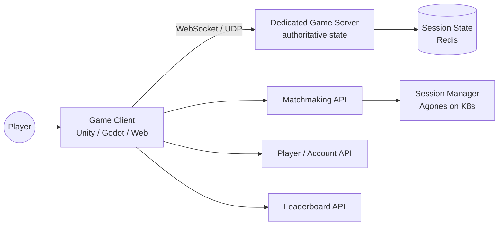
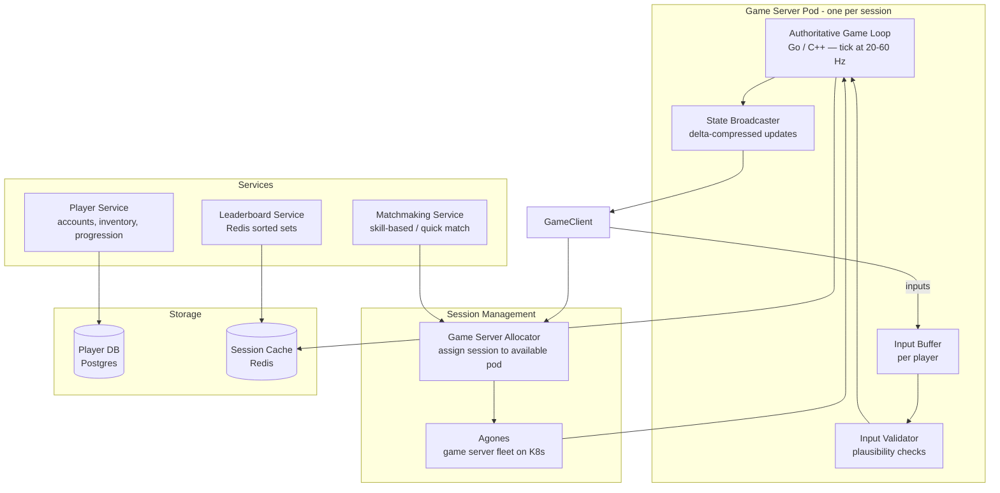

# Pattern: Multiplayer Game Backend

!!! info "Quick facts"
    - **Category:** Games & Graphics
    - **Maturity:** Trial
    - **Typical team size:** 2-5 engineers
    - **Typical timeline to MVP:** 8-14 weeks
    - **Last reviewed:** 2026-05-03 by Architecture Team

## 1. Context

**Use this pattern when:**

- The game has real-time multiplayer sessions where players interact simultaneously (action games, racing, turn-based async, battle royale)
- An authoritative server must prevent cheating by validating game state rather than trusting clients
- The game needs matchmaking, session management, and leaderboards as backend services

**Do NOT use this pattern when:**

- The game is single-player only — no dedicated server infrastructure is needed
- A peer-to-peer model (WebRTC) is acceptable for your player count and cheat tolerance — P2P avoids server costs at the expense of authoritative state
- You are building on a platform that provides managed multiplayer (Unity Relay, Photon, AWS GameLift) and its constraints are acceptable — use the managed service rather than this pattern

## 2. Problem it solves

Client-side multiplayer is exploitable: a modified client can teleport, report false positions, or manipulate game state. An authoritative dedicated server holds the canonical game state, validates all player inputs, and broadcasts authorised state updates — making it the source of truth that clients cannot contradict. The backend also handles the services that games require at scale: matching players into sessions, tracking scores, and managing player accounts.

## 3. Solution overview

### System context (C4 Level 1)

### Container view (C4 Level 2)

## 4. Technology stack

| Layer | Primary choice | Alternatives | Notes |
|---|---|---|---|
| Game server language | Go | C++ (Unreal Dedicated Server), C# (Unity Dedicated Server) | Go for custom game servers: fast, low GC pauses, easy concurrency; use the engine's dedicated server mode (Unreal/Unity) to reuse game logic |
| Transport protocol | WebSocket (web clients) + UDP (native clients via `go-enet` or similar) | TCP only, QUIC | UDP for low-latency action games (position updates, inputs); TCP/WebSocket for turn-based or web-based games |
| Game server fleet management | Agones (Kubernetes) | AWS GameLift, PlayFab Multiplayer Servers, self-managed | Agones is open-source, K8s-native, and handles server allocation, health checks, and autoscaling; GameLift for AWS-managed fleet |
| Matchmaking | Agones + Open Match | Nakama matchmaking, PlayFab matchmaking | Open Match (by Google) is open-source and integrates with Agones; Nakama for teams that want a full game backend platform |
| Player / account service | Custom NestJS + Postgres | Nakama, PlayFab | Nakama provides accounts, friends, leaderboards, and realtime in one platform; custom for full control |
| Leaderboard | Redis sorted sets | Nakama leaderboards, custom Postgres | Redis `ZADD` / `ZRANK` natively implements ranked leaderboards with O(log N) updates |
| State compression | Delta compression + bit packing | Full state snapshot | Only send changed fields per tick; bit-pack small values (position, rotation) to minimise packet size |
| Anti-cheat | Server-side plausibility checks | Easy Anti-Cheat, BattlEye | For PC games with competitive players, kernel-level anti-cheat is required; for casual or mobile, server-side validation is sufficient |

## 5. Non-functional characteristics

| Concern | Profile |
|---|---|
| **Scalability** | Each game session runs in an isolated server pod. Scale by running more pods (Agones autoscales the fleet). Backend services (matchmaking, leaderboards) scale independently. |
| **Availability target** | 99.9% for matchmaking and backend services. Individual game server pods can crash; design reconnection logic in the client. Never run multiple sessions in a single pod. |
| **Latency target** | Server tick rate: 20 Hz for casual games, 60 Hz for action games. Round-trip target: < 150 ms for a playable experience, < 80 ms for competitive play. Deploy game servers in the region closest to the player cluster. |
| **Security posture** | All game state mutations validated server-side. Client is untrusted for any gameplay-affecting data. Rate-limit inputs per player per tick. Use DTLS/TLS for all transport. |
| **Data residency** | Player account data in Postgres must comply with GDPR. Game replay data (for anti-cheat analysis) may be large; set explicit retention policies. |
| **Compliance fit** | GDPR ✓ — player data deletion cascades through all services. Age verification and parental controls required for games targeting minors. Loot box mechanics may require odds disclosure under gambling regulations in some jurisdictions. |

## 6. Cost ballpark

Indicative monthly USD cost. Game server compute scales with concurrent sessions.

| Scale | Peak concurrent sessions | Monthly cost | Cost drivers |
|---|---|---|---|
| Small | < 100 | $200 - $800 | Agones K8s cluster (small), Redis, Postgres |
| Medium | 100 - 5,000 | $1,000 - $8,000 | K8s node autoscaling, game server pod compute, CDN, monitoring |
| Large | 5,000+ | $8,000 - $50,000+ | Large K8s fleet, multi-region deployment, dedicated anti-cheat infrastructure |

## 7. LLM-assisted development fit

| Aspect | Rating | Notes |
|---|---|---|
| Game server tick loop and state broadcast scaffolding | ★★★★ | Good — authoritative game server patterns in Go are reasonably represented; verify tick timing and goroutine safety. |
| Agones SDK integration and fleet configuration | ★★★★ | Good; Agones SDK usage is straightforward; YAML fleet configuration needs review for resource limits. |
| Leaderboard with Redis sorted sets | ★★★★★ | Excellent — this is a classic pattern; generates correctly. |
| State delta compression / bit packing | ★★★ | Knows the concepts; correct implementation requires domain-specific knowledge of your game state schema. |
| Architecture decisions | ★ | Don't outsource. Use ADRs. |

**Recommended workflow:** Prototype the game loop as a simple TCP/WebSocket echo server before adding Agones and matchmaking. Validate the game feel (input lag, state synchronisation) on the prototype before investing in fleet management infrastructure.

## 8. Reference implementations

- **Public reference:** [googleforgames/agones](https://github.com/googleforgames/agones) — Agones game server fleet manager for Kubernetes; `examples/` covers simple server lifecycle, SDK usage, and fleet allocation (200 OK ✓)
- **Public reference:** [heroiclabs/nakama](https://github.com/heroiclabs/nakama) — open-source game backend platform; accounts, matchmaking, leaderboards, realtime multiplayer, and storage in one service (200 OK ✓)
- **Internal case study:** _Add your anonymised internal example here_

## 9. Related decisions (ADRs)

- [ADR-0010: Game engine selection](../../decisions/0010-game-engine.md)

## 10. Known risks & gotchas

- **Game server pod crashes mid-session without reconnection support** — all players in the session are disconnected with no path back; the session is lost. Mitigation: implement client-side reconnection with exponential backoff; persist minimal session state to Redis so a client can reconnect to a new pod if the original crashes.
- **Tick rate too high for low-end mobile clients** — a 60Hz server tick floods mobile clients with state updates they cannot render; battery drains and bandwidth is wasted. Mitigation: design client-side interpolation and extrapolation so clients can render smoothly at their own frame rate regardless of server tick rate; consider adaptive tick rates per session type.
- **Matchmaking puts high-latency players in the same session** — a player in Sydney and a player in London are matched into the same session; one of them has 350ms round-trip. Mitigation: implement region-aware matchmaking (prefer players in the same region); fall back to cross-region only after a configurable timeout with a latency warning UI.
- **Anti-cheat not implemented until cheating is reported** — the first week of competitive leaderboard results is invalidated by obvious exploits. Mitigation: implement server-side plausibility checks (speed, position deltas, score rates) before opening public access; treat impossible game states as banning criteria.
- **Agones fleet scales down while sessions are active** — K8s autoscaler terminates a node with active game server pods. Mitigation: use Agones `PodDisruptionBudget` to prevent eviction of pods in `Allocated` state; configure K8s cluster autoscaler to respect pod disruption budgets.
