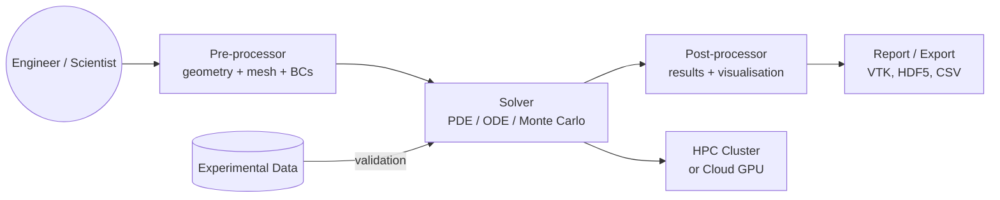
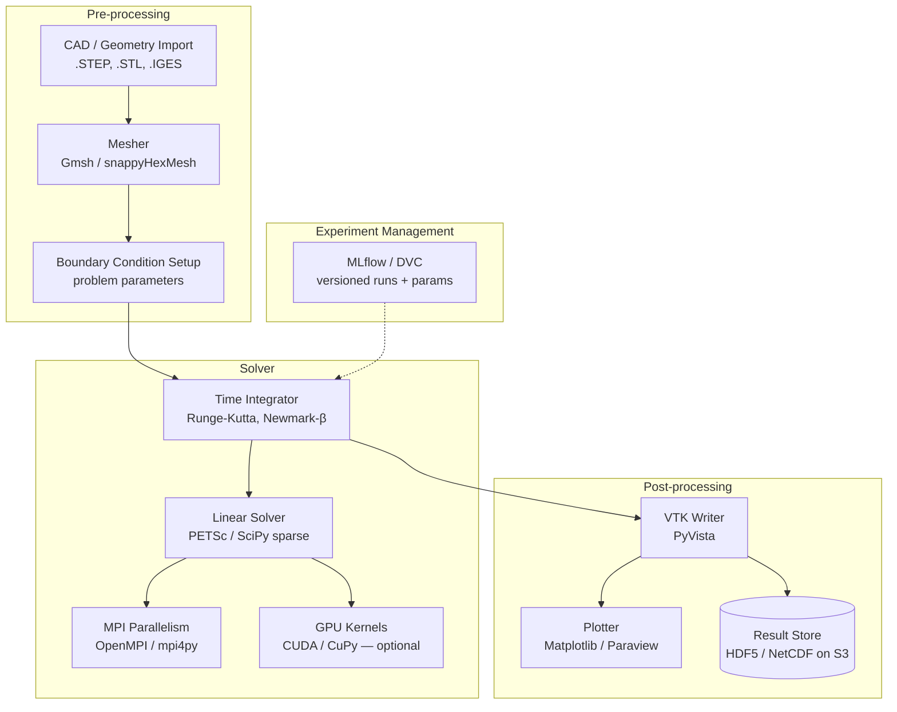

# Pattern: Scientific / Engineering Simulation

!!! info "Quick facts"
    - **Category:** Games & Graphics
    - **Maturity:** Adopt
    - **Typical team size:** 2-6 engineers (often with domain scientists)
    - **Typical timeline to MVP:** 8-20 weeks
    - **Last reviewed:** 2026-05-03 by Architecture Team

## 1. Context

**Use this pattern when:**

- Simulating physical, chemical, biological, or engineering systems where numerical accuracy is a first-class requirement alongside (or above) real-time performance
- Building training simulators, digital twins, computational fluid dynamics (CFD) tools, finite element analysis (FEA), or structural engineering software
- Results must be reproducible, versioned, and validated against physical measurements or analytical solutions

**Do NOT use this pattern when:**

- The simulation is purely visual and approximate accuracy is acceptable — use a game engine's physics engine instead
- The simulation is a simple analytical model that runs in milliseconds — a Python script or spreadsheet is sufficient
- Real-time interactive performance is more important than numerical precision — game engine physics is appropriate for interactive training applications where "good enough" accuracy suffices

## 2. Problem it solves

Engineering and scientific decisions depend on simulation results. A structural engineer needs to know whether a bridge design fails under load before building it. A pharma company needs to simulate molecular interactions before running wet lab experiments. These simulations involve large numerical systems (millions of degrees of freedom), stiff differential equations, or complex geometry that requires specialised numerical methods — not a game engine physics approximation.

## 3. Solution overview

### System context (C4 Level 1)

### Container view (C4 Level 2)

## 4. Technology stack

| Layer | Primary choice | Alternatives | Notes |
|---|---|---|---|
| Compute language | Python (NumPy + SciPy) | C++ (performance-critical kernels), Fortran (legacy HPC), Julia | Python for orchestration and post-processing; C/C++ extension modules for inner loops; Julia for teams wanting MATLAB-like syntax with C-level performance |
| Numerical library | NumPy + SciPy | JAX (auto-diff + GPU), PyTorch (ML-adjacent) | SciPy provides sparse solvers, ODE integrators, and signal processing; JAX for simulations requiring automatic differentiation |
| Parallel computing | MPI via `mpi4py` | Dask (task graph), Ray | MPI for tightly coupled parallel solvers (CFD, FEA); Dask for embarrassingly parallel parameter sweeps |
| GPU acceleration | CuPy (drop-in NumPy for CUDA) | JAX (XLA), Numba (CUDA kernels) | CuPy for porting NumPy code to GPU with minimal changes; Numba for writing custom CUDA kernels in Python |
| Meshing | Gmsh | OpenFOAM's snappyHexMesh, CGAL | Gmsh provides a Python API for programmatic mesh generation; well-suited for complex 3D geometries |
| Visualisation | PyVista + ParaView | Matplotlib (2D), VTK (low-level) | PyVista wraps VTK with a simpler Python API; ParaView for interactive exploration of large results |
| Results storage | HDF5 (via h5py) on AWS S3 | NetCDF4, Zarr | HDF5 for structured multidimensional result arrays; Zarr for cloud-native chunked access without full-file download |
| Experiment tracking | DVC (data + model versioning) | MLflow, Sacred | DVC versions both code and large data files (meshes, results); essential for reproducible simulation runs |

## 5. Non-functional characteristics

| Concern | Profile |
|---|---|
| **Scalability** | Tightly coupled solvers scale via MPI across nodes; diminishing returns above ~1,000 cores for most problems (Amdahl's Law). Embarrassingly parallel parameter sweeps scale linearly. Cloud HPC (AWS HPC instances, Google HPC) provides on-demand burst capacity without owning hardware. |
| **Availability target** | Simulation jobs run to completion; they are not long-running services. Availability = "job completes and results are retrievable." Use checkpointing to allow job restart from an intermediate state after a node failure. |
| **Latency target** | Wall-clock time to solution is the metric. Define acceptable solve time per problem size in the requirements; profile solver performance against this target. |
| **Security posture** | Simulation inputs often represent proprietary designs (CAD, IP). Encrypt at rest (S3 SSE-KMS). Restrict cluster access to authenticated researchers. Validate all mesh inputs before they enter the solver — malformed meshes can cause unbounded memory consumption. |
| **Data residency** | Large result files (TB-scale HPC output) must reside in a defined region for export control (ITAR, EAR) compliance if the simulation relates to defence or dual-use technology. |
| **Compliance fit** | Export control (ITAR/EAR) may restrict cloud provider choice and data sharing for defence-related simulations. FDA 21 CFR Part 11 applies to simulation software used in medical device submission. Academic and funded research may require open data archiving (Zenodo, institutional repository). |

## 6. Cost ballpark

Indicative monthly USD cost. HPC compute time is the dominant cost.

| Scale | Simulation size | Monthly cost | Cost drivers |
|---|---|---|---|
| Small | Single-node, < 1M DOF | $100 - $500 | EC2 c5.4xlarge or m5.8xlarge on-demand |
| Medium | Multi-node MPI, 1M-100M DOF | $1,000 - $10,000 | HPC instances (hpc6a), S3 storage for results, EFA networking |
| Large | GPU cluster, >100M DOF | $10,000 - $100,000 | p4d/p5 GPU instances, Lustre scratch filesystem (FSx), result archive storage |

## 7. LLM-assisted development fit

| Aspect | Rating | Notes |
|---|---|---|
| NumPy / SciPy numerical boilerplate (ODE setup, sparse matrix assembly) | ★★★★ | Good; verify numerical method choice and stability conditions with a domain expert. |
| MPI parallelism scaffolding (`mpi4py` scatter/gather) | ★★★ | Generates structurally correct patterns; load balancing and communication overlap require expert tuning. |
| HDF5 / VTK file I/O | ★★★★★ | Excellent — file format APIs are well-represented. |
| Numerical algorithm selection (solver, preconditioner, time integrator) | ★★ | Knows the names; selecting the right algorithm for a specific PDE and mesh requires numerical analysis expertise. |
| Architecture decisions | ★ | Don't outsource. Use ADRs. |

**Recommended workflow:** Validate the solver against an analytical solution or published benchmark before adding parallelism or GPU acceleration. Reproduce a known result first; optimise second.

## 8. Reference implementations

- **Public reference:** [numpy/numpy](https://github.com/numpy/numpy) — NumPy; `numpy/core/` and the documentation tutorials show the array computing foundation underpinning all Python scientific simulation (200 OK ✓)
- **Public reference:** [visgl/deck.gl](https://github.com/visgl/deck.gl) — deck.gl; large-scale geospatial and scientific data visualisation on the GPU using WebGL (200 OK ✓)
- **Internal case study:** _Add your anonymised internal example here_

## 9. Related decisions (ADRs)

- _No ADRs recorded yet. Candidate: Python vs Julia vs C++ for performance-critical simulation kernels._

## 10. Known risks & gotchas

- **Solver divergence produces plausible-looking wrong answers** — a stiff ODE with too large a time step produces results that look physically reasonable but are numerically wrong; the simulation has diverged silently. Mitigation: implement a validation test suite with analytical solutions for simple cases before running on real problems; monitor residual norms per timestep.
- **Memory exhaustion from mesh refinement** — doubling mesh resolution in 3D increases element count eightfold; the solver runs out of RAM partway through. Mitigation: estimate memory requirements before running (DOF count × sparse matrix density × data type size); run a quick coarse-mesh test to verify the setup before the full fine-mesh solve.
- **Reproducibility lost without versioning inputs** — a result cannot be reproduced six months later because the mesh, input parameters, or code version are not tracked. Mitigation: use DVC to version both code and input data; record the full solver configuration (seed, tolerances, mesh hash) in the experiment tracking system on every run.
- **Export control violation for cloud HPC** — a defence-related simulation workload runs on a cloud provider whose data centre is in an embargoed country. Mitigation: verify cloud region data residency before submitting; consult legal counsel for any simulation touching ITAR or EAR-controlled technology.
- **Parallelism scaling cliff** — MPI job scales well from 1 to 32 cores then levels off; adding 128 cores makes it slower due to communication overhead. Mitigation: profile communication vs compute ratio; perform a strong-scaling study before purchasing large reserved compute capacity.
