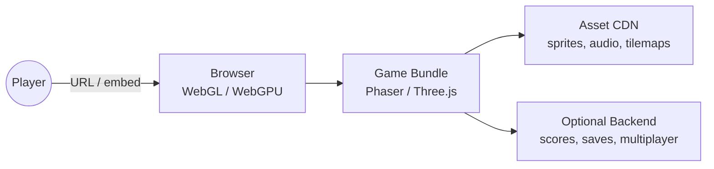
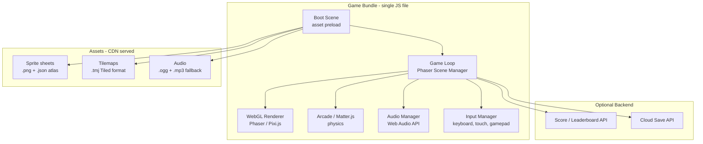

# Pattern: Web-based Game (WebGL / WebGPU)

!!! info "Quick facts"
    - **Category:** Games & Graphics
    - **Maturity:** Trial
    - **Typical team size:** 1-4 engineers
    - **Typical timeline to MVP:** 4-10 weeks
    - **Last reviewed:** 2026-05-03 by Architecture Team

## 1. Context

**Use this pattern when:**

- The game must be playable instantly in a browser with no download or install
- Distribution via a URL is a feature — social sharing, embedding in a marketing page, or a coding challenge where frictionless access matters
- The game is 2D, turn-based, card-based, puzzle, or casual — genres that do not push the browser rendering boundary

**Do NOT use this pattern when:**

- The game requires performance comparable to a native AAA title — WebGL and WebGPU have meaningful overhead vs native GPU APIs
- Persistent background execution is required (WebGL canvas is paused when the tab is not visible)
- The game must run offline without a network connection — use a cross-platform app with PWA capabilities instead

## 2. Problem it solves

App store friction reduces conversion dramatically. A web-based game loads in seconds from a shared link, works across devices without installation, and can be embedded in any web page. For marketing experiences, educational tools, casual games, and game jams, the web distribution model is a first-class advantage. WebGL (widely supported) and WebGPU (emerging, higher performance) bring GPU-accelerated rendering to the browser without a plugin.

## 3. Solution overview

### System context (C4 Level 1)

### Container view (C4 Level 2)

## 4. Technology stack

| Layer | Primary choice | Alternatives | Notes |
|---|---|---|---|
| Game framework | Phaser 3 | Babylon.js (3D), PixiJS (pure renderer), PlayCanvas | Phaser 3 for 2D games: scene manager, arcade physics, asset loader, input, camera — full game framework; PixiJS for custom 2D rendering without game logic opinions |
| 3D rendering | Three.js | Babylon.js, PlayCanvas | Three.js for custom 3D scenes; Babylon.js if you want a more opinionated game-oriented 3D engine |
| WebGPU | Not default yet — assess per project | Three.js WebGPU renderer (experimental) | WebGPU is supported in Chrome 113+ and is emerging; assess for new projects in 2026 but fallback to WebGL is still required |
| Build tooling | Vite | webpack, Parcel | Vite for fast HMR during development and tree-shaken production bundles |
| Asset pipeline | Texture Packer (sprite atlases) | Free Texture Packer, manual | Sprite atlases reduce draw calls; Tiled for tilemaps |
| Audio | Web Audio API (via Phaser sound manager) | Howler.js | Always provide both `.ogg` and `.mp3` formats for browser compatibility |
| Hosting | Cloudflare Pages | itch.io (games platform), GitHub Pages | Cloudflare Pages for zero-egress CDN; itch.io for indie game discoverability |
| Multiplayer (optional) | Colyseus (Node.js game server) | Socket.io (custom), Ably | Colyseus provides a typed room-based multiplayer framework; see the Multiplayer Game Backend pattern |

## 5. Non-functional characteristics

| Concern | Profile |
|---|---|
| **Scalability** | Game bundle is a static file served from CDN — scales to any traffic. Backend (scores, saves, multiplayer) scales independently. |
| **Availability target** | Static game is available as long as the CDN is up. If the backend is unavailable, implement graceful degradation — the game still plays, just without online features. |
| **Latency target** | Initial load: first interactive in < 3 s on a 4G connection (< 2 MB compressed bundle). Gameplay: 60fps target (16.6 ms frame budget) in Chrome on a mid-range laptop; profile on low-end mobile if mobile support is required. |
| **Security posture** | WebGL and WebGPU cannot access the filesystem or hardware directly. Sanitise any user-generated content (player names, chat) before rendering it to canvas. Rate-limit score submission endpoints to prevent leaderboard stuffing. |
| **Data residency** | Game state is in browser memory (lost on tab close) unless synced to a backend. If saving player data, apply the same GDPR requirements as any web application. |
| **Compliance fit** | GDPR: if analytics or cloud save is used, consent is required. COPPA: if the game is targeted at children under 13 (US), strict data collection rules apply. App store policies do not apply to web games, but advertising networks have their own standards. |

## 6. Cost ballpark

Web games have very low infrastructure cost — the main asset is engineering time.

| Scale | MAU | Monthly cost | Cost drivers |
|---|---|---|---|
| Small | < 50,000 | $0 - $50 | Cloudflare Pages free tier |
| Medium | 50k - 1M | $50 - $500 | CDN bandwidth (audio assets dominate), optional backend |
| Large | 1M+ | $300 - $3,000 | CDN, optional multiplayer server, analytics |

## 7. LLM-assisted development fit

| Aspect | Rating | Notes |
|---|---|---|
| Phaser 3 scene and game object scaffolding | ★★★★★ | Excellent — Phaser 3 API is well-represented; generate scene templates and sprite setup freely. |
| Game loop and state machine logic | ★★★★ | Good; verify state transition correctness by hand — game logic bugs are easy to miss in generated code. |
| Physics configuration (Arcade, Matter.js) | ★★★★ | Good; collision group setup and sensor configuration need manual testing in the browser. |
| WebGL shader customisation | ★★★ | Knows GLSL basics; Phaser's pipeline/shader integration has version-specific nuances. |
| Architecture decisions | ★ | Don't outsource. Use ADRs. |

**Recommended workflow:** Use Phaser's asset loader progress events to show a loading bar — the first user impression depends on load time. Test on a physical mid-range Android device early; desktop profiling significantly underestimates mobile performance constraints.

## 8. Reference implementations

- **Public reference:** [phaserjs/phaser](https://github.com/phaserjs/phaser) — Phaser 3 source and `examples/` directory covering every API feature with live demos (200 OK ✓)
- **Public reference:** [mrdoob/three.js](https://github.com/mrdoob/three.js) — Three.js; `examples/` contains hundreds of runnable 3D web demos covering materials, shaders, post-processing, and loaders (200 OK ✓)
- **Internal case study:** _Add your anonymised internal example here_

## 9. Related decisions (ADRs)

- [ADR-0010: Game engine selection](../../decisions/0010-game-engine.md)

## 10. Known risks & gotchas

- **Bundle size kills load time** — an unoptimised bundle including Phaser plus all assets is 15 MB; the game never starts on mobile. Mitigation: code-split scenes; lazy-load assets per scene rather than preloading everything at boot; target < 500 KB initial JS + progressive asset loading.
- **iOS Safari audio blocked until user gesture** — Web Audio API requires a user interaction (tap/click) before any sound plays on iOS. Mitigation: unlock the audio context on the first user input; Phaser's sound manager has a `unlock()` helper; test on a real iPhone.
- **60fps target not met on low-end devices** — the game runs at 60fps on a developer's laptop and 15fps on an entry-level Android phone. Mitigation: establish a target device profile early; profile with Chrome DevTools on a connected Android device; use Phaser's `game.loop.actualFps` metric.
- **Game canvas obscures or overlaps page elements** — the Phaser canvas is positioned incorrectly and intercepts scroll or click events on the page. Mitigation: set `pointer-events: none` on the canvas for non-interactive embedding; use `parent` config to constrain the canvas to a specific container element.
- **Cross-origin audio blocked by CORS** — audio files on a CDN are blocked because the CDN response does not include `Access-Control-Allow-Origin`. Mitigation: configure CORS headers on the CDN for audio content types; always test asset loading from the production CDN domain before launch.
